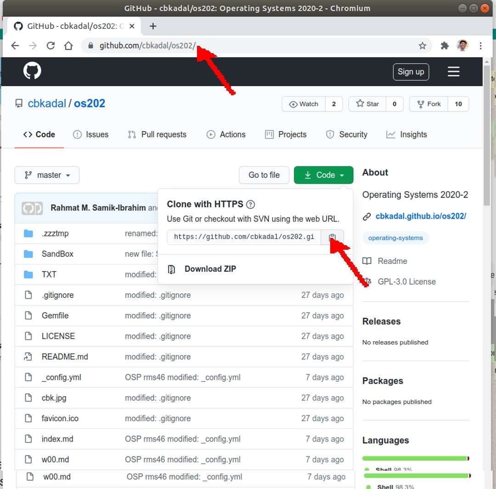
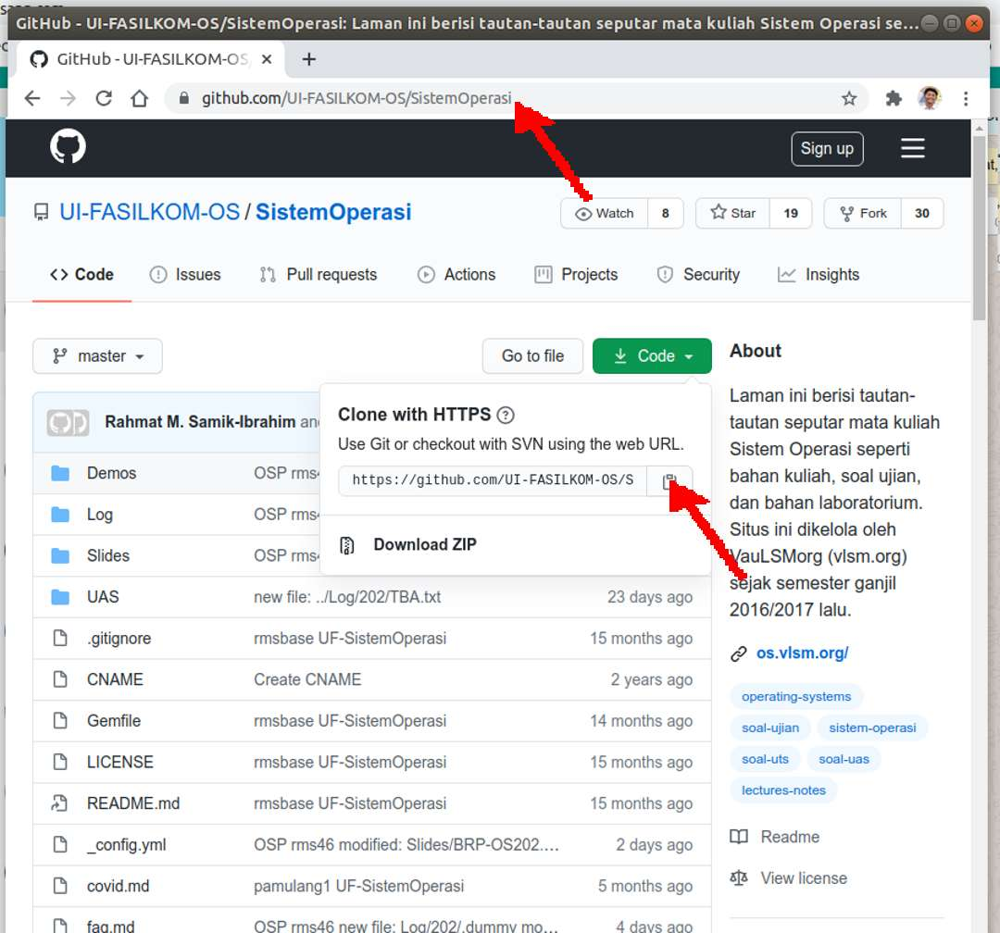
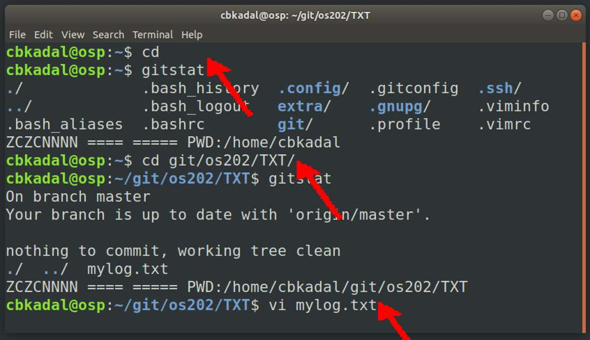
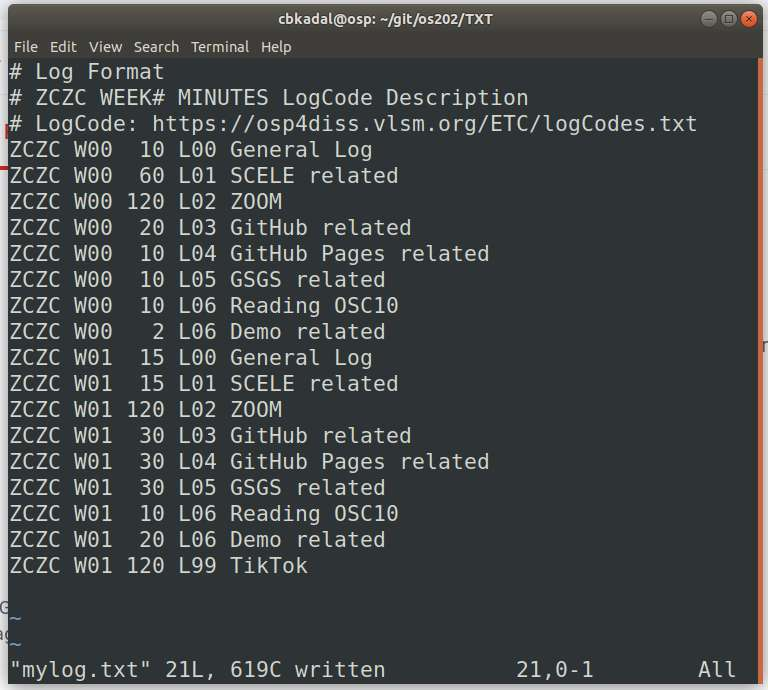
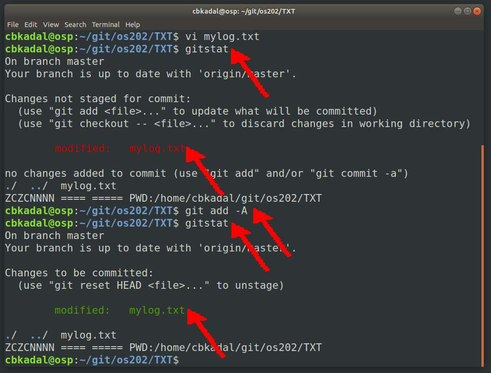
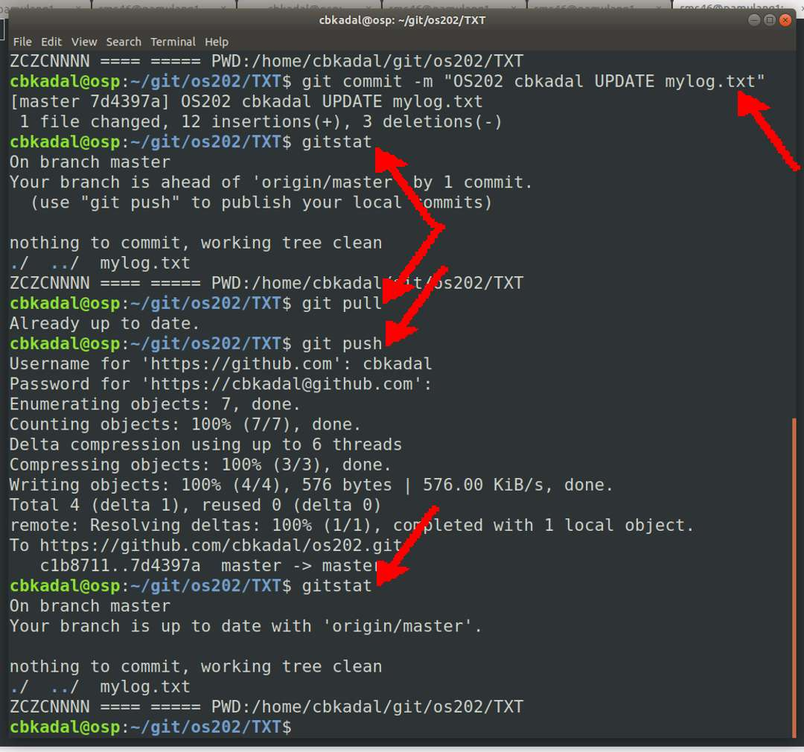

---
---
[HOME](index.md)
[ABOUT](README.md)
[WEB](https://osp4diss.vlsm.org/)
[GITHUB](https://github.com/os2xx/osp4diss)
[TOP](#)
[BOTTOM](#endofpage)
[PREV](index.md)
[NEXT](CBKadal2.md)

# Eg. User: cbkadal (1)

These following examples is for user **cbkadal** of guest *osp*.
Replace **cbkadal** with your own user name.

* [A Tunnel 2 Badak](#input01)
* [From OSP (Guest) to Badak via Tunnel](#input02)
* [rsync badak:///extra/Docs/](#input03)
* [rsync badak:///extra/Slides/](#input04)
* [rsync badak:///extra/Demos/](#input04a)
* [Setting .gitconfig](#input05)
* [Cloning os211](#input06)
* [Cloning Sistem Operasi](#input07)
* [Updating mylog.txt](#input09)

<br>
## Set a tunnel from osp (port 6022) to badak (ssh port 22) via kawung (ssh port XYZZY).

* Sooorry: port XYZZY is a moving target.

### INPUT01
```
ssh -p XYZZY -L 6022:badak.cs.ui.ac.id:22 cbkadal@kawung.cs.ui.ac.id

```

### OUTPUT01

```
cbkadal@osp:~$ ssh -p XYZZY -L 6022:badak.cs.ui.ac.id:22 cbkadal@kawung.cs.ui.ac.id
Linux kawung amd64 #1 Debian x86_64
**************************************************************
              P   E   R   H   A   T   I   A   N
**************************************************************
Sehubungan dengan adanya serangan masif ke server Fasilkom:
1. Akses ke host kawung dibatasi
2. Gunakan "ssh keys" untuk akses ke kawung dan host lainnya.
**************************************************************
Last login: Sun Feb 28 23:02:26 2021 from 127.0.0.1
cbkadal@kawung:~$

```

<br>
## Connect to badak via a tunnel.

### INPUT02

```
ssh -p 6022 cbkadal@localhost
ls -al /extra/
ls -al /extra/Slides/

```

### OUTPUT02

```
cbkadal@osp:~$ ssh -p 6022 demo@localhost
Linux badak amd64 #1 Debian x86_64

The programs included with the Debian GNU/Linux system are free software;
the exact distribution terms for each program are described in the
individual files in /usr/share/doc/*/copyright.

Debian GNU/Linux comes with ABSOLUTELY NO WARRANTY, to the extent
permitted by applicable law.
Last login: Sun Feb 28 17:45:15 2021 from 127.0.0.1

cbkadal@badak:~$ ls -al /extra/
total 28
drwxr-xr-x  7 demo demo 4096 Dec  8 01:28 .
drwxr-xr-x 19 root root 4096 Feb 20 16:06 ..
drwxr-xr-x 14 demo demo 4096 Nov 15 20:24 Demos
drwxr-xr-x  2 demo demo 4096 Feb 10 10:43 Docs
drwxr-xr-x  2 demo demo 4096 Nov 11 13:43 Silberschatz
drwxr-xr-x  2 demo demo 4096 Mar  9 07:26 Slides
drwxr-xr-x  2 demo demo 4096 Feb 10 10:43 UXS

cbkadal@badak:~$ ls -al /extra/Slides/
total 9856
drwxr-xr-x 2 demo demo    4096 Mar  9 07:26 .
drwxr-xr-x 7 demo demo    4096 Dec  8 01:28 ..
-rw-r--r-- 1 demo demo 1528155 Mar  9 07:16 W00-os00.pdf
-rw-r--r-- 1 demo demo  335307 Mar  9 07:16 W00-os00x.pdf
-rw-r--r-- 1 demo demo 2080237 Mar  9 07:16 W01-os01.pdf
-rw-r--r-- 1 demo demo  353258 Mar  9 07:16 W02-os02.pdf
-rw-r--r-- 1 demo demo  335778 Mar  9 07:16 W03-os03.pdf
-rw-r--r-- 1 demo demo  382131 Mar  9 07:16 W04-os04.pdf
-rw-r--r-- 1 demo demo  929356 Mar  9 07:16 W05-os05.pdf
-rw-r--r-- 1 demo demo  565225 Mar  9 07:16 W06-os06.pdf
-rw-r--r-- 1 demo demo  522473 Mar  9 07:16 W07-os07.pdf
-rw-r--r-- 1 demo demo  455379 Mar  9 07:16 W08-os08.pdf
-rw-r--r-- 1 demo demo 1981484 Mar  9 07:16 W09-os09.pdf
-rw-r--r-- 1 demo demo  596363 Mar  9 07:16 W10-os10.pdf

cbkadal@badak:~$

```

<br>
## Copy from badak:///extra/ to *osp* via tunnel

### INPUT03

```
ls -F
mkdir extra
rsync -auv --delete -e 'ssh -p 6022' cbkadal@localhost:/extra/Docs/  extra/Docs/

```

### OUTPUT03

```
cbkadal@osp:~$ ls -F
git/  mydemo/  ospubkey.txt  tmp/

cbkadal@osp:~$ mkdir extra

cbkadal@osp:~$ rsync -auv --delete -e 'ssh -p 6022' cbkadal@localhost:/extra/Docs/  extra/Docs/
receiving incremental file list
created directory extra/Docs
./
W00-X-Gedris-2003-Shell-Intro.pdf
W00-X-HBR-2016-CIOs-Guide-Cloud-Computing.pdf
W00-X-IJMCSA-2015-Comparison-between-Cloud-Grid-Cluster-and-Virtualization.pdf
W00-X-TMUX-Cheat-Sheet.pdf
W00-X-WattsRaza-2019-SaaS-vs-PaaS-vs-IaaS.pdf
W01-X-AddedBytesCom-2008-RegexCheatSheet.pdf
W01-X-Cooper-2014-Advanced-Bash-Scripting-Guide.pdf
W01-X-Garells-2008-Bash-Beginners-Guide.pdf
W01-X-Goyvaerts-2007-Regular-Expressions.pdf
W01-X-PLB-70.pdf
W01-X-Scripting-2014.pdf
W02-X-AHB-172.pdf
W02-X-EncryptBlog-2019-Online-Privacy-Checklist.pdf
W02-X-Johnston-2019-Privacy-101.pdf
W02-X-Long-2016-Learn-To-Code-With-C.pdf
W03-X-fhs-3.0.pdf
W08-Beekmans-2020-Linux-From-Scratch-10-0.pdf
W08-X-Lozi-etal-2016-The-Linux-Scheduler-a-Decade-of-Wasted-Cores.pdf
W08-X-Tanenbaum-1997-Operating-Systems-193-195.pdf
W09-X-disk-raid-2013.pdf

sent 407 bytes  received 19,616,892 bytes  2,064,978.84 bytes/sec
total size is 19,610,293  speedup is 1.00

cbkadal@osp:~$ 

```


<br>

### INPUT04

```
rsync -auv --delete -e 'ssh -p 6022' cbkadal@localhost:/extra/Slides/  extra/Slides/

```

### OUTPUT04

```
cbkadal@osp:~$ rsync -auv --delete -e 'ssh -p 6022' cbkadal@localhost:/extra/Slides/  extra/Slides/
receiving incremental file list
created directory extra/Slides
./
W00-os00.pdf
W00-os00x.pdf
W01-os01.pdf
W02-os02.pdf
W03-os03.pdf
W04-os04.pdf
W05-os05.pdf
W06-os06.pdf
W07-os07.pdf
W08-os08.pdf
W09-os09.pdf
W10-os10.pdf

sent 255 bytes  received 10,068,401 bytes  1,549,024.00 bytes/sec
total size is 10,065,146  speedup is 1.00

cbkadal@osp:~$

```

<br>

### INPUT04A

```
rsync -auv --delete -e 'ssh -p 6022' cbkadal@localhost:/extra/Demos/  extra/Demos/

```

### OUTPUT04A

```
cbkadal@osp:~$ rsync -auv --delete -e 'ssh -p 6022' cbkadal@localhost:/extra/Demos/  extra/Demos/
receiving incremental file list
created directory extra/Demos
./
.zzz-doREADTHISFIRST
000-READ-THIS-FIRST.txt
Week00/
Week00/.head
Week00/.zzz-doREADTHISFIRST
Week00/000-READ-THIS-FIRST.txt
Week00/Makefile
Week00/c-program-example.c
Week01/

*** TL;DR ***

ZADMIN/zzx-thanks.txt
ZADMIN/zzy-copyright.txt
ZADMIN/zzz-generate-READ-THIS-FIRST.sh

sent 4,400 bytes  received 1,153,098 bytes  771,665.33 bytes/sec
total size is 1,137,087  speedup is 0.98

cbkadal@osp:~$ 

```

<br>
## Setup git

Config name and email for git.
Replace 'Cicak Bin Kadal' with your own name.

### INPUT05

```
gitstat
git config --global user.email        '70104051+cbkadal@users.noreply.github.com'
git config --global user.name         'Cicak Bin Kadal'
git config --global core.editor       'vi'
git config --global credential.helper 'cache --timeout=3600'
git config user.email
git config user.name
git config core.editor
git config credential.helper
git config --list
cat ~/.gitconfig
gitstat

```

### OUTPUT05

```
cbkadal@osp:~$ gitstat
./  ../  .bash_aliases  .bash_logout  .bashrc  .profile  .viminfo  .vimrc
ZCZC cbkadal ==== Wed 10 Mar 2021 07:05:22 PM WIB ===== PWD:/home/cbkadal

cbkadal@osp:~$ git config --global user.email        '70104051+cbkadal@users.noreply.github.com'

cbkadal@osp:~$ git config --global user.name         'Cicak Bin Kadal'

cbkadal@osp:~$ git config --global core.editor       'vi'

cbkadal@osp:~$ git config --global credential.helper 'cache --timeout=3600'

cbkadal@osp:~$ git config user.email
70104051+cbkadal@users.noreply.github.com

cbkadal@osp:~$ git config user.name
Cicak Bin Kadal

cbkadal@osp:~$ git config core.editor
vi

cbkadal@osp:~$ git config credential.helper
cache --timeout=3600

cbkadal@osp:~$ git config --list
user.email=70104051+cbkadal@users.noreply.github.com
user.name=Cicak Bin Kadal
core.editor=vi
credential.helper=cache --timeout=3600

cbkadal@osp:~$ cat ~/.gitconfig
[user]
	email = 70104051+cbkadal@users.noreply.github.com
	name = Cicak Bin Kadal
[core]
	editor = vi
[credential]
	helper = cache --timeout=3600

cbkadal@osp:~$ gitstat
./  ../  .bash_aliases  .bash_logout  .bashrc  .gitconfig  .profile  .viminfo  .vimrc
ZCZC cbkadal ==== Wed 10 Mar 2021 07:05:22 PM WIB ===== PWD:/home/cbkadal

cbkadal@osp:~$

```

<br>
## Cloning a github repository "os211" (was "**os202**")



<br>

### INPUT06

```
cd
gitstat
mkdir git
cd git
git clone https://github.com/cbkadal/os211.git
gitstat
cd os211
gitstat

```

### OUTPUT06

```
cbkadal@osp:~$ cd

cbkadal@osp:~$ gitstat
./             .bash_history  .bundle/  extra/  git/        .memo.txt     .profile  tmp/      .wget-hsts
../            .bash_logout   .cache/   .gem/   .gitconfig  mydemo/       .rbenv/   .viminfo  .Xauthority
.bash_aliases  .bashrc        .config/  .gemrc  .gnupg/     ospubkey.txt  .ssh/     .vimrc
ZCZC cbkadal ==== Thu 11 Mar 14:28:32 WIB 2021 ===== PWD:/home/cbkadal

cbkadal@osp:~$ mkdir git

cbkadal@osp:~$ cd git

cbkadal@osp:~/git$ git clone https://github.com/cbkadal/os211.git
Cloning into 'os211'...
remote: Enumerating objects: 369, done.
remote: Counting objects: 100% (369/369), done.
remote: Compressing objects: 100% (237/237), done.
remote: Total 369 (delta 212), reused 260 (delta 109), pack-reused 0
Receiving objects: 100% (369/369), 318.83 KiB | 670.00 KiB/s, done.
Resolving deltas: 100% (212/212), done.

cbkadal@osp:~/git$ gitstat
./  ../  os211/  .shsh  SistemOperasi/  xchg211/  .ZREMOTE/
ZCZC cbkadal ==== Thu 11 Mar 14:28:35 WIB 2021 ===== PWD:/home/cbkadal/git

cbkadal@osp:~/git$ cd os211

cbkadal@osp:~/git/os211$ gitstat
On branch master
Your branch is up to date with 'origin/master'.

nothing to commit, working tree clean
./      004.pmd      .dojekyll    .git/       index.md   README.md@  TXT/    w03.md  w06.md  w09.md
../     assets/      favicon.ico  .gitignore  _layouts/  SandBox/    w01.md  w04.md  w07.md  w10.md
004.md  _config.yml  Gemfile      _includes/  Makefile   .template   w02.md  w05.md  w08.md
ZCZC cbkadal ==== Thu 11 Mar 14:28:35 WIB 2021 ===== PWD:/home/cbkadal/git/os211

cbkadal@osp:~/git/os211$ 

```

<br>
## Cloning a github repository "SistemOperasi"



<br>
### INPUT07
```
cd 
cd git
gitstat
git clone https://github.com/UI-FASILKOM-OS/SistemOperasi.git
gitstat
cd SistemOperasi
gitstat

```

<br>
### OUTPUT07
```
cbkadal@osp:~$ cd 

cbkadal@osp:~$ cd git

cbkadal@osp:~/git$ gitstat
./  ../  os211/  .shsh  xchg211/  .ZREMOTE/
ZCZC cbkadal ==== Sun 28 Feb 17:06:16 WIB 2021 ===== PWD:/home/cbkadal/git

cbkadal@osp:~/git$ git clone https://github.com/UI-FASILKOM-OS/SistemOperasi.git
Cloning into 'SistemOperasi'...
remote: Enumerating objects: 119, done.
remote: Counting objects: 100% (119/119), done.
remote: Compressing objects: 100% (69/69), done.
remote: Total 5774 (delta 67), reused 76 (delta 50), pack-reused 5655
Receiving objects: 100% (5774/5774), 105.23 MiB | 2.14 MiB/s, done.
Resolving deltas: 100% (4296/4296), done.

cbkadal@osp:~/git$ gitstat
./  ../  os211/  .shsh  SistemOperasi/  xchg211/  .ZREMOTE/
ZCZC cbkadal ==== Sun 28 Feb 17:07:11 WIB 2021 ===== PWD:/home/cbkadal/git

cbkadal@osp:~/git$ cd SistemOperasi

cbkadal@osp:~/git/SistemOperasi$ gitstat
On branch master
Your branch is up to date with 'origin/master'.

nothing to commit, working tree clean
./     _config.yml  .dojekyll    Gemfile     index.md  pib.jpg       SECURITY.md
../    covid.md     faq.md       .git/       LICENSE   playlists.md  Slides/
CNAME  Demos/       favicon.ico  .gitignore  Log/      README.md@    WEEK/
ZCZC cbkadal ==== Sun 28 Feb 17:08:11 WIB 2021 ===== PWD:/home/cbkadal/git/SistemOperasi
cbkadal@osp:~/git/SistemOperasi$ 

```

<br>
### INPUT08
```
cd
pwd
mkdir mydemo
cp -r git/SistemOperasi/Demos/Week01/ mydemo/
ls -F mydemo/Week01/

```

<br>
### OUTPUT08
```
cbkadal@osp:~/git/SistemOperasi$ cd

cbkadal@osp:~$ pwd
/home/cbkadal

cbkadal@osp:~$ mkdir mydemo

cbkadal@osp:~$ cp -r git/SistemOperasi/Demos/Week01/ mydemo/

cbkadal@osp:~$ ls -F mydemo/Week01/
000-READ-THIS-FIRST.txt  a05-finding-EXIST  a10-mysha1   a15-uts171  a20-uts201
a01-SCREEN-CHECK         a06-loop           a11-banding  a16-uts181
a02-sort-n-prepare       a07-tester         a12-fixfs    a17-uts182
a03-command-lines-demo   a08-append-a-file  a13-last     a18-uts191
a04-does-it-exist        a09-add-numbers    a14-absen    a19-uts192
cbkadal@osp:~$ 

```

<br>
## Updating mylog.txt

### INPUT09

```
cd
gitstat
cd git/os211/TXT
gitstat
vi mylog.txt

```

### OUTPUT09



<br>
## mylog.txt



### INPUT10

```
gitstat
git add -A
gitstat

```

### OUTPUT10



### INPUT11

```
git commit -m "OS211 cbkadal UPDATE mylog.txt"
gitstat
git pull
git push
git stat

```

### OUTPUT11



<br id="endofpage"><br>

[HOME](index.md)
[ABOUT](README.md)
[WEB](https://osp4diss.vlsm.org/)
[GITHUB](https://github.com/os2xx/osp4diss)
[TOP](#)
[BOTTOM](#endofpage)
[PREV](index.md)
[NEXT](CBKadal2.md)

