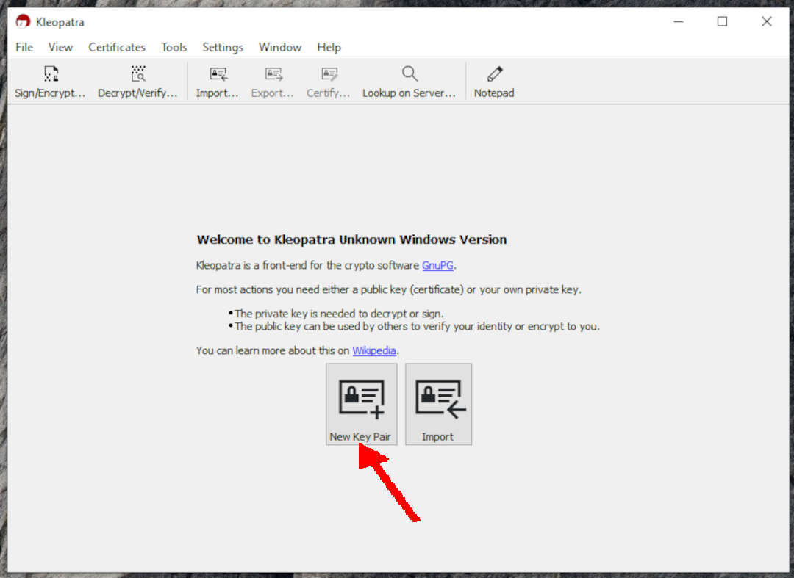
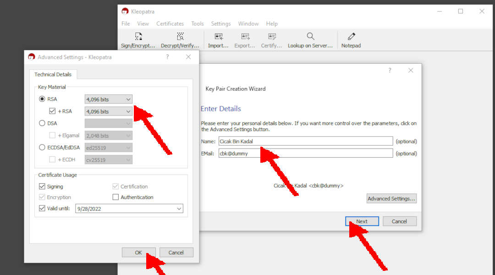
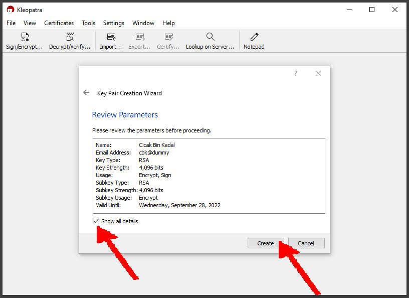
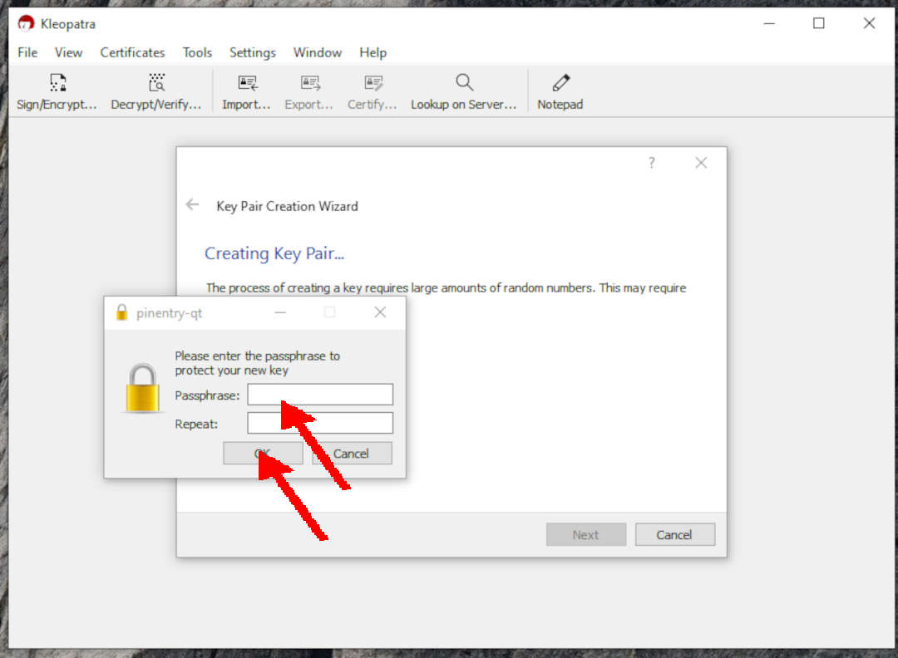
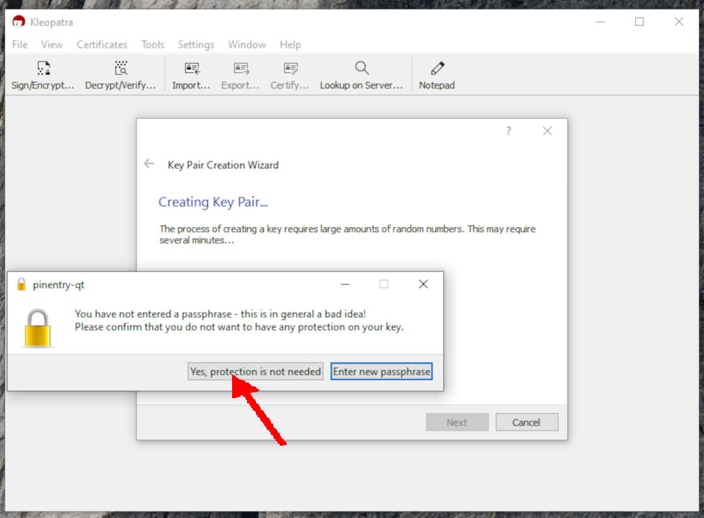
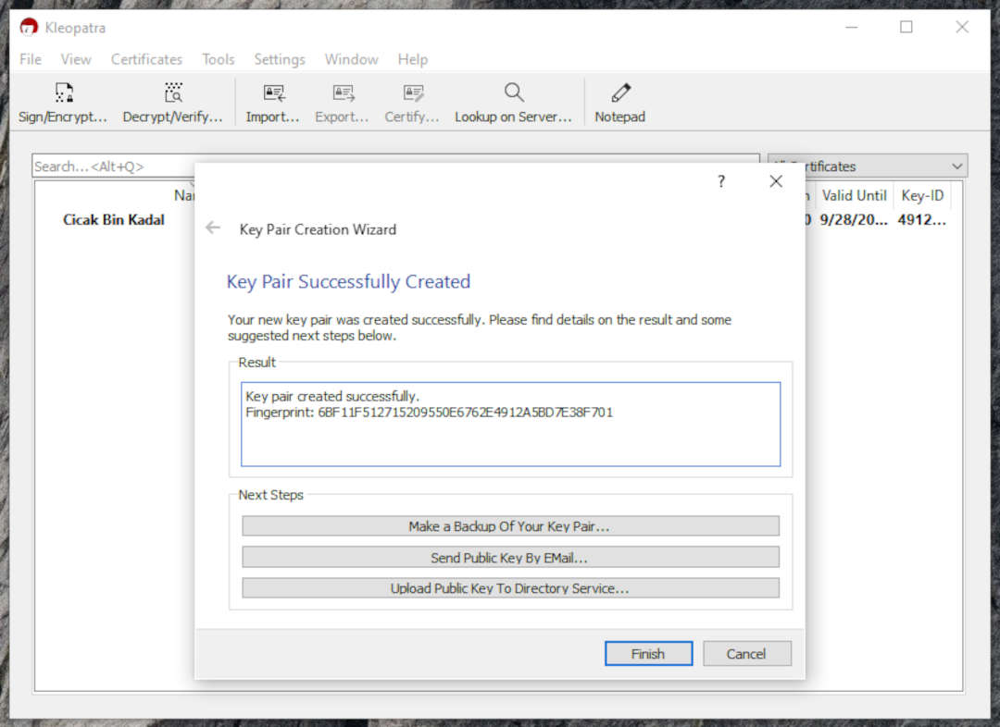
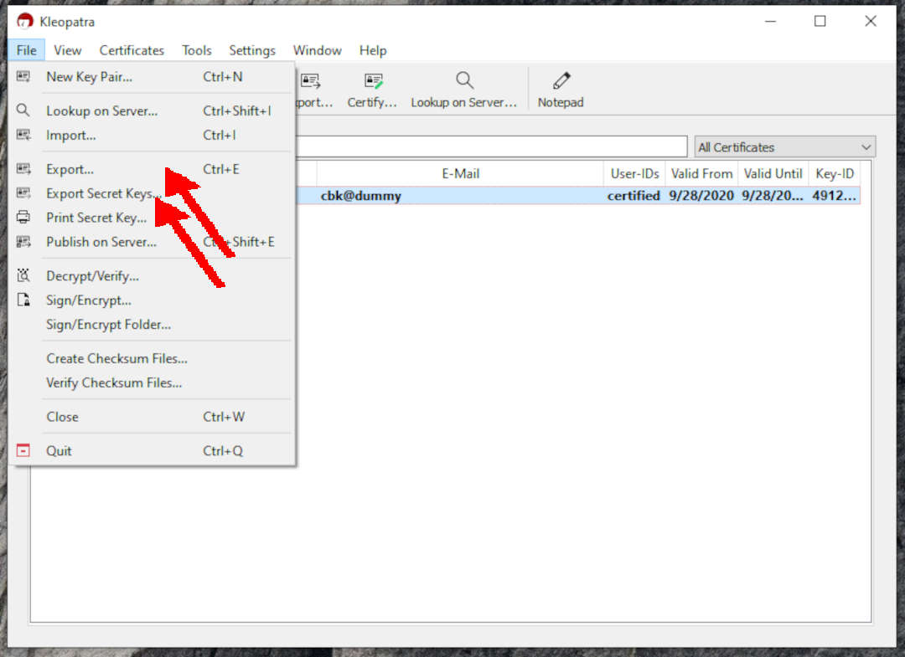

---
---
[HOME](index.md)
[ABOUT](README.md)
[WEB](https://osp4diss.vlsm.org/)
[GITHUB](https://github.com/os2xx/osp4diss)
[TOP](#)
[BOTTOM](#endofpage)
[PREV](index.md)
[NEXT](index.md)

# Kleopatra (Windows 10)

Generating GNUPG Key Pairs using Kleopatra (Windows 10).



```
RSA; 4096 bits
Name: Cicak Bin Kadal
Email: cbk@dummy
Valid: 1 year
```



```
**NO PASSPHRASE IS NOT A GOOD IDEA!**
**Forgetting the passphrase is even worse!**
```





```
Exporting the **SECRET KEY**.
Exporting the **PUBLIC KEY**.
```


<br id="endofpage"><br>
[HOME](index.md)
[ABOUT](README.md)
[WEB](https://osp4diss.vlsm.org/)
[GITHUB](https://github.com/os2xx/osp4diss)
[TOP](#)
[BOTTOM](#endofpage)
[PREV](index.md)
[NEXT](index.md)

