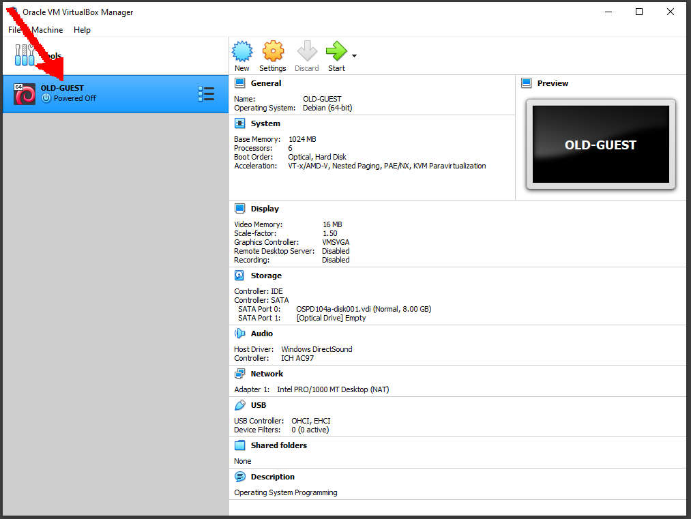
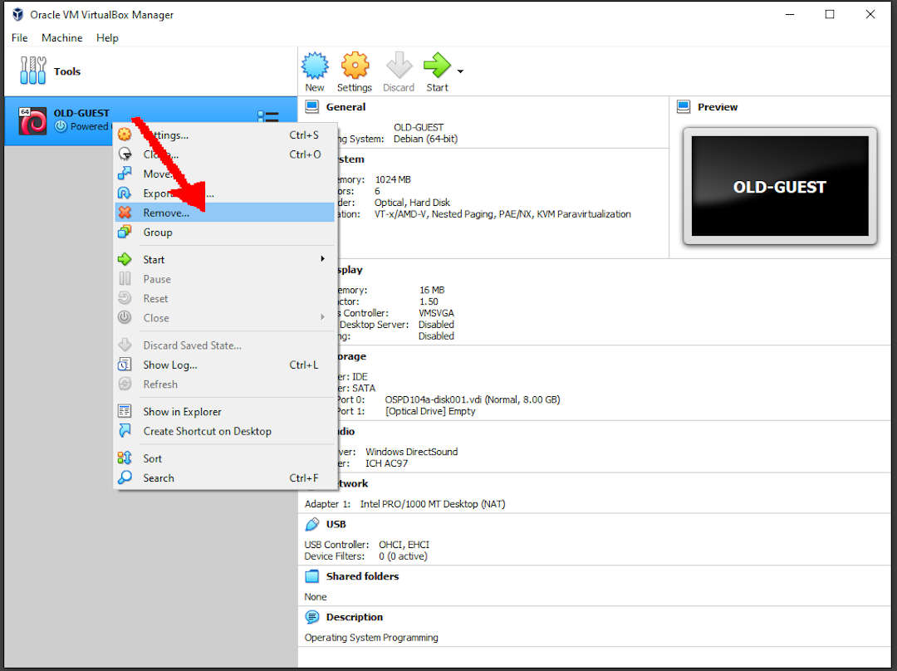
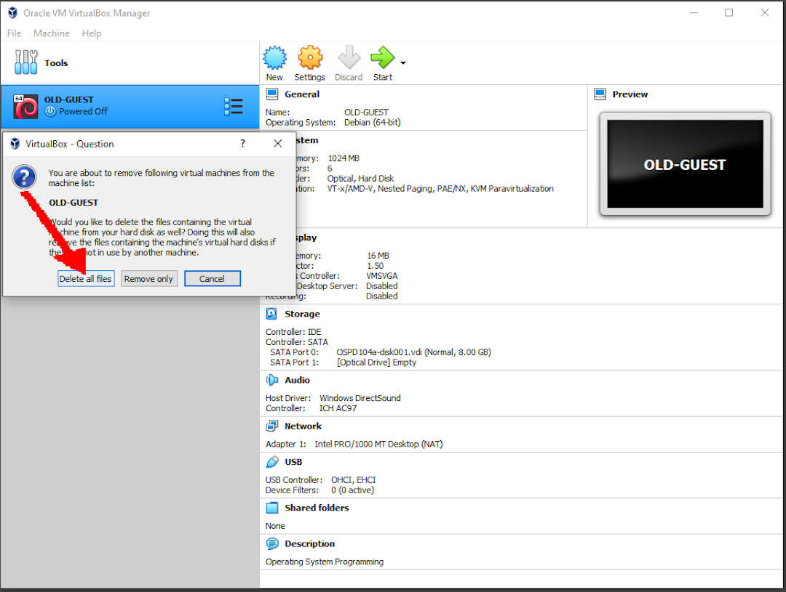

---
---

[HOME](index.md)
[ABOUT](README.md)
[WEB](https://osp4diss.vlsm.org/)
[GITHUB](https://github.com/os2xx/osp4diss)
[TOP](#)
[BOTTOM](#endofpage)
[PREV](DebianGuestImportOva.md)
[NEXT](DebianGuestDeleteOva.md)

# More About Export Import Guests

## Delete OLD-GUEST

* Select OLD-GUEST

* Select Remove

* Select Delete All Files

 
# DONE

  

[HOME](index.md)
[ABOUT](README.md)
[WEB](https://osp4diss.vlsm.org/)
[GITHUB](https://github.com/os2xx/osp4diss)
[TOP](#)
[BOTTOM](#endofpage)
[PREV](DebianGuestImportOva.md)
[NEXT](DebianGuestDeleteOva.md)
 

