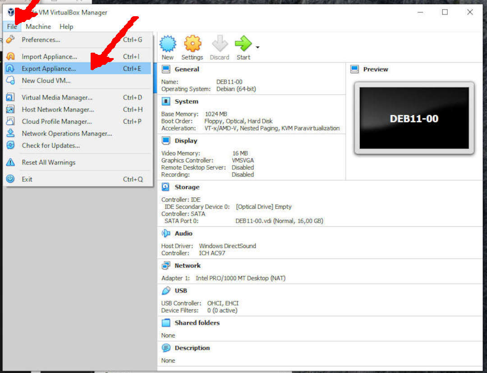
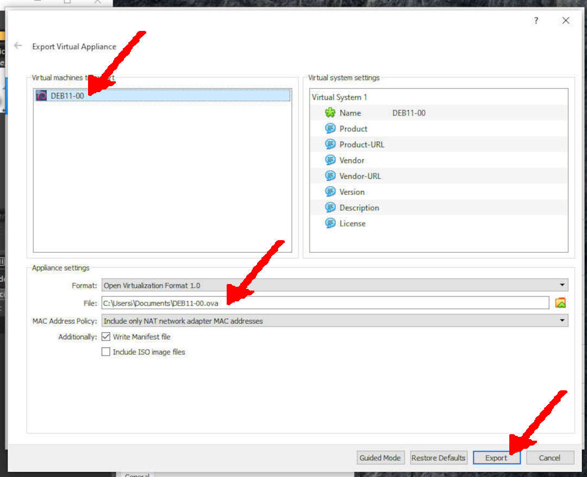

---
---

[HOME](index.md)
[ABOUT](README.md)
[WEB](https://osp4diss.vlsm.org/)
[GITHUB](https://github.com/os2xx/osp4diss)
[TOP](#)
[BOTTOM](#endofpage)
[PREV](DebianGuestOnVirtualBox1.md)
[NEXT](DebianGuestExportOva1.md)

# Exporting a Debian Guest In OVA Format (E.g. DEB11-00)

### (File) Export Applience...

 
### Virtual Machines To Export: DEB11-00

### Export Done (DEB11-00)

  

[HOME](index.md)
[ABOUT](README.md)
[WEB](https://osp4diss.vlsm.org/)
[GITHUB](https://github.com/os2xx/osp4diss)
[TOP](#)
[BOTTOM](#endofpage)
[PREV](DebianGuestOnVirtualBox1.md)
[NEXT](DebianGuestExportOva1.md)
 

