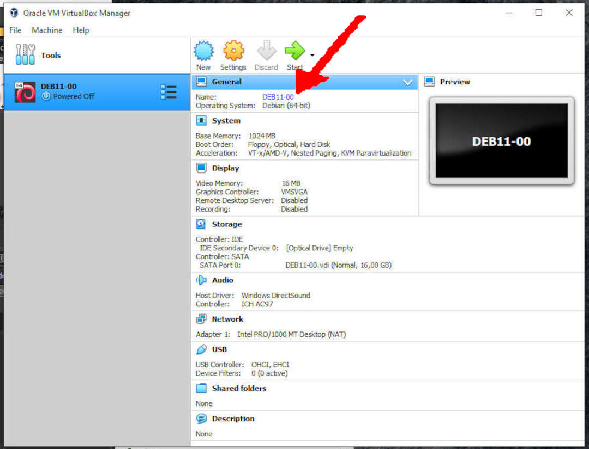
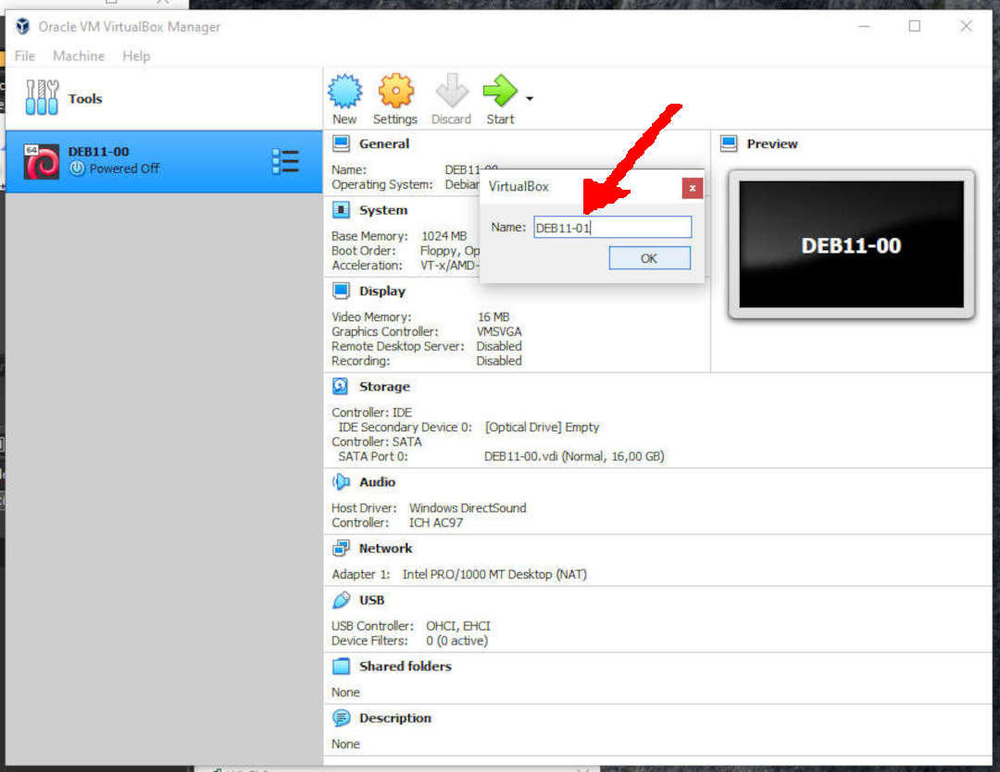
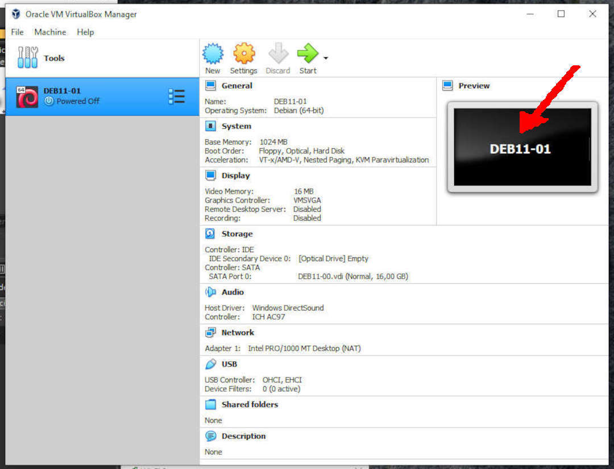

---
---

[HOME](index.md)
[ABOUT](README.md)
[WEB](https://osp4diss.vlsm.org/)
[GITHUB](https://github.com/os2xx/osp4diss)
[TOP](#)
[BOTTOM](#endofpage)
[PREV](DebianGuestExportOva.md)
[NEXT](DebianGuestOnVirtualBox2.md)

# Renaming a Debian Guest (E.g. DEB11-00 to DEB11-01)

 
### Click: General --> Name (e.g. DEB11-00)

 
### Rename: DEB11-01

 
### DEB11-01

  

[HOME](index.md)
[ABOUT](README.md)
[WEB](https://osp4diss.vlsm.org/)
[GITHUB](https://github.com/os2xx/osp4diss)
[TOP](#)
[BOTTOM](#endofpage)
[PREV](DebianGuestExportOva.md)
[NEXT](DebianGuestOnVirtualBox2.md)
 

