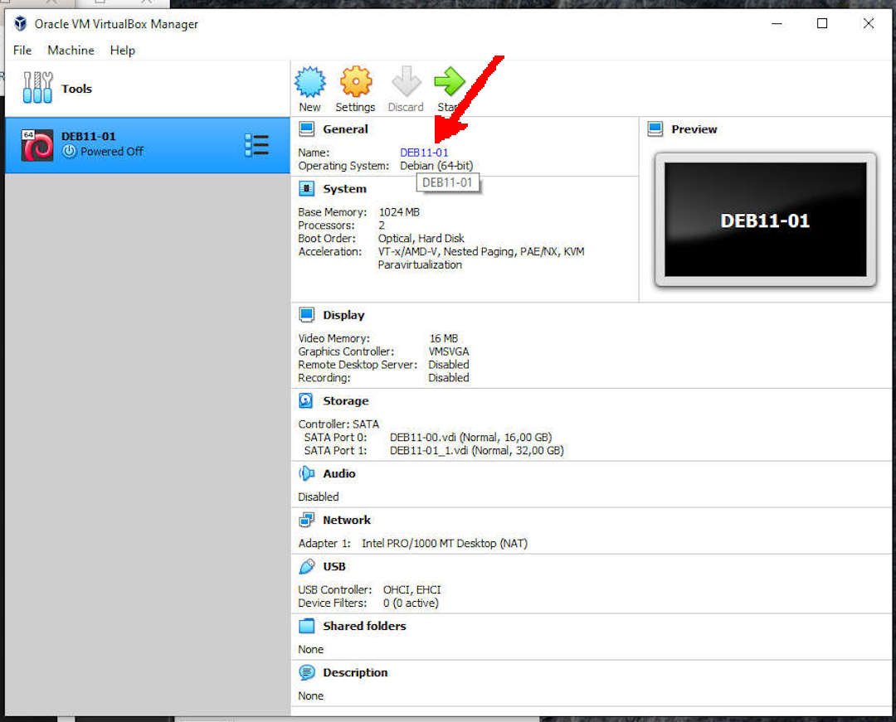
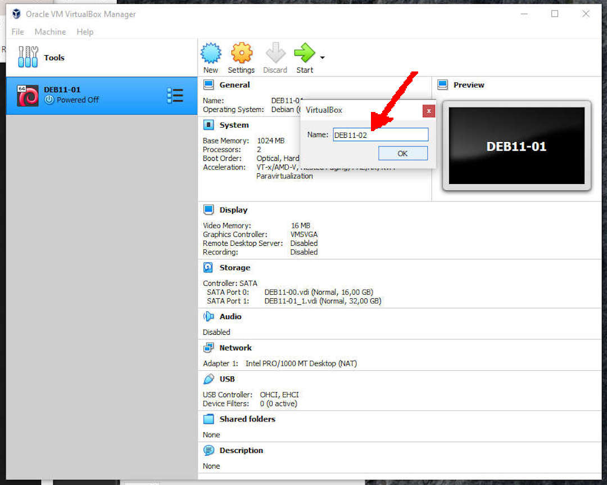

---
---

[HOME](index.md)
[ABOUT](README.md)
[WEB](https://osp4diss.vlsm.org/)
[GITHUB](https://github.com/os2xx/osp4diss)
[TOP](#)
[BOTTOM](#endofpage)
[PREV](DebianGuestExportOva2.md)
[NEXT](DebianISOImage.md)

# Renaming a Debian Guest

## E.g. Rename DEB11-01 to DEB11-02

 
### Click: General --> Name (e.g. DEB11-01)

 
### Rename: DEB11-02

 
### DEB11-02

  

[HOME](index.md)
[ABOUT](README.md)
[WEB](https://osp4diss.vlsm.org/)
[GITHUB](https://github.com/os2xx/osp4diss)
[TOP](#)
[BOTTOM](#endofpage)
[PREV](DebianGuestExportOva2.md)
[NEXT](DebianISOImage.md)
 

