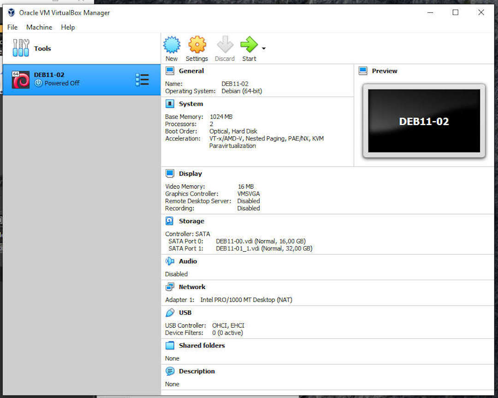
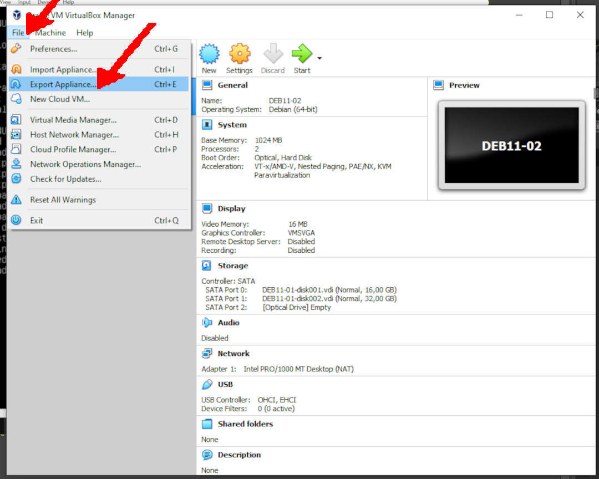
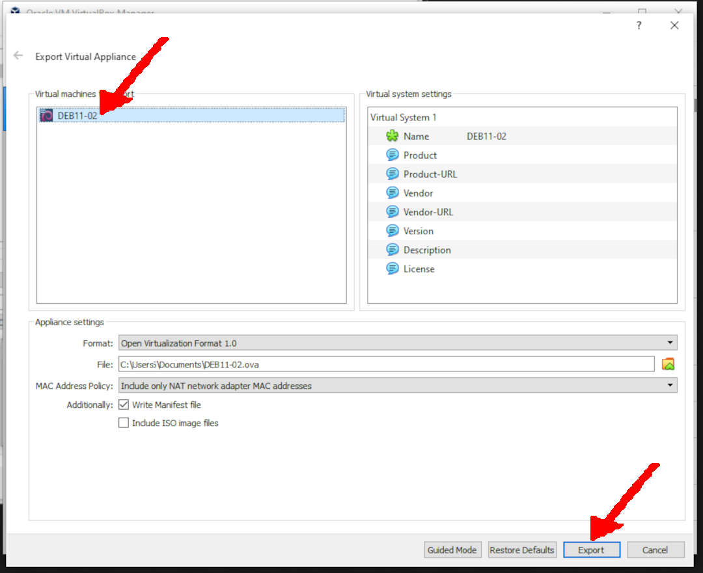
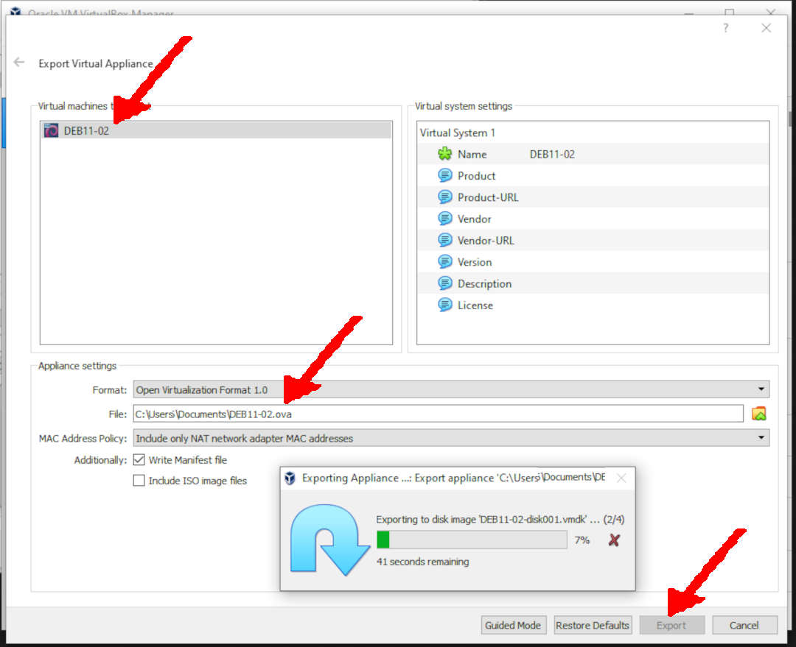

---
---

[HOME](index.md)
[ABOUT](README.md)
[WEB](https://osp4diss.vlsm.org/)
[GITHUB](https://github.com/os2xx/osp4diss)
[TOP](#)
[BOTTOM](#endofpage)
[PREV](InstallDebianNetinst.md)
[NEXT](index.md#idx03)

# Exporting a Debian Guest In OVA Format

* It is always a good idea to back up the last few OVA files on an external disk. 
  If your computer has problems, those OVA files can be run on another computer.

## Eg. DEB11-02

### (File) Export Applience...

 
### Virtual Machines To Export: DEB11-02

### Export Done (DEB11-02)

  

[HOME](index.md)
[ABOUT](README.md)
[WEB](https://osp4diss.vlsm.org/)
[GITHUB](https://github.com/os2xx/osp4diss)
[TOP](#)
[BOTTOM](#endofpage)
[PREV](InstallDebianNetinst.md)
[NEXT](index.md#idx03)
 

