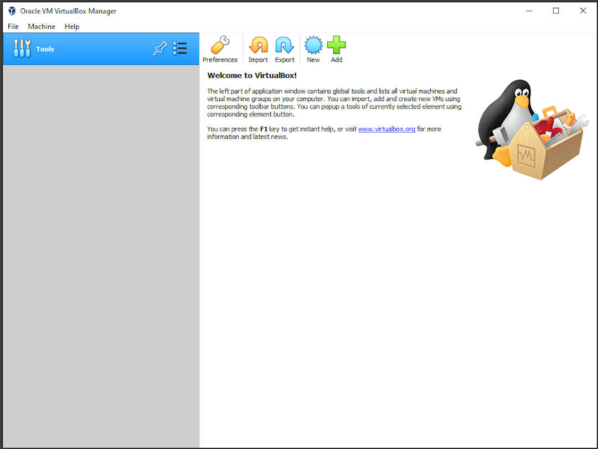
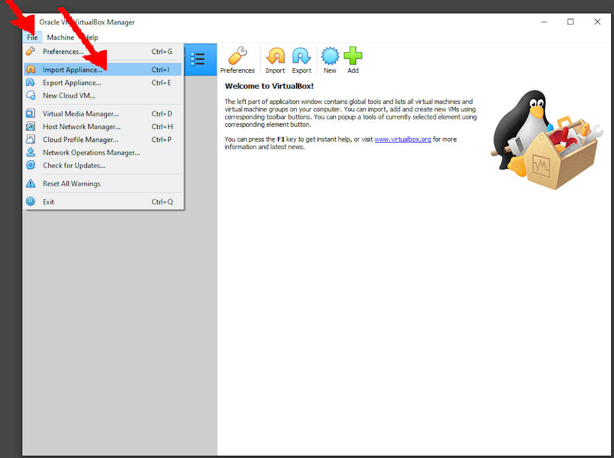
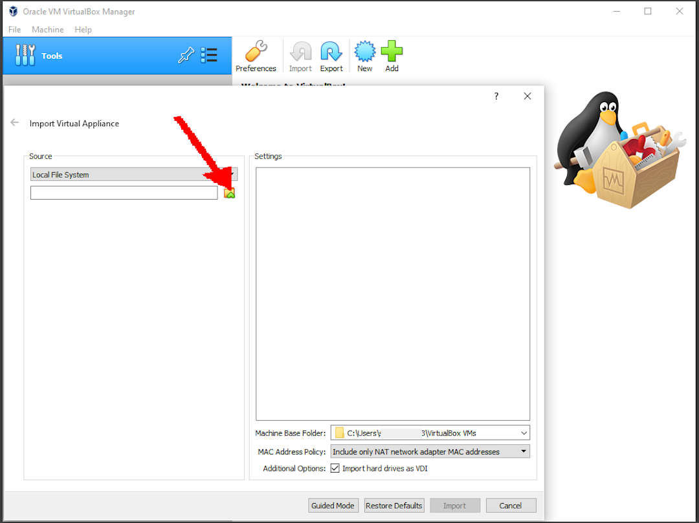
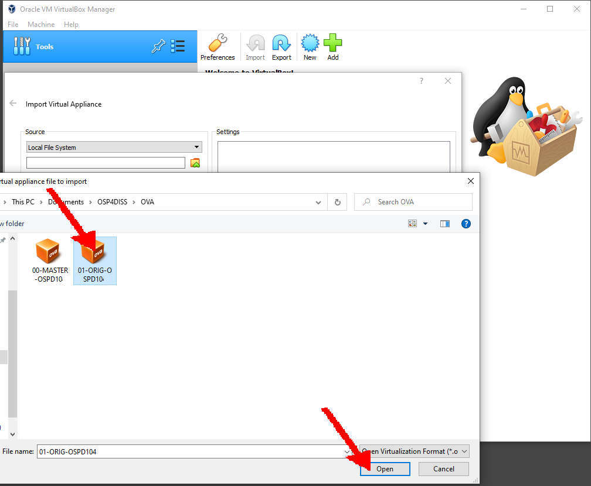
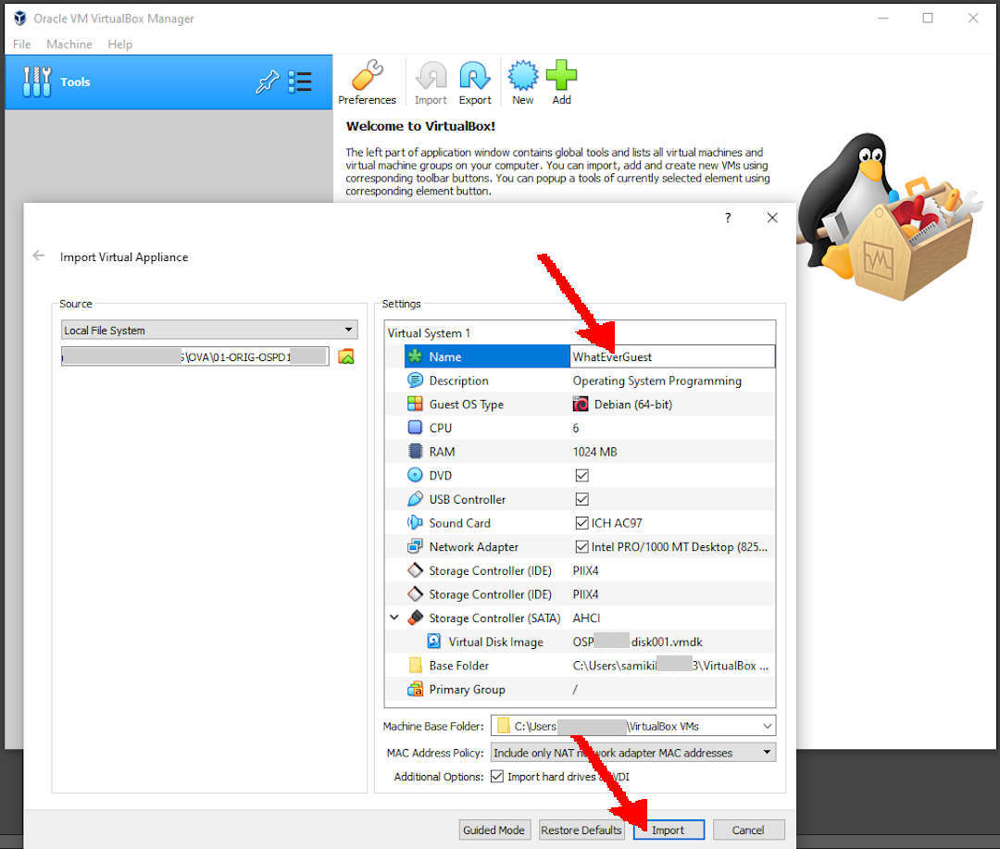
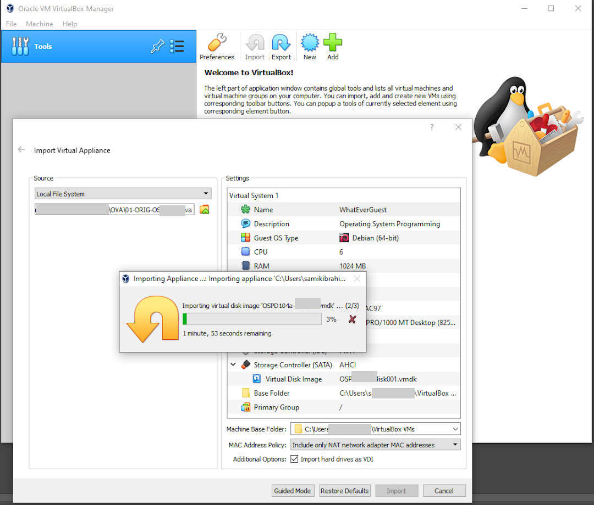

---
---

[HOME](index.md)
[ABOUT](README.md)
[WEB](https://osp4diss.vlsm.org/)
[GITHUB](https://github.com/os2xx/osp4diss)
[TOP](#)
[BOTTOM](#endofpage)
[PREV](index.md#idx01)
[NEXT](index.md#idx01)

# Importing a GUEST OVA and rename it to “WhatEverGuest”

* Select File/Import Applience...

* Locate and select an OVA file

* Open the OVA file

* Rename guest to "WhatEverGuest"

* Import

* Guest "WhatEverGuest" is ready.

 
# DONE

  

[HOME](index.md)
[ABOUT](README.md)
[WEB](https://osp4diss.vlsm.org/)
[GITHUB](https://github.com/os2xx/osp4diss)
[TOP](#)
[BOTTOM](#endofpage)
[PREV](DebianGuestImportOva.md)
[NEXT](DebianGuestDeleteOva.md)
 

