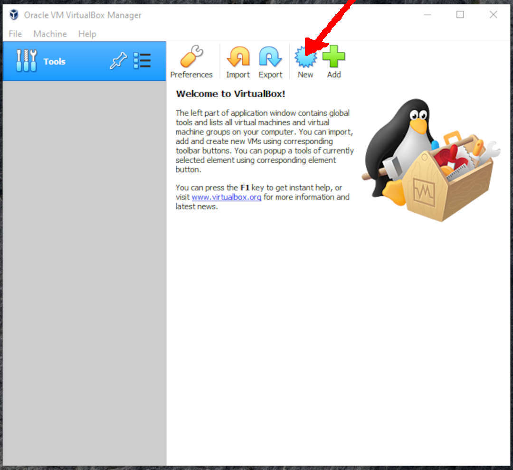
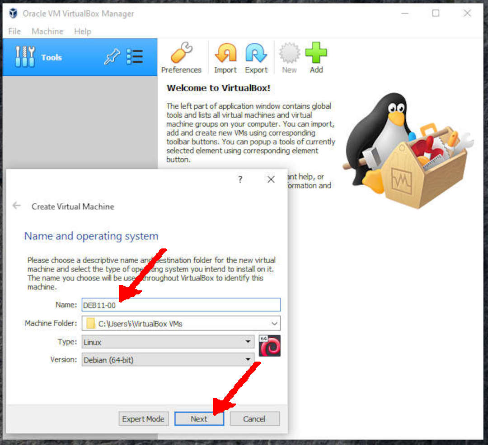
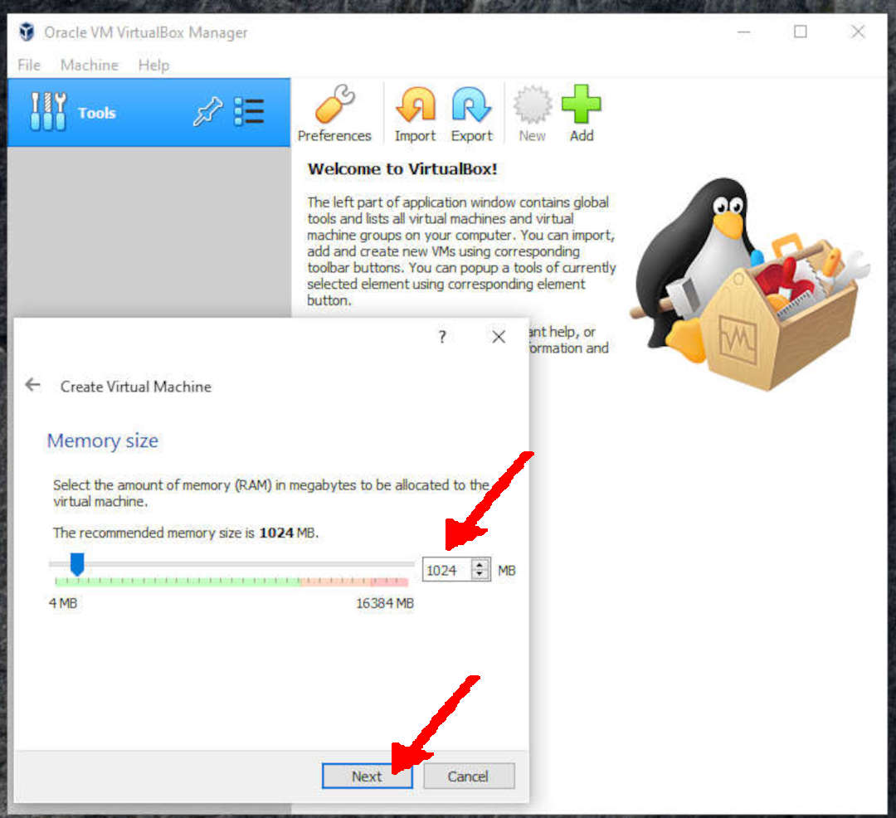
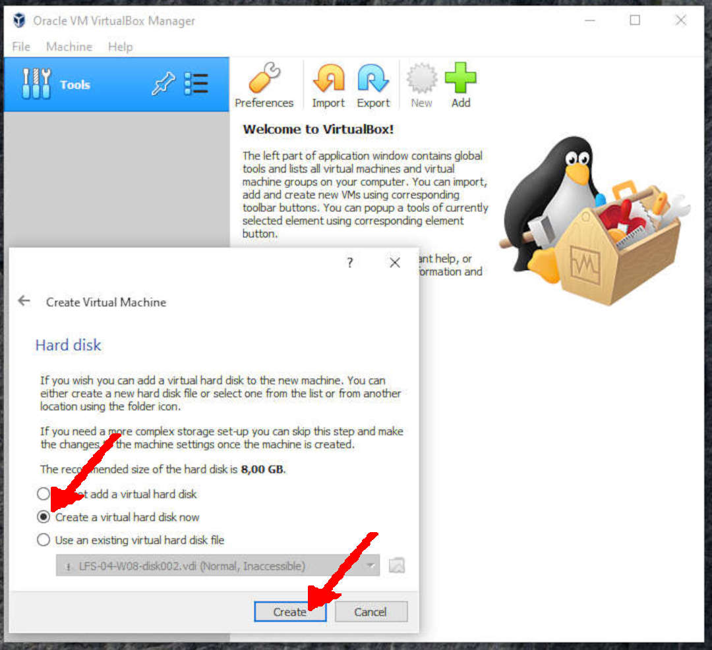
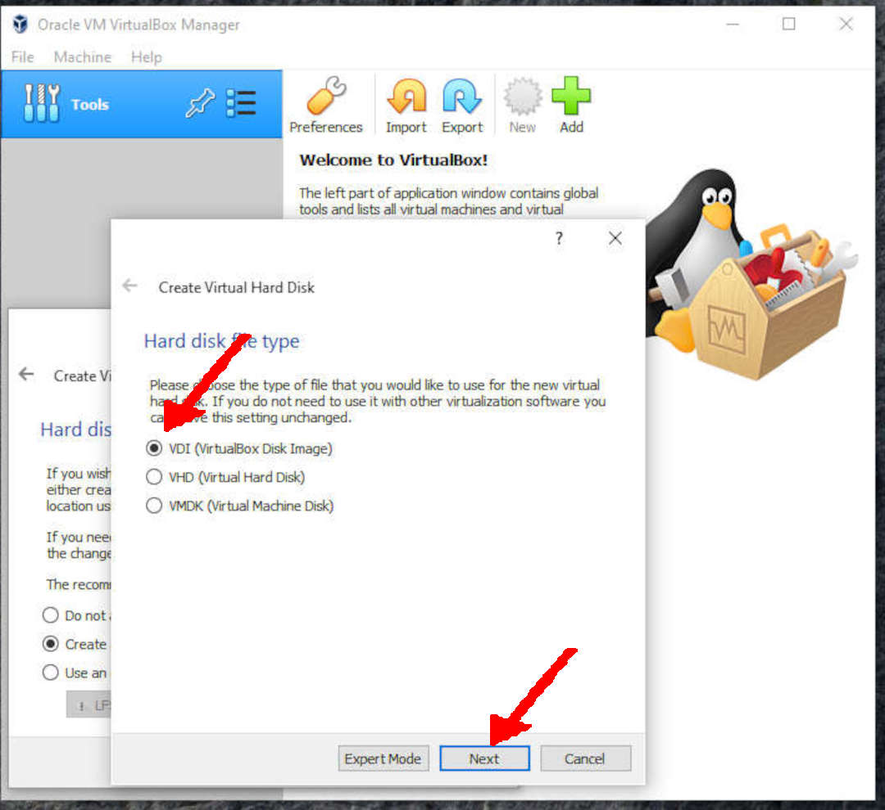
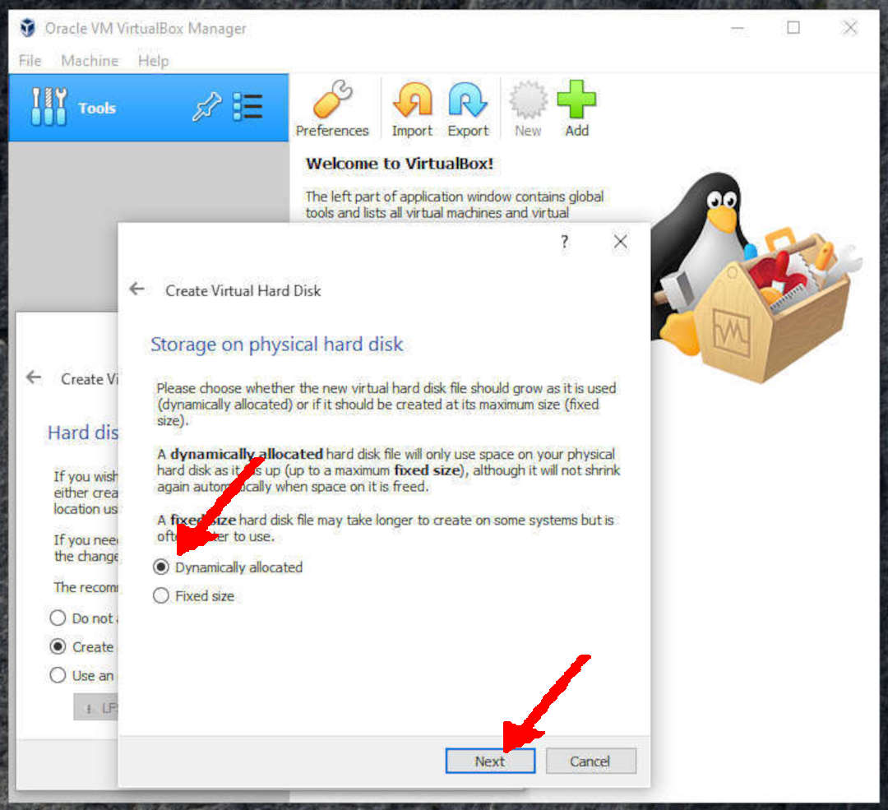
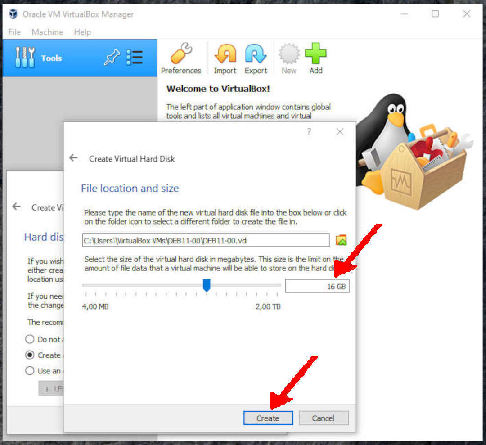

---
---

[HOME](index.md)
[ABOUT](README.md)
[WEB](https://osp4diss.vlsm.org/)
[GITHUB](https://github.com/os2xx/osp4diss)
[TOP](#)
[BOTTOM](#endofpage)
[PREV](index.md#idx02)
[NEXT](DebianGuestExportOva.html)

# Creating a NEW empty VirtualBox Guest

* You should adjust these following according to your own belief and faith.
  * Name: **DEB11-00** (your may choose a different guest name).
  * Processors (Cores): 2 (check your CPU!)
  * Memory = 1024 MB (or more. 512MB is OK too!)
  * Storage1 = 16 GB (dynamically allocated)
  * Storage2 = 32 GB (dynamically allocated)
  * SSH: NAT  from host  (127.0.0.1 port 6022) to guest (10.0.2.15 port 22)
  * Jekyll: NAT from host (127.0.0.1 port 5000) to guest (10.0.2.15 port 4000)

 
## Click NEW

 
* Name = **DEB11-00**
  * Type: Linux
  * Version: Debian (64bit)

 
* Memory size = 1024 MB
  * Try to set for as much memory as possible. 
    Although it can be forced up to 512MB, it will be unreasonably slow.

 
* Create a Virtual Hard Disk

 
* Hard Disk type: VDI

 
* Storage: Dynamically Allocated

 
* Storage = 16 GB (dynamically allocated)

  
## Created (and Done)

[HOME](index.md)
[ABOUT](README.md)
[WEB](https://osp4diss.vlsm.org/)
[GITHUB](https://github.com/os2xx/osp4diss)
[TOP](#)
[BOTTOM](#endofpage)
[PREV](index.md#idx02)
[NEXT](DebianGuestExportOva.html)
 
