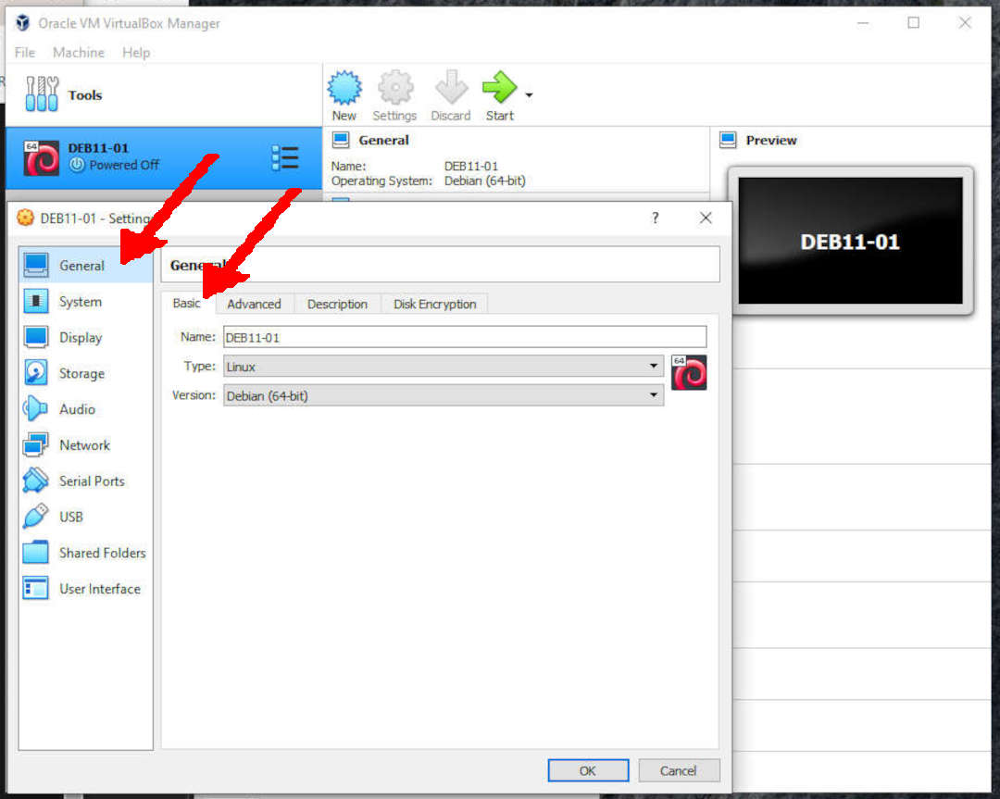
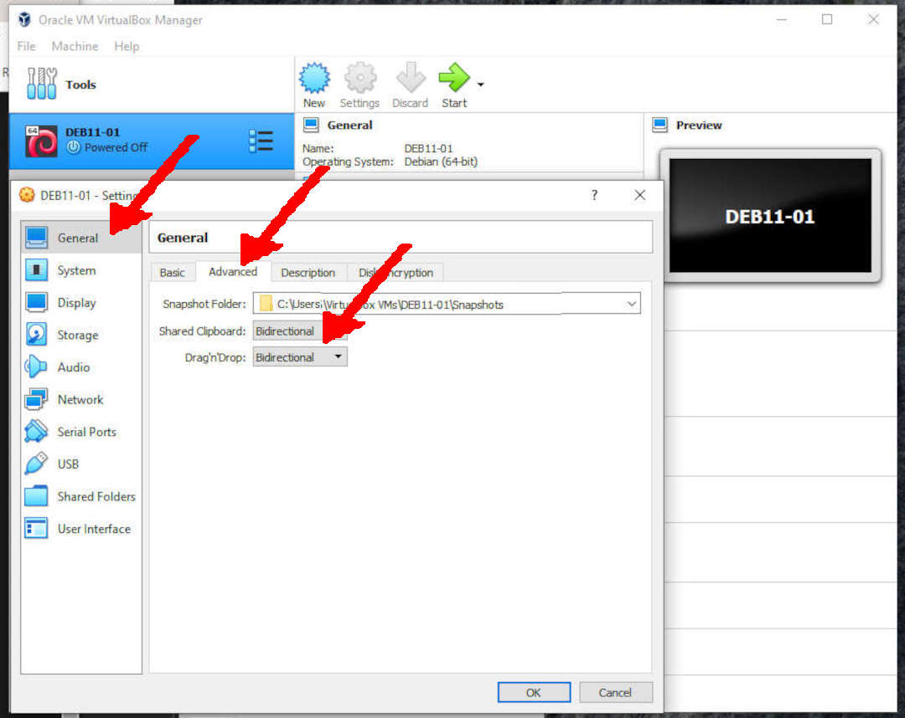

---
---

[HOME](index.md)
[ABOUT](README.md)
[WEB](https://osp4diss.vlsm.org/)
[GITHUB](https://github.com/os2xx/osp4diss)
[TOP](#)
[BOTTOM](#endofpage)
[PREV](DebianGuestExportOva1.md)
[NEXT](DebianGuestOnVirtualBox3.md)

# VirtualBox Guest: General (E.g., DEB11-01)

### Click SETTING

 
### General: Basic

 
### General: Advanced

  

[HOME](index.md)
[ABOUT](README.md)
[WEB](https://osp4diss.vlsm.org/)
[GITHUB](https://github.com/os2xx/osp4diss)
[TOP](#)
[BOTTOM](#endofpage)
[PREV](DebianGuestExportOva1.md)
[NEXT](DebianGuestOnVirtualBox3.md)
 
