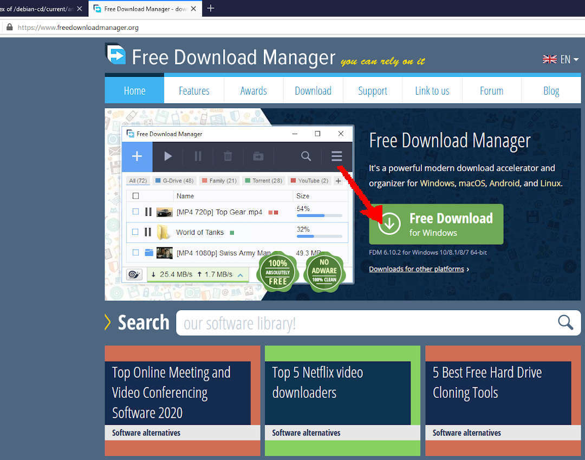
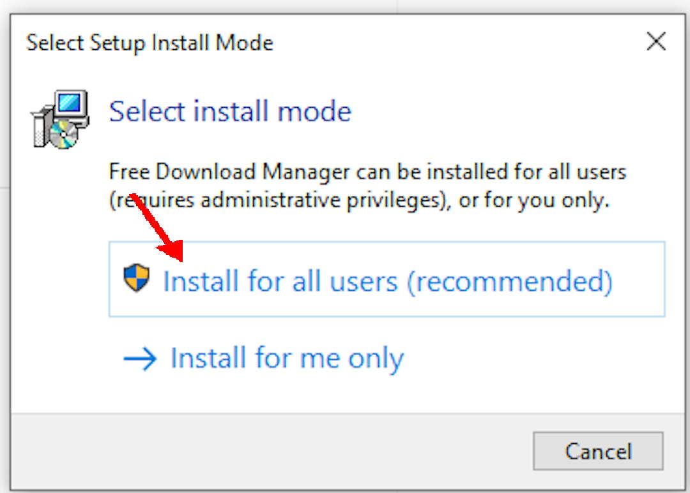
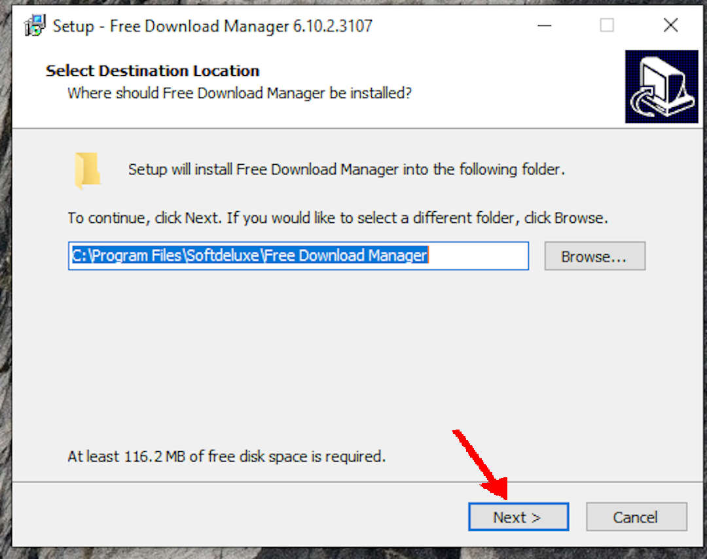
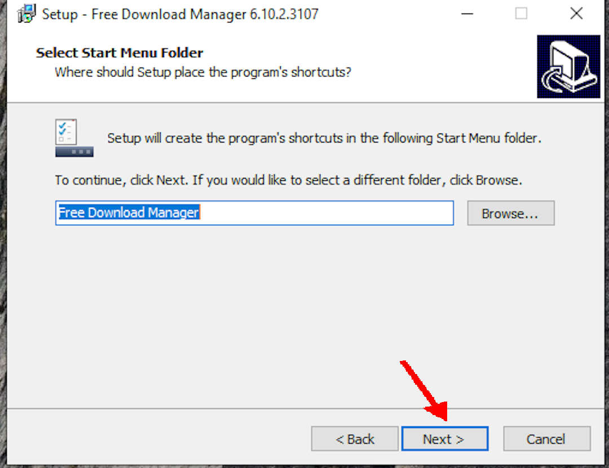
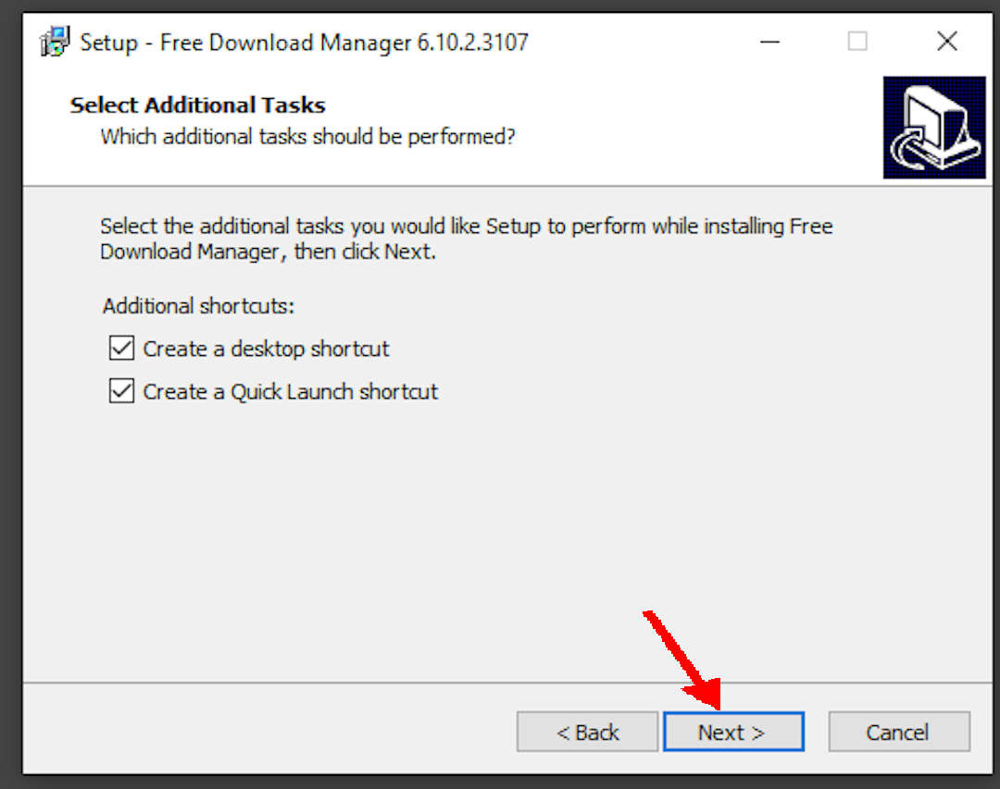
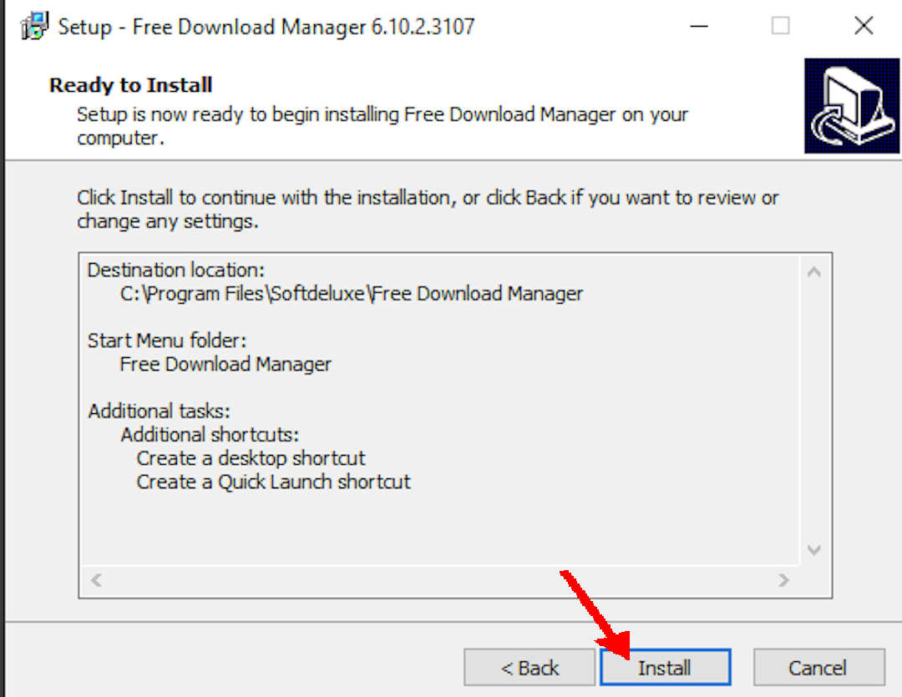
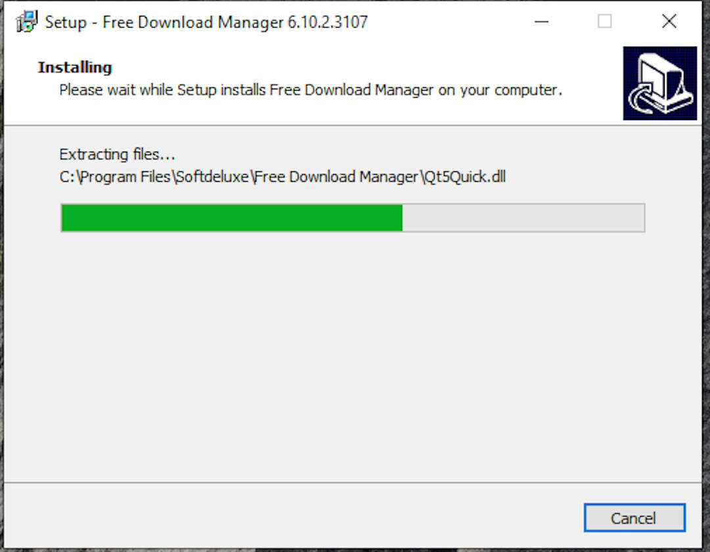
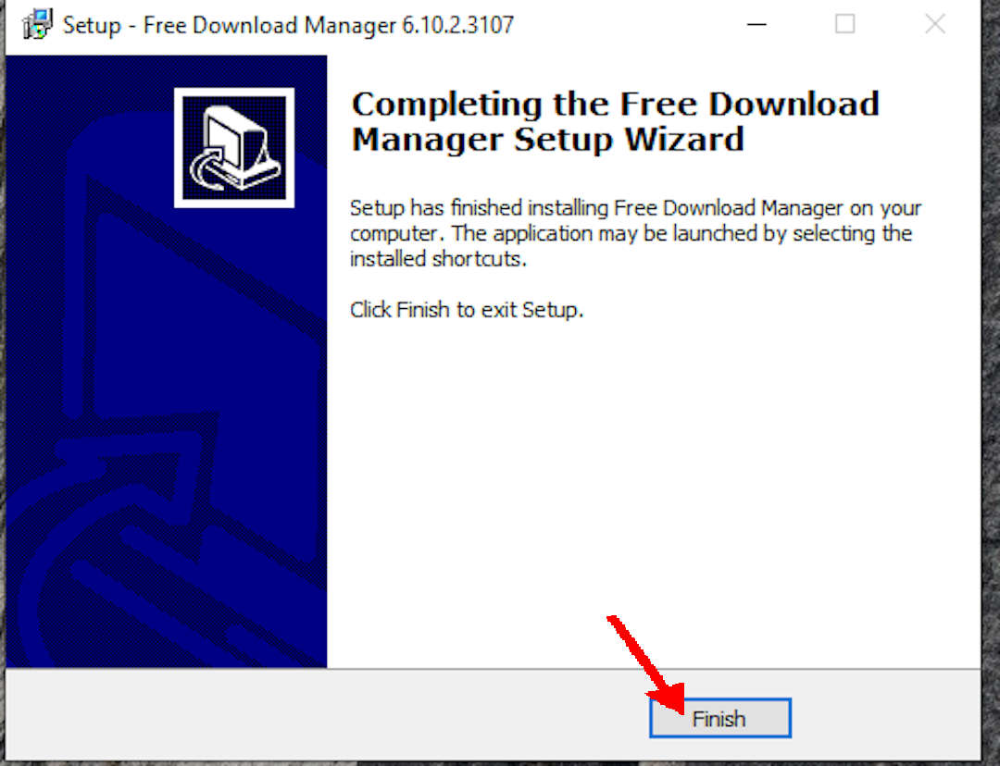
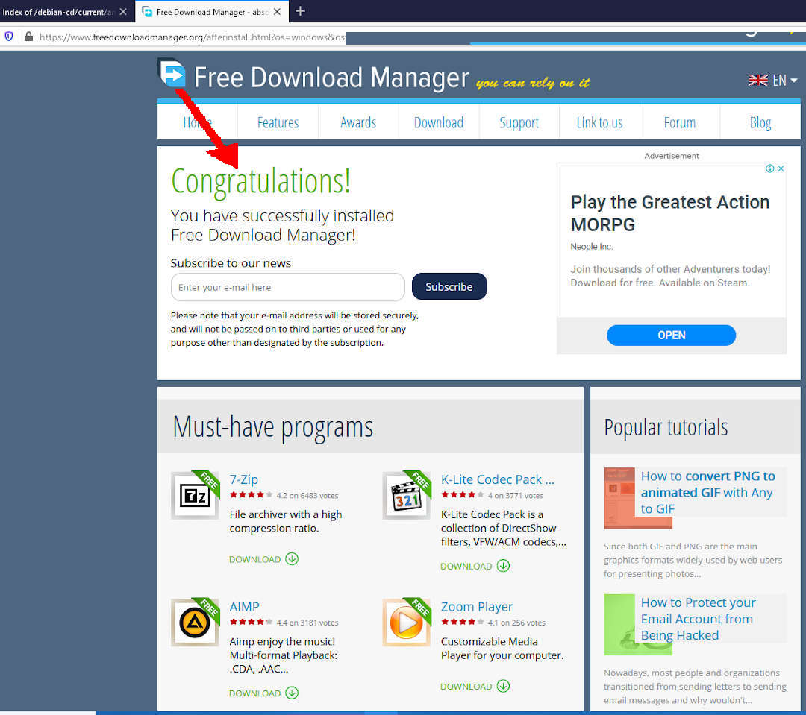

---
---

[HOME](index.md)
[ABOUT](README.md)
[WEB](https://osp4diss.vlsm.org/)
[GITHUB](https://github.com/os2xx/osp4diss)
[TOP](#)
[BOTTOM](#endofpage)
[PREV](index.md#idx00b)
[NEXT](InstallVirtualBox.md)
 

# FDM: Free Download Manager (Optional)

Use this Free Download Manager if your internet link is slow and less reliable.
Otherwise, you can download with a regular browser like Firefox or install the <b>plugin</b> for that browser.

 
## Downloading FDM

### URL: [https://www.freedownloadmanager.org/](https://www.freedownloadmanager.org/)
* NOTE: The current FDM version is
  6.16.2
  (or more).
  THIS IS SUBJECT TO CHANGE!
* In this example, the FDM version is 6.10.2.

 
## Installing FDM

 
## Installing for all users

 
## Congratulations, your FDM is ready!

  

[HOME](index.md)
[ABOUT](README.md)
[WEB](https://osp4diss.vlsm.org/)
[GITHUB](https://github.com/os2xx/osp4diss)
[TOP](#)
[BOTTOM](#endofpage)
[PREV](index.md#idx00b)
[NEXT](InstallVirtualBox.md)
 

