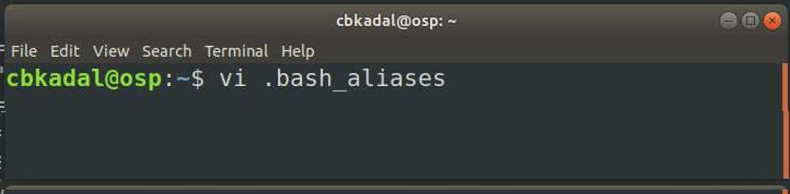
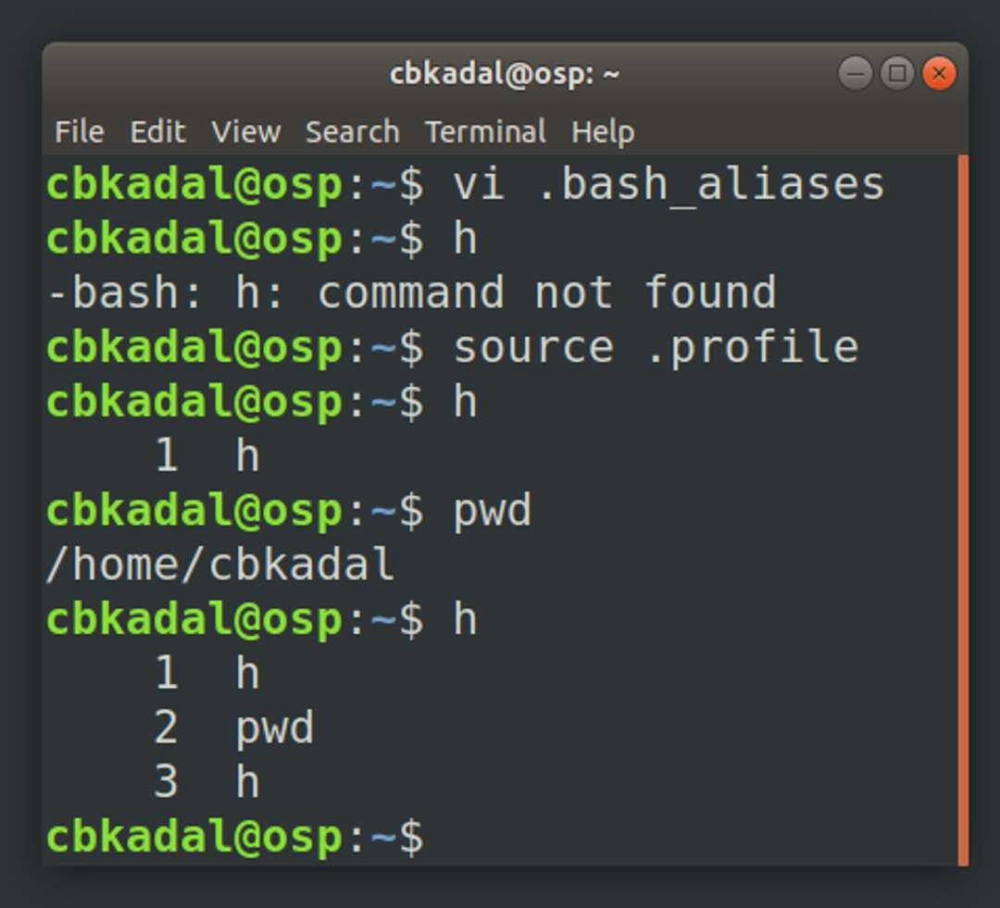

---
---

[HOME](index.md)
[ABOUT](README.md)
[WEB](https://osp4diss.vlsm.org/)
[GITHUB](https://github.com/os2xx/osp4diss)
[TOP](#)
[BOTTOM](#endofpage)
[PREV](Welcome2GNULinux.md)
[NEXT](index.md)

# More Gnu/Linux

<span style="color:red; font-weight:bold; font-size:larger;">
You need an editor for this page. Preferable, the vi (visual) editor.
</span>

* [Super User (root)](#su)
* [Add a user account (eg. dummy)](#adduser)
* [Testing new user dummy](#user-dummy)
* [Account name with Capital Letters (eg. CicakBinKadal)](#bad-name)
* [The .bash_aliases file](#dotbash_aliases)


<br>
## su

* Substitute super-user (root)

### INPUT01

```
su -

```

### OUTPUT01

```
cbkadal@osp:~$ su -
Password: 

root@osp:~# 

```

<br>
## adduser 

* Example, add a new user "dummy".
* (exit) from "root", back to user "cbkadal".

### INPUT02

```
adduser dummy
exit

```

### OUTPUT02

```
root@osp:~# adduser dummy
Adding user `dummy' ...
Adding new group `dummy' (1001) ...
Adding new user `dummy' (1001) with group `dummy' ...
Creating home directory `/home/dummy' ...
Copying files from `/etc/skel' ...
New password: 
Retype new password: 
passwd: password updated successfully
Changing the user information for dummy
Enter the new value, or press ENTER for the default
	Full Name []: Dummy McDumDum
	Room Number []: 
	Work Phone []: 
	Home Phone []: 
	Other []: 
Is the information correct? [Y/n] 

root@osp:~# exit
logout

cbkadal@osp:~$

```

<br>
## User dummy 

* Checking/print working directory (pwd) 
* Substitute (su) user "dummy" from "cbkadal"
* Checking/print working directory (pwd) 
* Exit from user "dummy" back to "cbkadal"

### INPUT03

```
pwd
su - dummy

```
```
pwd
exit

```

### OUTPUT03

```
cbkadal@osp:~$ pwd
/home/cbkadal

cbkadal@osp:~$ su - dummy
Password: 

dummy@osp:~$ pwd
/home/dummy

dummy@osp:~$ exit
logout

cbkadal@osp:~$

```

<br>
## Bad Name

* Bad Name = an Account wiht capital letter(s) 
* Eg. "CicakBinKadal"

### INPUT04

```
adduser CicakBinKadal
adduser --force-badname CicakBinKadal

```

### OUTPUT04

```
root@osp:~# adduser CicakBinKadal
adduser: Please enter a username matching the regular expression configured
via the NAME_REGEX configuration variable.  Use the `--force-badname'
option to relax this check or reconfigure NAME_REGEX.

root@osp:~# adduser --force-badname CicakBinKadal
Allowing use of questionable username.
Adding user `CicakBinKadal' ...
Adding new group `CicakBinKadal' (1002) ...
Adding new user `CicakBinKadal' (1002) with group `CicakBinKadal' ...
Creating home directory `/home/CicakBinKadal' ...
Copying files from `/etc/skel' ...
New password: 
Retype new password: 
passwd: password updated successfully
Changing the user information for CicakBinKadal
Enter the new value, or press ENTER for the default
	Full Name []: Bad Cicak Bin Kadal
	Room Number []: 
	Work Phone []: 
	Home Phone []: 
	Other []: 
Is the information correct? [Y/n] 

root@osp:~# 

```

<br>
##### dotbash_aliases
## Create/Edit your first file: "**.bash_aliases**"
* Go to your HOME directory (ie. "cd").
* Use your favorite editor (vi) to add this following TEXT to file .bash_aliases.
<br>


### COPY and PASTE this following

```
# REV01 Tue 23 Feb 2021 17:23:19 WIB (RMS)
alias cl='clear;echo ""'
alias h='history'  
alias gac='git add -A && git commit'
alias ggg='git pull; git add -A; git commit -m "OS211 cbkadal"; git push;'
alias glog='git log --all --decorate --oneline --graph'
alias mv='mv -i'  
alias rm='rm -i'  
alias sss='. ~/.profile'
# REV01 Mon 05 Oct 2020 09:14:50 AM WIB (RMS)
# START Sat 19 Sep 2020 00:00:00 (RMS)
gitstat() {
   git rev-parse --is-inside-work-tree &> /dev/null
   [ "$?" == "0" ] && git status
   ls -aF
   printf "ZCZC $USER ==== %s ===== PWD:%s\n" "$(date)" $(pwd)
}
# REV02 Mon 05 Oct 2020 07:34:14 AM WIB (RMS)
# REV01 (2020-10-04 07:43 PM UTC+7) Muhamad Yoga Mahendra (aceyoga) 
# START (2020-10-04 03:51 PM UTC+7) Muhamad Yoga Mahendra (aceyoga) 
chktoken() {
    [ -z $1 ] && { 
        echo "Usage: chktoken <token>"
        echo "Example 1) chktoken 0"
        echo "           $(chktoken 0)"
        echo "Example 2) chktoken 1"
        echo "           $(chktoken 1)"
        echo "Example 3) chktoken XXXX"
        echo "           $(chktoken XXXX)"
        echo "Is $USER your GitHub Account?"
        echo "If not, please create a new user name!"
        return 0
    } || [ $1 == 0 ] && {
        echo "0"
        return 0
    } || [ $1 == 1 ] && {
        echo "$USER"
        return 0
    } || {
        STAMP=$(date +%M%S)
        echo "$USER $STAMP-$(echo $STAMP$USER$1 | sha1sum  | cut -c1-4 | tr '[:lower:]' '[:upper:]'  )"
        return 0
    }
}
# REV04 Mon 12 Oct 2020 11:39:44 PM WIB (RMS)
# REV03 Mon Oct  5 09:25:23 WIB 2020 (RMS)
# REV01 (2020-10-04 07:43 PM UTC+7) Muhamad Yoga Mahendra (aceyoga)
# START (2020-10-04 03:51 PM UTC+7) Muhamad Yoga Mahendra (aceyoga)
verifyToken() {
    [ -z $3 ] && {
        echo "verifyToken()"
        echo "Usage: verifyToken TOKEN USER RESULT"
        echo "Or:    verifyToken TOKEN USER RESULT trueFalseMode"
        return 0
    }
    DATE="$(echo $3 | cut -d' ' -f2 | cut -d'-' -f1)"
    SHA="$(echo  $3 | cut -d' ' -f2 | cut -d'-' -f2 )"
    RESULT="$(echo $DATE$2$1 | sha1sum  | cut -c1-4 | tr '[:lower:]' '[:upper:]' )"
    [ $SHA == $RESULT ] && RETURN="1" || RETURN="0"
    [ -z $4 ] && {
        [ "$RETURN" == "1" ] && echo "Verified"  || echo "Error"
    } || {
        echo $RETURN
    }
}
export EDITOR=/usr/bin/vi
export HISTSIZE=2000
export HISTFILESIZE=2000 

```

* Having problem with "COPY and PASTE" in vi?
  *Add "syntax off" to your ".vimrc" file!

<br>
<br>
## Testing ".bash_aliases"
### "h" is an alias for "history"
```
h
source ~/.profile
h
```



<br id="endofpage"><br>

[HOME](index.md)
[ABOUT](README.md)
[WEB](https://osp4diss.vlsm.org/)
[GITHUB](https://github.com/os2xx/osp4diss)
[TOP](#)
[BOTTOM](#endofpage)
[PREV](Welcome2GNULinux.md)
[NEXT](index.md)
<br>

