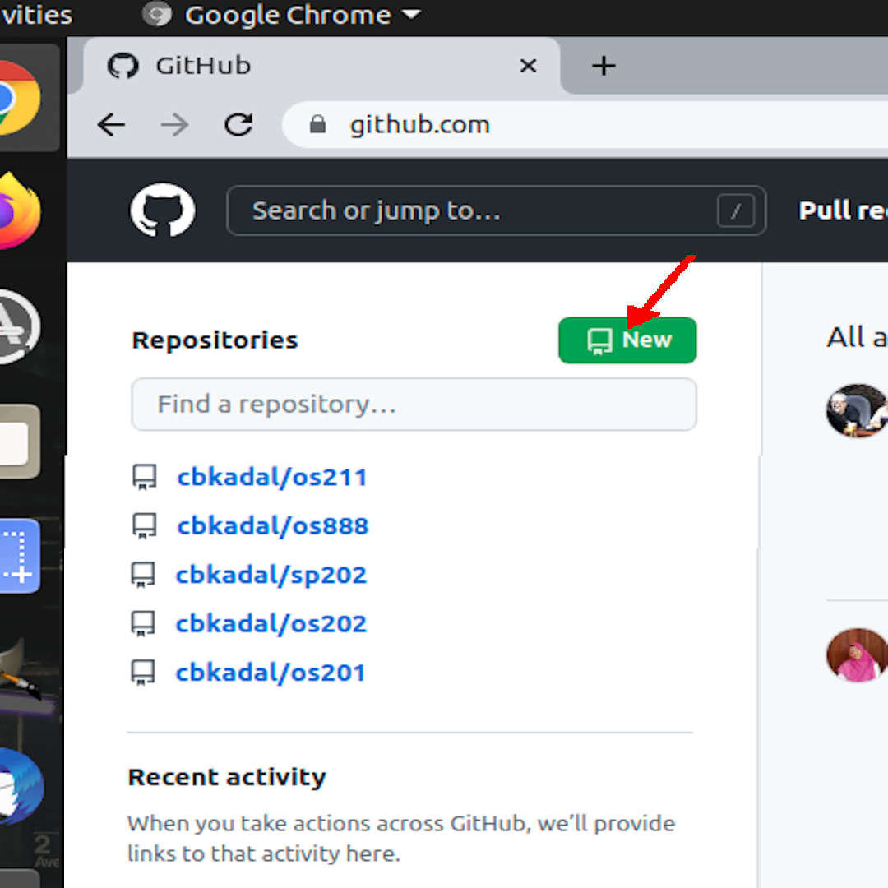
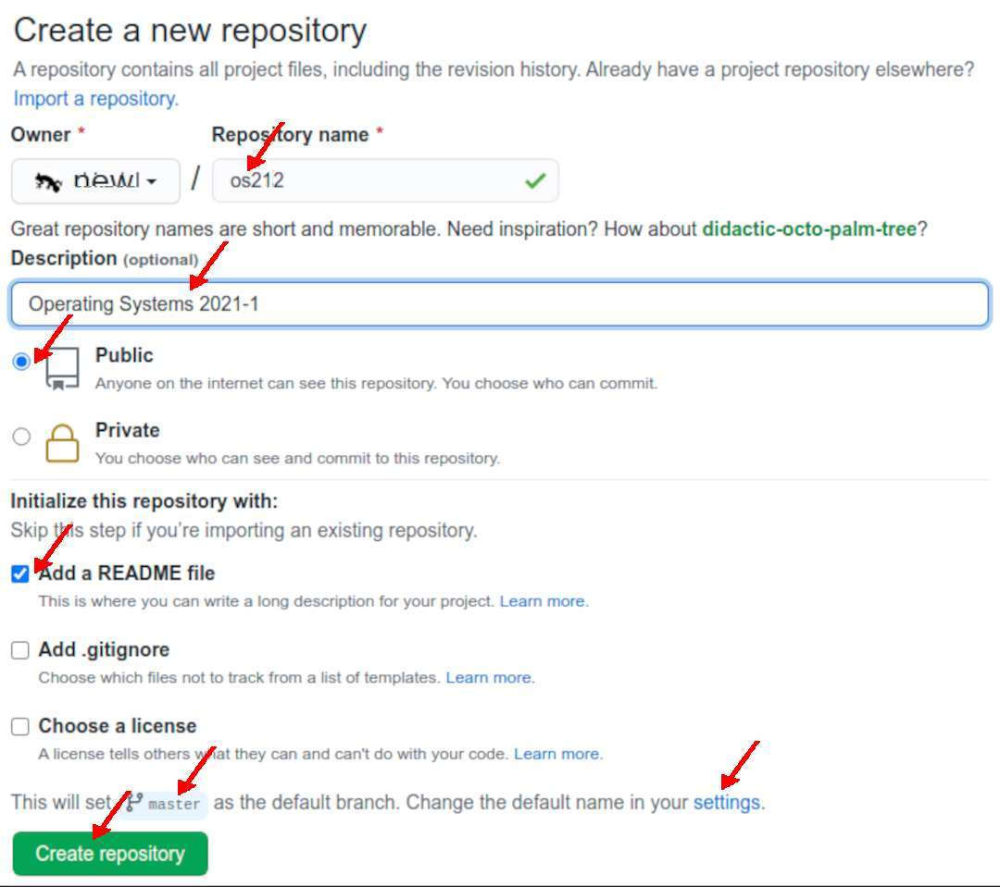

---
---
[HOME](index.md)
[ABOUT](README.md)
[WEB](https://osp4diss.vlsm.org/)
[GITHUB](https://github.com/os2xx/osp4diss/)
[TOP](#)
[BOTTOM](#endofpage)
[PREV](ASP.md#idx00)
[NEXT](S00-02.md)

[&#x213C;](#endofpage) 
# SP Week 00 Assignment #1: GitHub Account

* Assignments will be submitted to GitHub and displayed on GitHub Page.
* Visit <https://github.com>:
  * SIGN UP if you have no account: (<https://github.com/join/>).
    GitHub accounts are not case-sensitive.
    Unfortunately, Linux accounts are!
    Preferably, use all lowercase characters for your GitHub account.
  * Else, SIGN IN: (<https://github.com/login/>)
* E.g., see also <https://github.com/cbkadal/sp231/>.
  * But always REMEMBER,
  you are not "cbkadal"!
  Always replace "cbkadal" with your
  own
  GitHub account.

[&#x213C;](#) 
## Create a new Repository (sp231)
  * Repository name, e.g:
    * "sp231" for year 2023-1 (even semester 2022/2023),
    * "sp232" for year 2023-2 (odd semester 2023/2024),
    * "sp241" for year 2024-1 (even semester 2023/2024),
    * "sp242" for year 2024-2 (odd semester 2024/2025),
    * "sp251" for year 2025-1 (even semester 2024/2025),
    * "sp252" for year 2025-2 (odd semester 2025/2026),
    * Note: For "sp" use lowercase. Do not use uppercase!
  * **Description**: (e.g.) System Programming 2023-1 (Even Semester 22/23).
  * **Public**: Anyone can see this repository.
  * A simple **README.md** file.
  * The
    following is an example from a past year (os212)
  

  

[&#x213C;](#) 
## Default Branch

* The GitHub Default Branch Name Is Now "main"
  * To be "politically correct," GitHub has changed the default branch
    name from ”master” to ”main.”
  * Many past examples here have been using the "master" branch name.
  * Therefore -- for being consistent -- the "master" branch name will
    continue to be used.
  * Feel free to use either "main" or "master." However, once it has been
    chosen, you should not alter your branch name.
  * To change the default branch name, click "settings."

[&#x213C;](#)  
[HOME](index.md)
[ABOUT](README.md)
[WEB](https://osp4diss.vlsm.org/)
[GITHUB](https://github.com/os2xx/osp4diss)
[TOP](#)
[BOTTOM](#endofpage)
[PREV](ASP.md#idx00)
[NEXT](S00-02.md)
 

