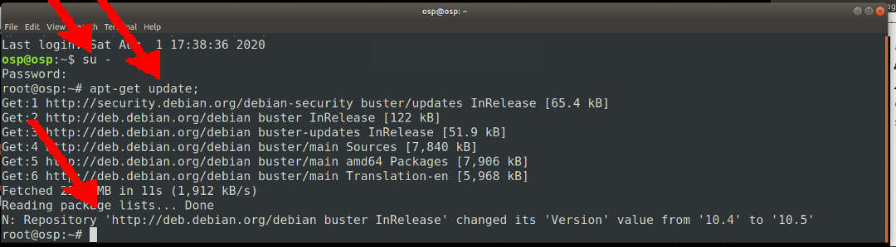
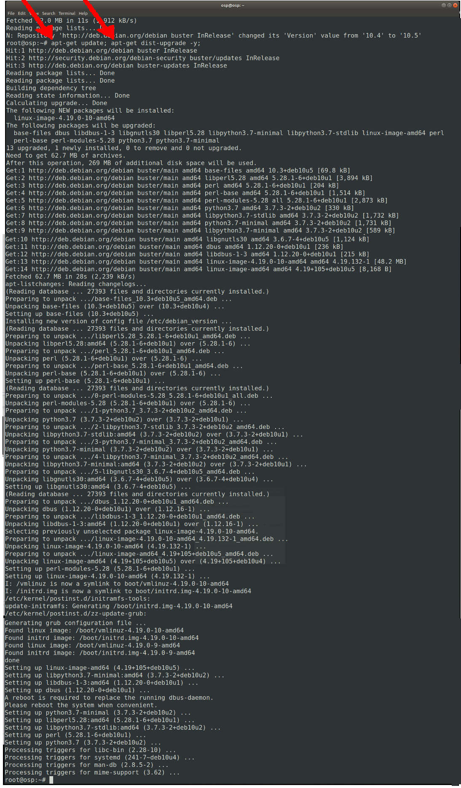

---
---

[HOME](index.md)
[ABOUT](README.md)
[WEB](https://osp4diss.vlsm.org/)
[GITHUB](https://github.com/os2xx/osp4diss)
[TOP](#)
[BOTTOM](#endofpage)
[PREV](SSHGuest.md)
[NEXT](MoreDebianPackages.md)

# Update Debian

* Username: cbkadal (or whatever)

```
ssh -p 6022 cbkadal@localhost
```


```
# You need the "root" password
su -
apt-get update;
```



```
apt-get update; apt-get dist-upgrade -y;
```



<br id="endofpage"><br>

[HOME](index.md)
[ABOUT](README.md)
[WEB](https://osp4diss.vlsm.org/)
[GITHUB](https://github.com/os2xx/osp4diss)
[TOP](#)
[BOTTOM](#endofpage)
[PREV](SSHGuest.md)
[NEXT](MoreDebianPackages.md)
<br>

