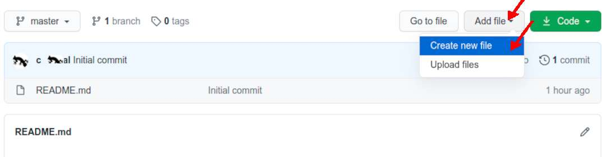
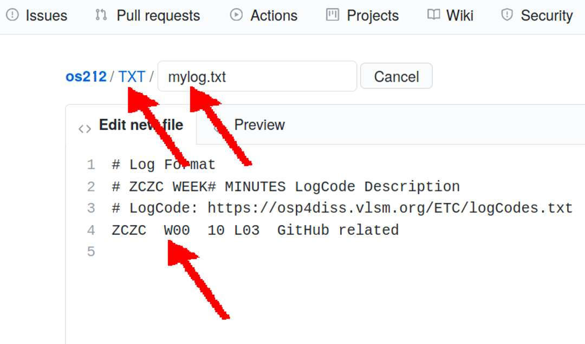

---
---
[HOME](index.md)
[ABOUT](README.md)
[WEB](https://osp4diss.vlsm.org/)
[GITHUB](https://github.com/os2xx/osp4diss/)
[TOP](#)
[BOTTOM](#endofpage)
[PREV](W00-01.md)
[NEXT](W00-03.md)

# OS Week 00 Assignment #2: "TXT/mylog.txt"

## Start Week 00 Log

* See <https://osp4diss.vlsm.org/ETC/logCodes.txt>

[&#x213C;](#endofpage) 
## Add file --> Create a new file

* The 
  following is an example from the year 2021 (os212)

[&#x213C;](#) 
## Folder/File: "TXT/mylog.txt"

* The 
  following is an example from year 2021 (os212)

[&#x213C;](#) 
## Commit a new file

[&#x213C;](#)  
[HOME](index.md)
[ABOUT](README.md)
[WEB](https://osp4diss.vlsm.org/)
[GITHUB](https://github.com/os2xx/osp4diss)
[TOP](#)
[BOTTOM](#endofpage)
[PREV](W00-01.md)
[NEXT](W00-03.md)
 

