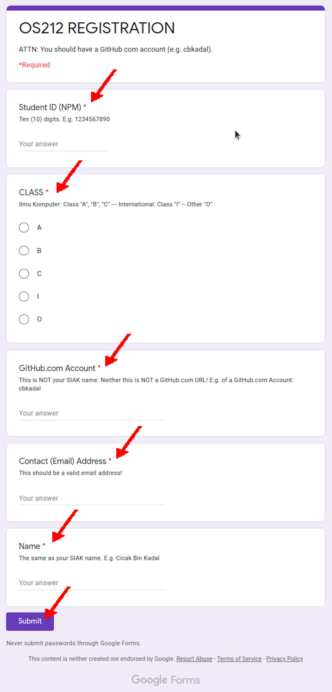

---
---
[HOME](index.md)
[ABOUT](README.md)
[WEB](https://osp4diss.vlsm.org/)
[GITHUB](https://github.com/os2xx/osp4diss/)
[TOP](#)
[BOTTOM](#endofpage)
[PREV](W00-03.md)
[NEXT](W00-05.md)

# OS Week 00 Assignment #4: Course Registration (Google Form)

* You should have a [GitHub.com](https://github.com/) account.
* First, you need to log in (login) with your Google account by visiting:
  <https://accounts.google.com/>.
* Next, visit the Google Form 
  ([see SCELE](https://scele.cs.ui.ac.id/mod/forum/discuss.php?d=45533)) 
  and fill in the following information into the Google Form:
  * Student ID (NPM)
  * Class A, B, C, I (Int) (this
    information is subject to change)
  * GitHub.com Account
    * GitHub Account example: "cbkadal".
    * "github.com/cbkadal/" is not a GitHub account name.
    *  But always REMEMBER,
         you are not "cbkadal"!
         Always replace "cbkadal" with your
         own
         GitHub account.
  * Email contact
    * Fill in with the email address that you usually use.
  * Your Full (SIAK) Name:
    * Use your SIAK name, NOT your NICK name.
  * If you make a mistake, revisit the Google Form page.

[&#x213C;](#) 
## The following is an example from the year 2021 (os212)

  
[HOME](index.md)
[ABOUT](README.md)
[WEB](https://osp4diss.vlsm.org/)
[GITHUB](https://github.com/os2xx/osp4diss)
[TOP](#)
[BOTTOM](#endofpage)
[PREV](W00-03.md)
[NEXT](W00-05.md)
 

