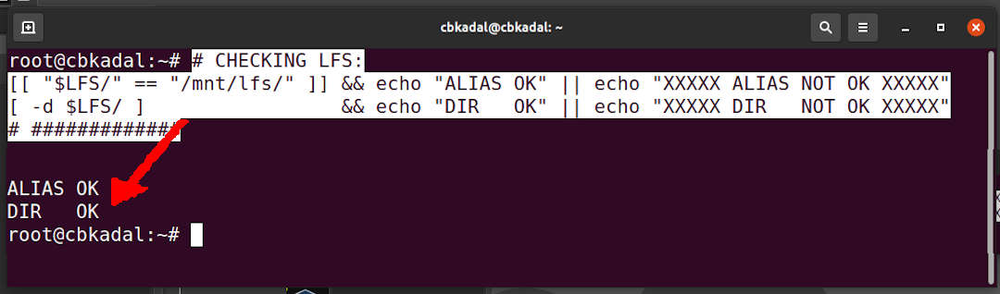
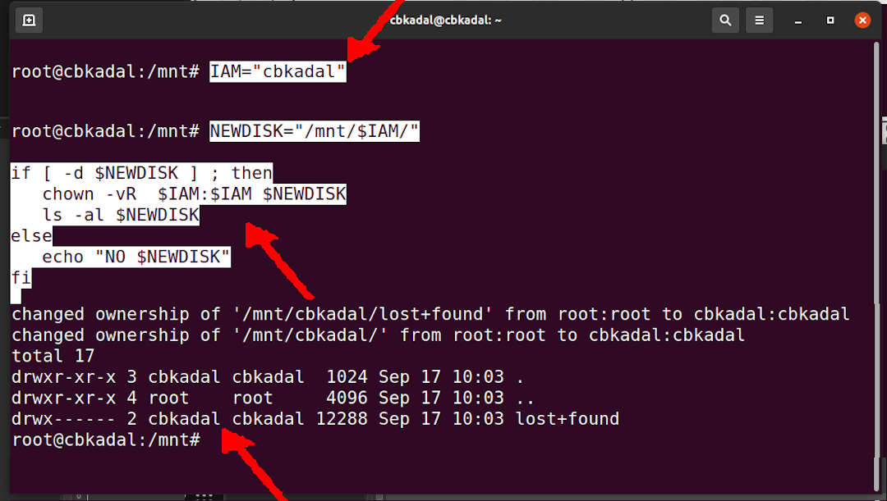
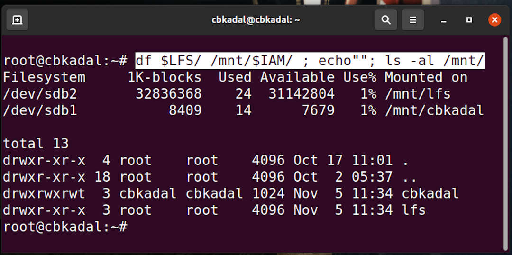

---
---
[HOME](index.md)
[ABOUT](README.md)
[WEB](https://osp4diss.vlsm.org/)
[GITHUB](https://github.com/os2xx/osp4diss/)
[TOP](#)
[BOTTOM](#endofpage)
[PREV](W03-01.md)
[NEXT](AOS.md#idx03)

[&#x213C;](#endofpage)<br id="idx00">
# OS Week 03 Assignment #2: Add/Create An Extra Virtual Disk

## Shutdown the guest

* Add/create an extra disk with your Hypervisor (VirtualBox or UTM)

### VirtualBox
* Visit <https://doit.vlsm.org/015.html>
  * Crosscheck /dev/sdb (<span style="color:red; font-weight:bold; font-size:larger;">root mode</span>)
  * VirtualDisk Format  (<span style="color:red; font-weight:bold; font-size:larger;">root mode</span>)
  * Mounting /mnt/lfs   (<span style="color:red; font-weight:bold; font-size:larger;">root mode</span>)
  * Add to /etc/fstab   (<span style="color:red; font-weight:bold; font-size:larger;">root mode</span>)

### UTM MacOs Silicon
* Visit <https://doit.vlsm.org/016.html>
  * Crosscheck /dev/vdb (<span style="color:red; font-weight:bold; font-size:larger;">root mode</span>)
  * VirtualDisk Format  (<span style="color:red; font-weight:bold; font-size:larger;">root mode</span>)
  * Mounting /mnt/lfs   (<span style="color:red; font-weight:bold; font-size:larger;">root mode</span>)
  * Add to /etc/fstab   (<span style="color:red; font-weight:bold; font-size:larger;">root mode</span>)

[&#x213C;](#)<br id="idx02">
## Is $LFS == /mnt/lfs ?
* Make sure that LFS is /mnt/lfs
* Execute (<span style="color:red; font-weight:bold; font-size:larger;">root mode</span>):

```
# CHECKING LFS:
[[ "$LFS/" == "/mnt/lfs/" ]] && echo "ALIAS OK" || echo "XXXXX ALIAS NOT OK XXXXX"
[ -d $LFS/ ]                 && echo "DIR   OK" || echo "XXXXX DIR   NOT OK XXXXX"
# #############


```

[&#x213C;](#)<br id="idx03">

<br>

<span style="color:red; font-weight:bold; font-size:larger;">
STOP/RETURN: if "ALIAS OR DIR IS NOT OK"</span>

[&#x213C;](#)<br id="idx04">
## Create A New Directory (<span style="color:red; font-weight:bold; font-size:larger;">root mode</span>)
* Directory Name: GitHub-Account (e.g. "cbkadal").
* Change directory owner/group to your account.
  * You are not <span style="color:red; font-weight:bold; font-size:larger;">cbkadal</span>! Replace <span style="color:red; font-weight:bold; font-size:larger;">cbkadal</span> with your GitHub Account.

```
IAM="cbkadal"

```

```
NEWDISK="/mnt/$IAM/"

if [ -d $NEWDISK ] ; then
   chown -vR  $IAM:$IAM $NEWDISK
   ls -al $NEWDISK
else
   echo "NO $NEWDISK"
fi

```

<br>


[&#x213C;](#)<br id="idx05">

## (<span style="color:red; font-weight:bold; font-size:larger;">root mode</span>)

```
df $LFS/ /mnt/$IAM/ ; echo""; ls -al /mnt/

```

<br>


## <span style="color:red; font-weight:bold; font-size:larger;">NOTE</span>

For UTM MacOs Silicon, replace each device such as /dev/sda with device /dev/vda etc.

[&#x213C;](#)<br id="endofpage"><br>
[HOME](index.md)
[ABOUT](README.md)
[WEB](https://osp4diss.vlsm.org/)
[GITHUB](https://github.com/os2xx/osp4diss/)
[TOP](#)
[BOTTOM](#endofpage)
[PREV](W03-01.md)
[NEXT](AOS.md#idx03)
<br>

