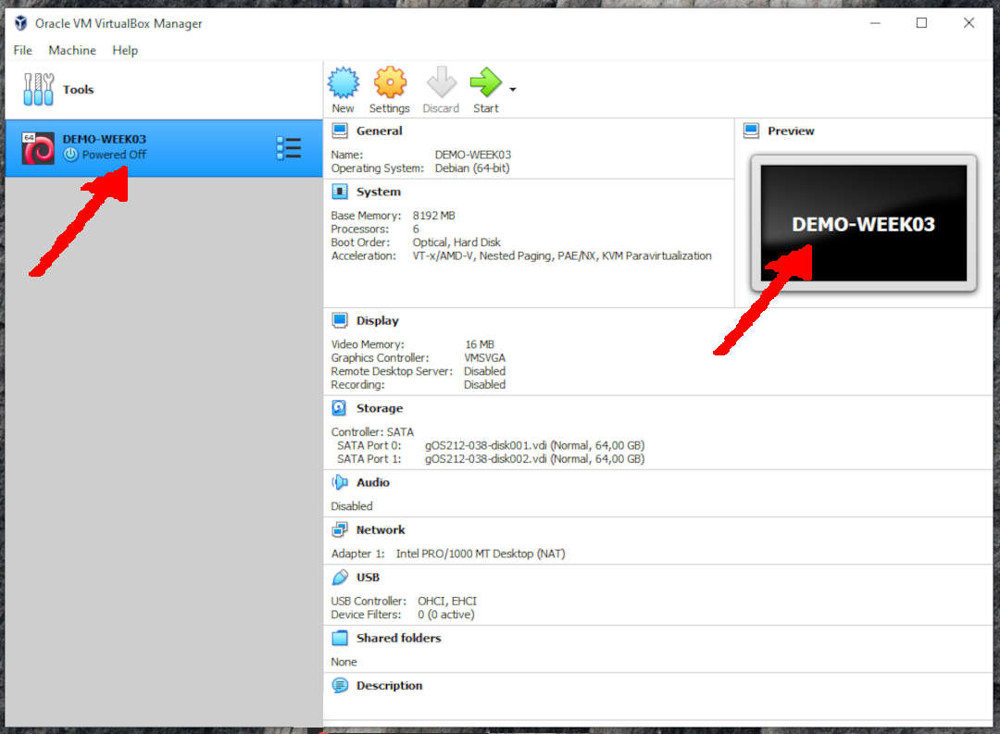
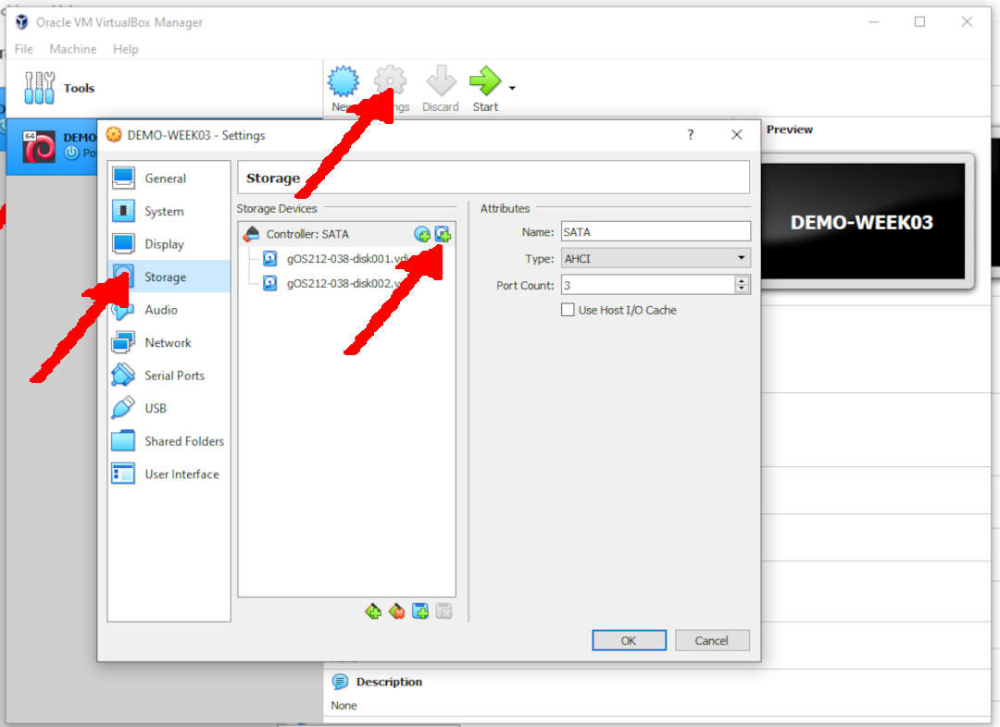
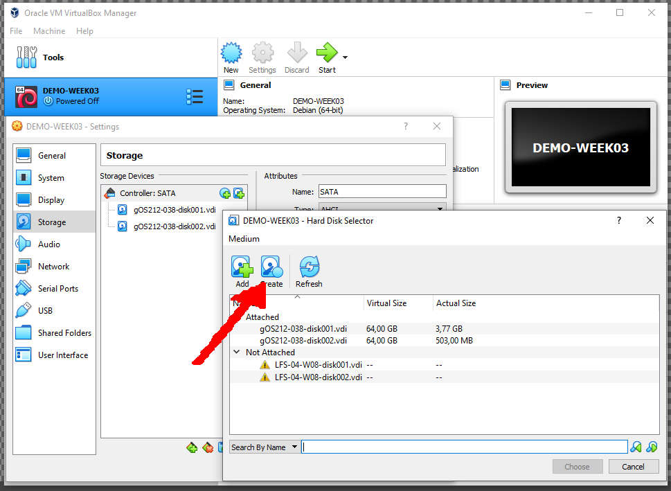
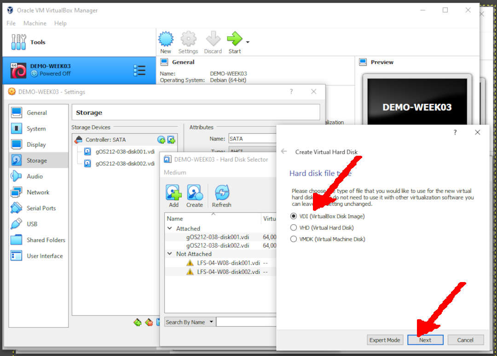
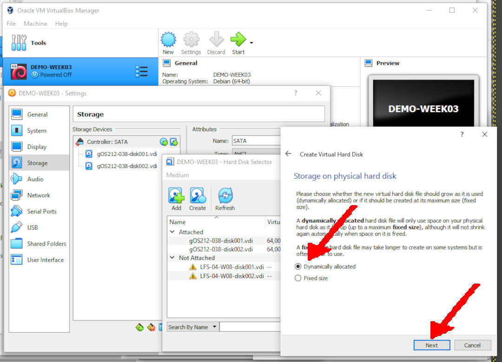
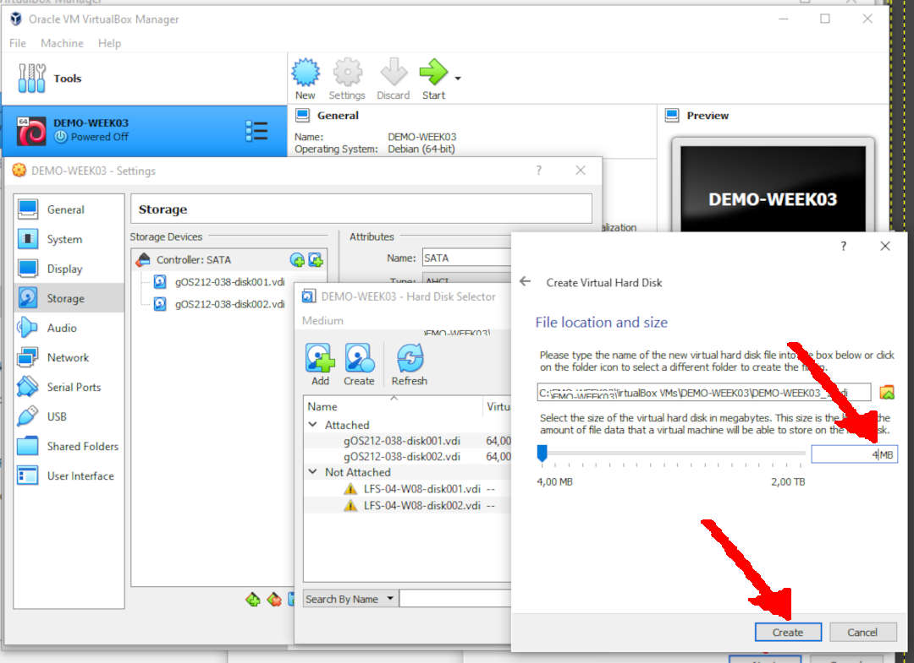
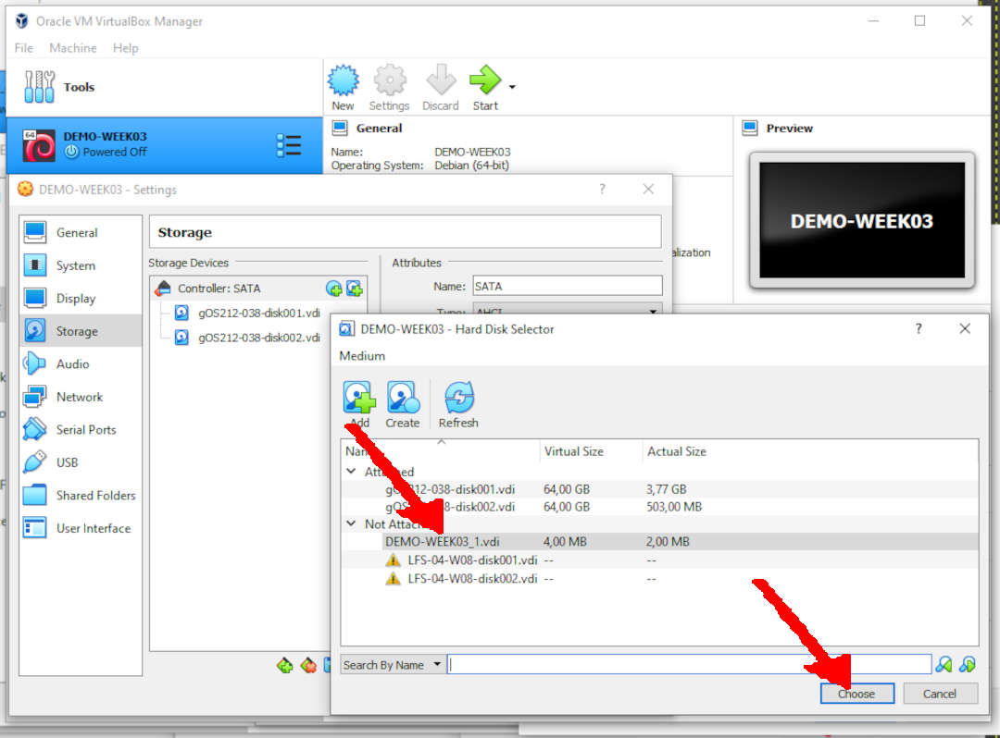
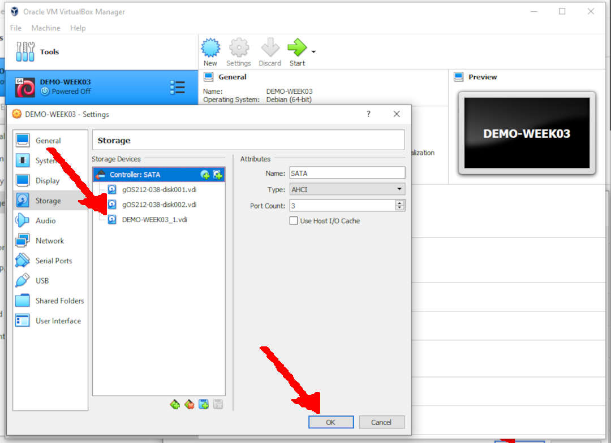
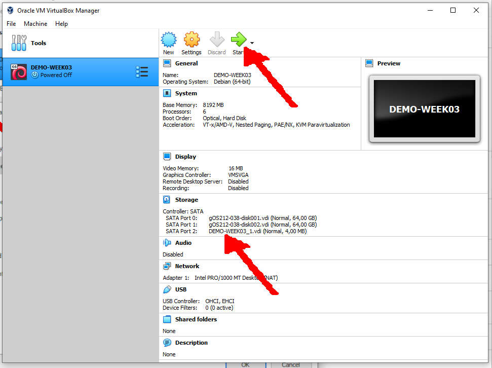

---
---
[HOME](index.md)
[ABOUT](README.md)
[WEB](https://osp4diss.vlsm.org/)
[GITHUB](https://github.com/os2xx/osp4diss/)
[TOP](#)
[BOTTOM](#endofpage)
[PREV](W03-02.md)
[NEXT](W03-04.md)

# Run the VirtualBox Manager

## Rename Virtual Guest (e.g. DEMO-WEEK03)

* This is for VirtualBox only.
  * For UTM M1, see [https://osp4diss.vlsm.org/osp-129.html](osp-129.md).
* Load your last OVA file
* Rename the guest (e.g. DEMO-WEEK03)
  * You may choose other names!

 
## Select SETTING

* Select: **STORAGE**
* Controller: SATA --> Adds Hard Disks

 
## Hard Disk Selector

* **CREATE**

 
## Hard Disk File Type

* Select VDI (Virtual Disk Image)

 
## Storage On Physical Hard Disk

* Dynamically Allocated

 
## File Location And Size

* Select your last digit of your Student ID (NPM). E.g.
  * For ID="1234567890", the last digit is "0".
* Add your last digit to 4 MB. E.g.
  * Last Digit = 0, the disk size is 4 MB.
  * Last Digit = 1, the disk size is 5 MB.
  * Last Digit = 2, the disk size is 6 MB.
  * Last Digit = 3, the disk size is 7 MB.
  * ...
  * Last Digit = N, the disk size is (4+N) MB.

 
## (Backto) Hard Disk Selector

* Choose File Name: (E.g.) DEMO-WEEK03_01.vdi

 
## (Backto) Storage

  Start the Virtual Guest

  
[HOME](index.md)
[ABOUT](README.md)
[WEB](https://osp4diss.vlsm.org/)
[GITHUB](https://github.com/os2xx/osp4diss)
[TOP](#)
[BOTTOM](#endofpage)
[PREV](W03-02.md)
[NEXT](W03-04.md)
 

