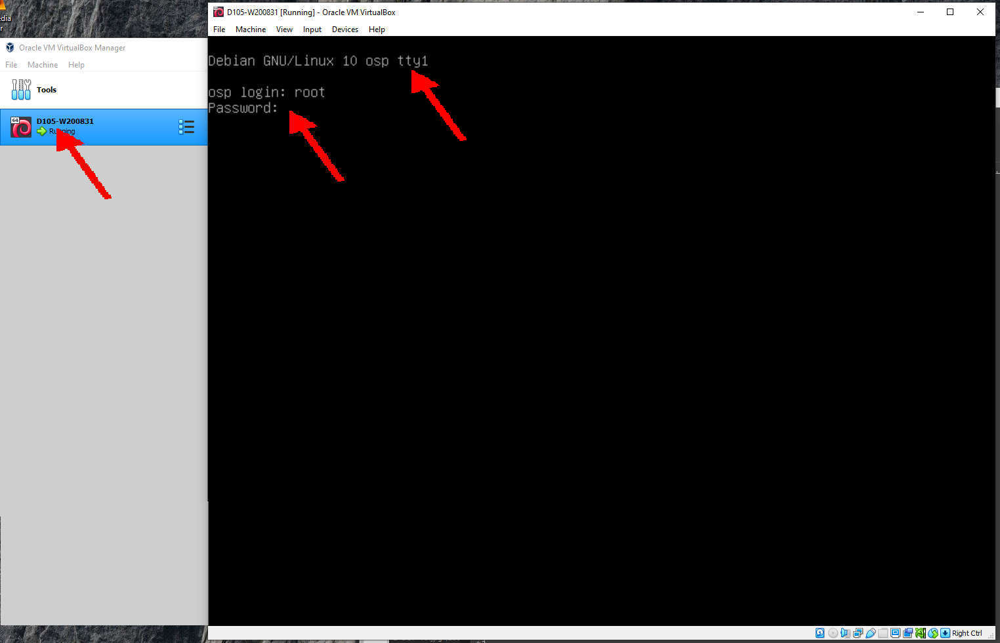
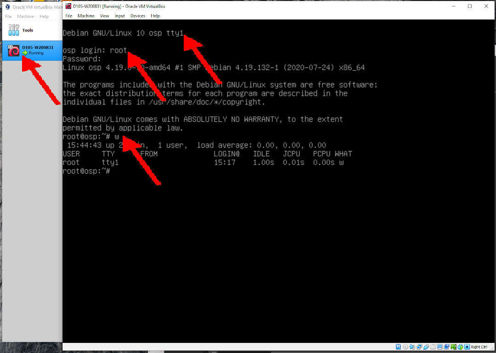
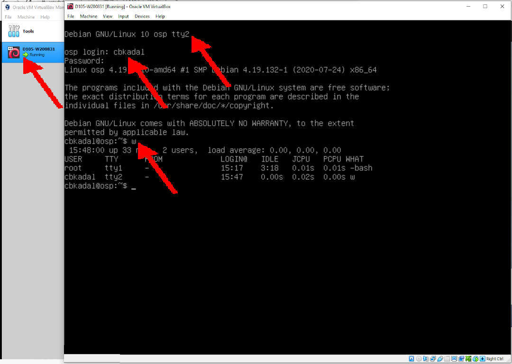

---
---

[HOME](index.md)
[ABOUT](README.md)
[WEB](https://osp4diss.vlsm.org/)
[GITHUB](https://github.com/os2xx/osp4diss)
[TOP](#)
[BOTTOM](#endofpage)
[PREV](osp-002-startup.md)
[NEXT](osp-002-shutdown.md)

## (HOST KEY)

* Linux: &lt;CTRL RIGHT>
* Windows: &lt;CTRL ALT>

<br>
# login from console (tty1)

* HIT (HOST KEY) F1
* User: root



<br>
* who is there (w)

```
w

```
<br>



<br>
## HIT (HOST KEY) F2

* login from tty2 as "cbkadal" (or whatever your username is)
* who is there (w)

```
w

```

<br>


<br id="endofpage"><br>

[HOME](index.md)
[ABOUT](README.md)
[WEB](https://osp4diss.vlsm.org/)
[GITHUB](https://github.com/os2xx/osp4diss)
[TOP](#)
[BOTTOM](#endofpage)
[PREV](osp-002-startup.md)
[NEXT](osp-002-shutdown.md)
<br>

