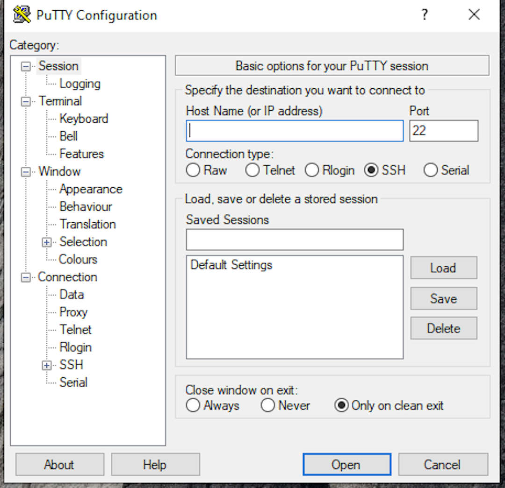
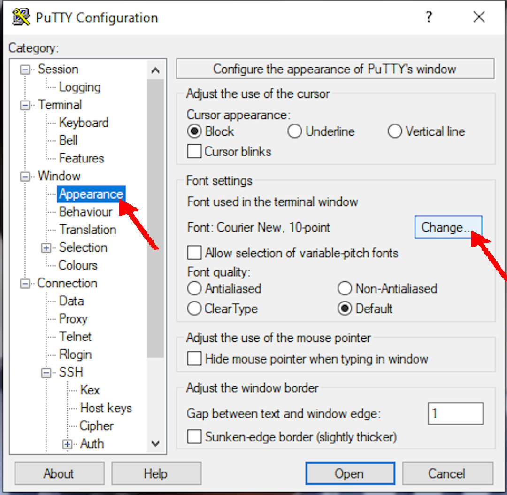
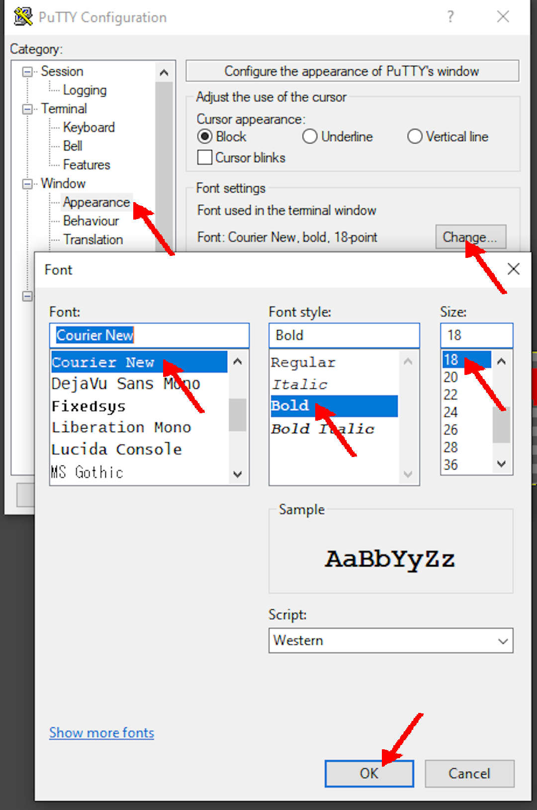
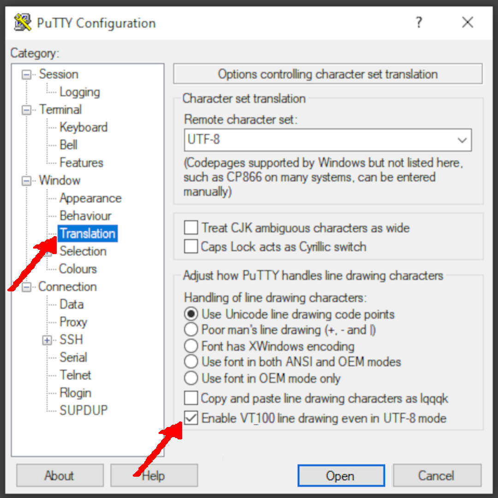
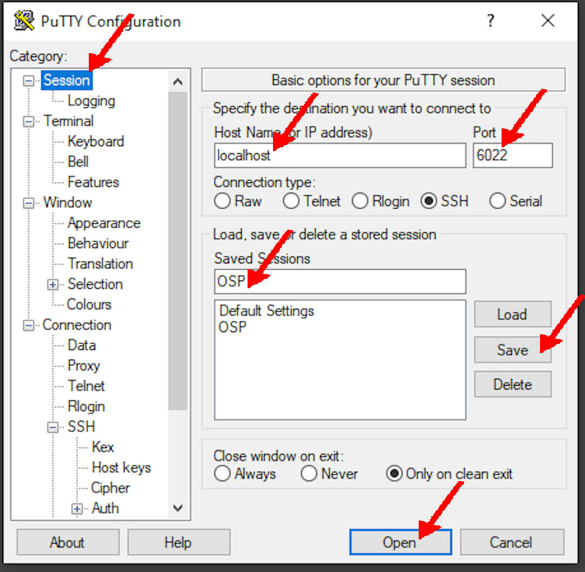
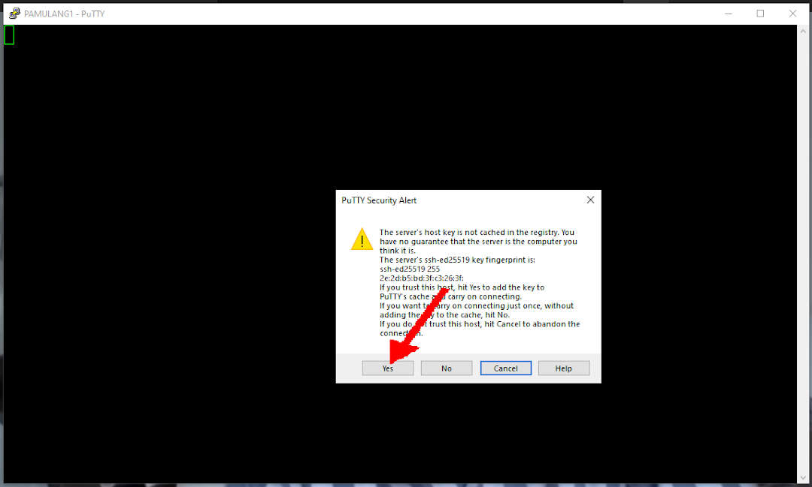
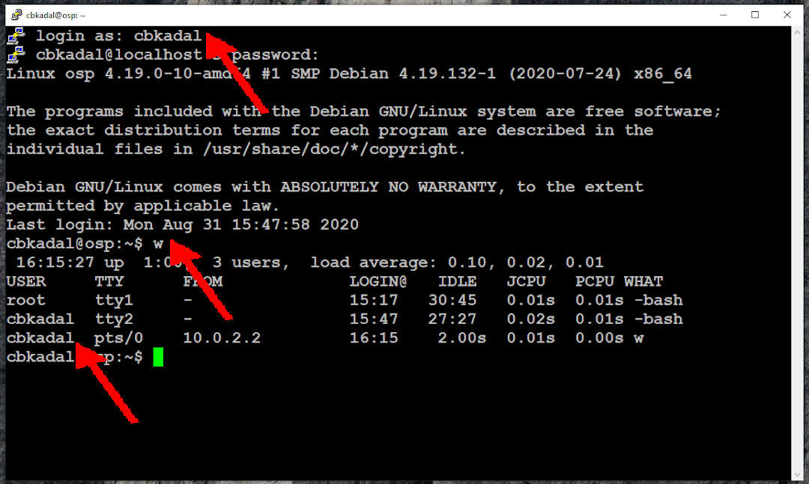
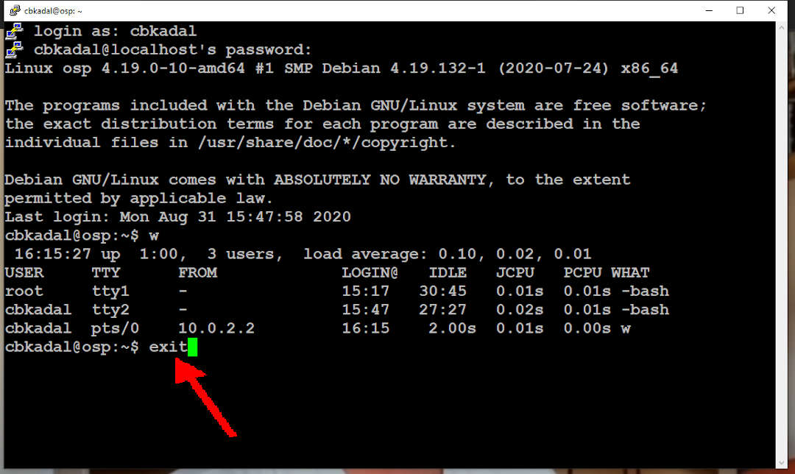

---
---

[HOME](index.md)
[ABOUT](README.md)
[WEB](https://osp4diss.vlsm.org/)
[GITHUB](https://github.com/os2xx/osp4diss)
[TOP](#)
[BOTTOM](#endofpage)
[PREV](osp-002-shutdown.md)
[NEXT](osp-002-ssh.md)

<br>
# PUTTY



<br>
## SSH NAT (See VirtualBox settings)

* from port 6022 of localhost (127.0.0.1) 
* to port 22 of guest (10.0.2.15) 
* save as "OSP"


<br>
* Change Appearance



<br>
* Courier New, Bold, 18pt (or else)



<br>
* Character Translation



<br>
* Save and Open



<br>
* Security Alert (First Time)



<br>
* login as cbkadal
* who is there (w)

```
w

```
<br>


<br>

```
exit

```
<br>



<br id="endofpage"><br>

[HOME](index.md)
[ABOUT](README.md)
[WEB](https://osp4diss.vlsm.org/)
[GITHUB](https://github.com/os2xx/osp4diss)
[TOP](#)
[BOTTOM](#endofpage)
[PREV](osp-002-shutdown.md)
[NEXT](osp-002-ssh.md)
<br>

