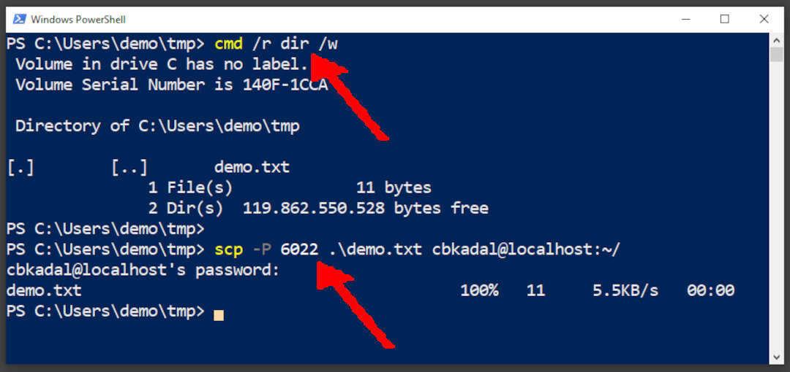

---
---

[HOME](index.md)
[ABOUT](README.md)
[WEB](https://osp4diss.vlsm.org/)
[GITHUB](https://github.com/os2xx/osp4diss)
[TOP](#)
[BOTTOM](#endofpage)
[PREV](osp-002-winscp.md)
[NEXT](Welcome2GNULinux.md)

[&#x213C;](#endofpage)<br id="idx000">
## Table of Contents

* [scp from a Windows Host to a Debian Guest (port 6022)](#idx001)
* [ssh from a Linux Host to a Linux guest (port 6022)](#idx002)
* [scp from a Linux Host to a Linux guest (port 6022)](#idx003)
* [check ~/guest/ at guest](#idx004)

[&#x213C;](#)<br id="idx001">
## ssh from a Windows Host to a Debian Guest (port 6022)

* check the the directory (cmd /r dir /w)
* scp file demo.txt to localhost (port 6022)

```

cmd /r dir /w

scp -P 6022 .\demo.txt cbkadal@localhost:~/

```



[&#x213C;](#)<br id="idx002">
## ssh from host to guest (port 6022)

```
$ ssh -p 6022 cbkadal@localhost
cbkadal@localhost's password: 
Linux osp 4.19.0-16-amd64 #1 SMP Debian 4.19.181-1 (2021-03-19) x86_64

The programs included with the Debian GNU/Linux system are free software;
the exact distribution terms for each program are described in the
individual files in /usr/share/doc/*/copyright.

Debian GNU/Linux comes with ABSOLUTELY NO WARRANTY, to the extent
permitted by applicable law.
Last login: Thu Jul  8 15:53:56 2021 from 10.0.2.2

cbkadal@osp:~$ ls -al ~/guest/
total 8
drwxr-xr-x 2 cbkadal cbkadal 4096 Jul  8 15:54 .
drwxr-xr-x 3 cbkadal cbkadal 4096 Jul  8 15:54 ..
cbkadal@osp:~$ exit
logout
Connection to localhost closed.

$

```

[&#x213C;](#)<br id="idx003">
## scp from a Linux Host to a Linux Guest (port 6022)

```
$ ls -F
file1.txt  file2.txt  file3.txt  file4.txt  file5.txt

$ scp -P 6022 file?.txt cbkadal@localhost:~/guest/
cbkadal@localhost's password: 
file1.txt                100%   10     4.4KB/s   00:00    
file2.txt                100%   10     8.3KB/s   00:00    
file3.txt                100%   10    10.5KB/s   00:00    
file4.txt                100%   10     9.7KB/s   00:00    
file5.txt                100%   10    16.6KB/s   00:00    

$

```

[&#x213C;](#)<br id="idx004">
## check ~/guest/ at guest

```
$ ssh -p 6022 cbkadal@localhost
cbkadal@localhost's password: 
Linux osp 4.19.0-16-amd64 #1 SMP Debian 4.19.181-1 (2021-03-19) x86_64

The programs included with the Debian GNU/Linux system are free software;
the exact distribution terms for each program are described in the
individual files in /usr/share/doc/*/copyright.

Debian GNU/Linux comes with ABSOLUTELY NO WARRANTY, to the extent
permitted by applicable law.
Last login: Thu Jul  8 15:54:33 2021 from 10.0.2.2

cbkadal@osp:~$ ls -al ~/guest/
total 28
drwxr-xr-x 2 cbkadal cbkadal 4096 Jul  8 15:55 .
drwxr-xr-x 3 cbkadal cbkadal 4096 Jul  8 15:54 ..
-rw-r--r-- 1 cbkadal cbkadal   10 Jul  8 15:55 file1.txt
-rw-r--r-- 1 cbkadal cbkadal   10 Jul  8 15:55 file2.txt
-rw-r--r-- 1 cbkadal cbkadal   10 Jul  8 15:55 file3.txt
-rw-r--r-- 1 cbkadal cbkadal   10 Jul  8 15:55 file4.txt
-rw-r--r-- 1 cbkadal cbkadal   10 Jul  8 15:55 file5.txt

cbkadal@osp:~$ 

```

[&#x213C;](#)<br id="endofpage"><br>

[HOME](index.md)
[ABOUT](README.md)
[WEB](https://osp4diss.vlsm.org/)
[GITHUB](https://github.com/os2xx/osp4diss)
[TOP](#)
[BOTTOM](#endofpage)
[PREV](osp-002-winscp.md)
[NEXT](Welcome2GNULinux.md)
<br>

