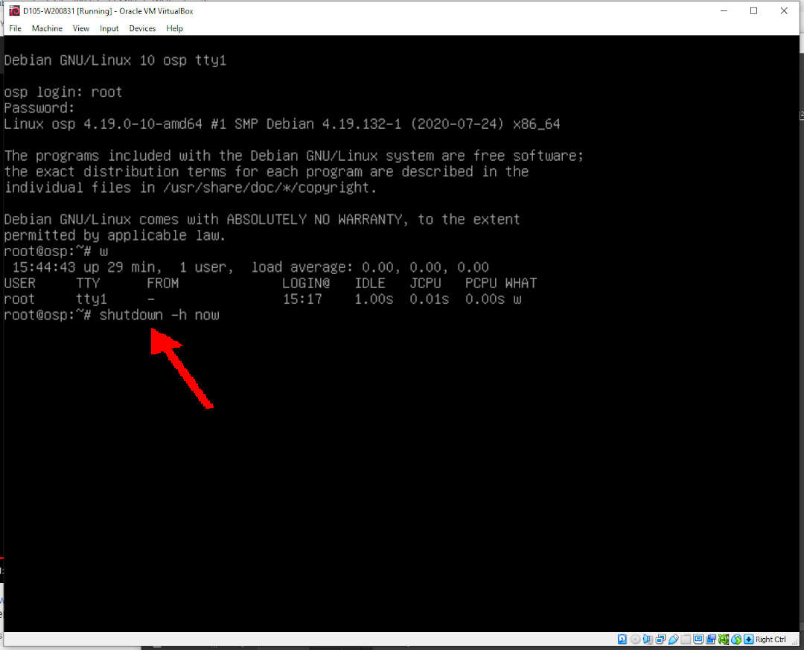
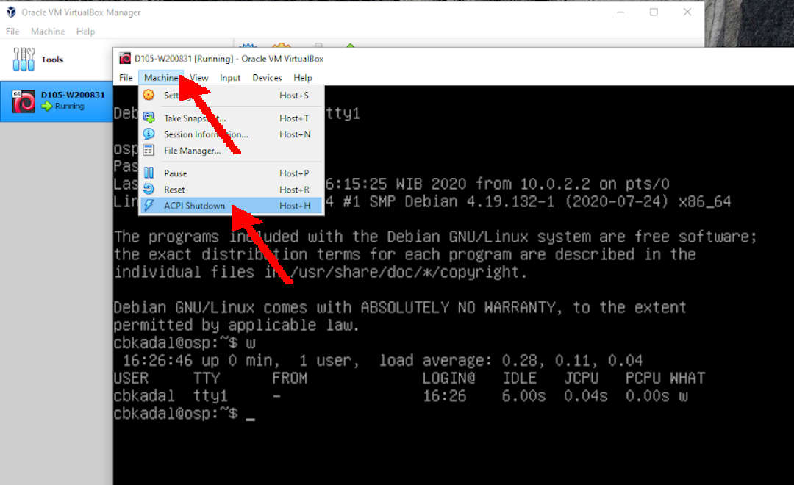

---
---

[HOME](index.md)
[ABOUT](README.md)
[WEB](https://osp4diss.vlsm.org/)
[GITHUB](https://github.com/os2xx/osp4diss)
[TOP](#)
[BOTTOM](#endofpage)
[PREV](osp-002-login.md)
[NEXT](osp-002-putty.md)

# Shutdown a Debian Guest

<br>
## RUN: Shutdown from console/tty1 (ALT-F1)

* login as user: root
* enter the root password
* execute "shutdown"

```
shutdown -h now

```



<br>
## PR RUN: poweroff from console/tty1 (ALT-F1)

* login as user: root
* enter the root password
* execute "poweroff"


```
poweroff

```

<br>
## OR: ACPI SHUTDOWN



<br id="endofpage"><br>

[HOME](index.md)
[ABOUT](README.md)
[WEB](https://osp4diss.vlsm.org/)
[GITHUB](https://github.com/os2xx/osp4diss)
[TOP](#)
[BOTTOM](#endofpage)
[PREV](osp-002-login.md)
[NEXT](osp-002-putty.md)
<br>

