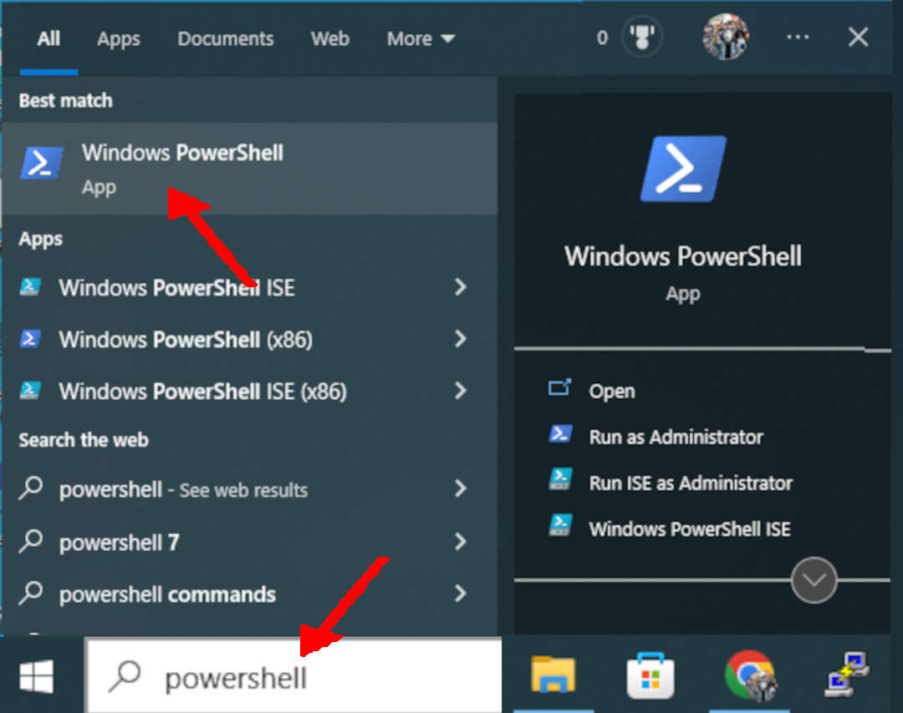
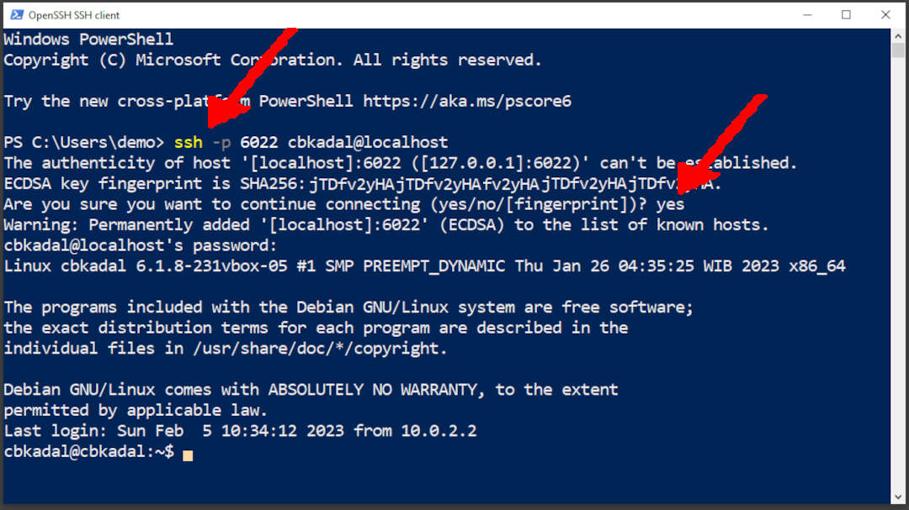
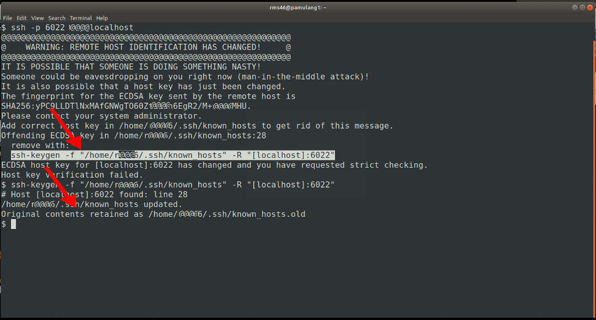

---
---

[HOME](index.md)
[ABOUT](README.md)
[WEB](https://osp4diss.vlsm.org/)
[GITHUB](https://github.com/os2xx/osp4diss)
[TOP](#)
[BOTTOM](#endofpage)
[PREV](osp-002-putty.md)
[NEXT](osp-002-winscp.md)

[&#x213C;](#endofpage)<br id="idx000">
## Table of Contents
* [SSH from a Windows HOST](#idx001)
* [SSH from a GNU/Linux HOST](#idx003)

Most will run VirtualBox on a Microsoft Windows-based HOST. But, some may use a GNU/Linux-based HOST. 
The following illustrates running SSH from a Microsoft Windows host and GNU/Linux.

[&#x213C;](#)<br id="idx001">
## SSH from a Windows HOST

This example is if you run VirtualBox on a Microsoft Windows-based HOST.

* Run PowerShell



[&#x213C;](#)<br id="idx002">

* Running "ssh" from Windows

```
ssh -p 6022 cbkadal@localhost

```


[&#x213C;](#)<br id="idx003">

## SSH from a GNU/Linux HOST

This example is if you run VirtualBox on a GNU/Linux-based HOST.

```
ssh -p 6022 cbkadal@localhost
# REMOVE THE OLD KEY
ssh-keygen -f ~/.ssh/known_hosts -R "[localhost]:6022"

```



[&#x213C;](#)<br id="idx003">

```
# ONE MORE TIME
ssh -p 6022 cbkadal@localhost

```


[&#x213C;](#)<br id="endofpage"><br>

[HOME](index.md)
[ABOUT](README.md)
[WEB](https://osp4diss.vlsm.org/)
[GITHUB](https://github.com/os2xx/osp4diss)
[TOP](#)
[BOTTOM](#endofpage)
[PREV](osp-002-putty.md)
[NEXT](osp-002-winscp.md)
<br>

