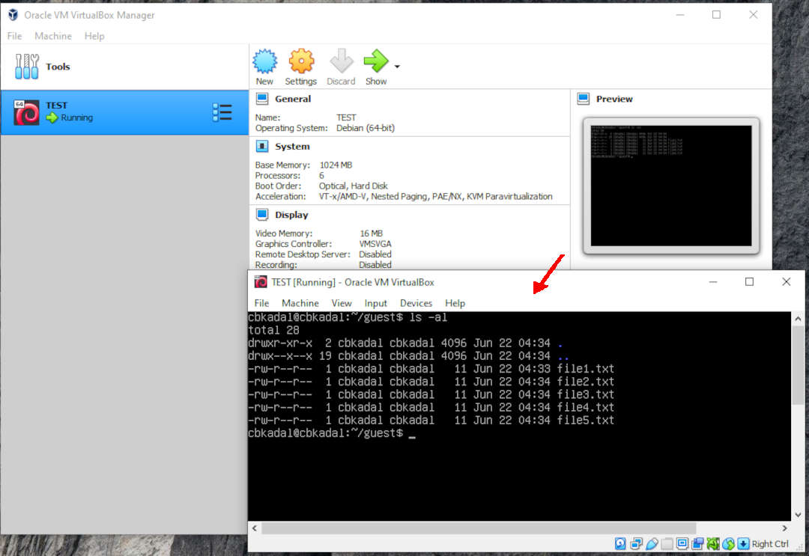
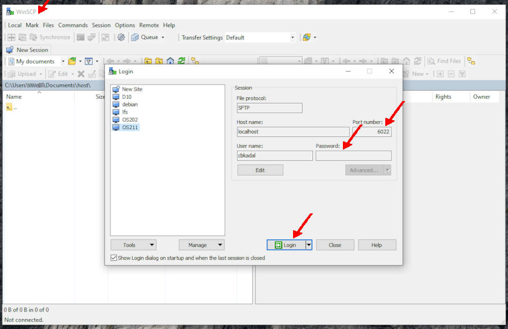
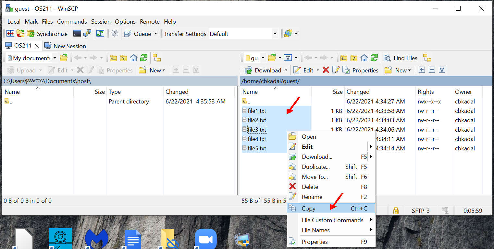
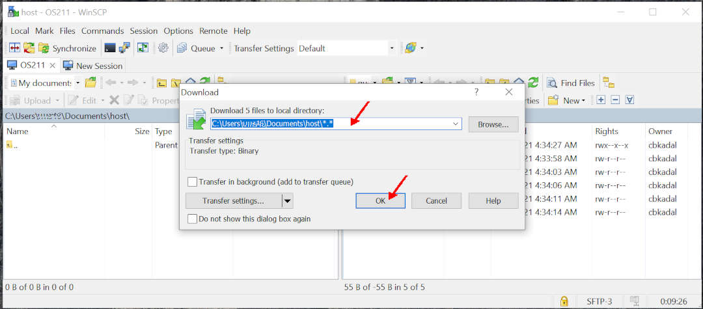
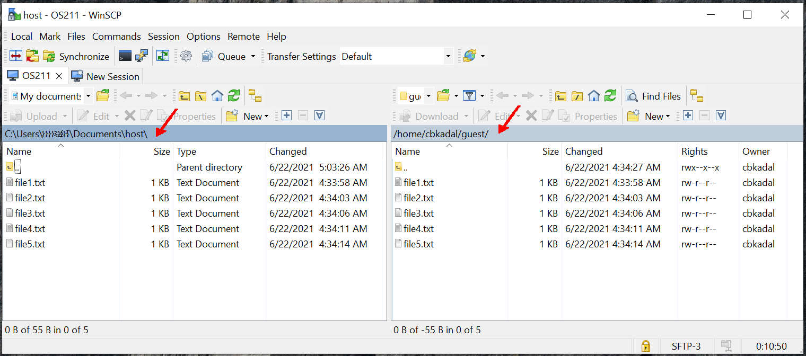

---
---

[HOME](index.md)
[ABOUT](README.md)
[WEB](https://osp4diss.vlsm.org/)
[GITHUB](https://github.com/os2xx/osp4diss)
[TOP](#)
[BOTTOM](#endofpage)
[PREV](osp-002-ssh.md)
[NEXT](osp-002-scp.md)

 
# WINSCP

* Copying files from the guest to the host

 
* Login to guest

 
## E.g.
* from /home/chkadal/guest/* (guest)
* to Documents\host\ (host)

 
* copy

 
* paste

  

[HOME](index.md)
[ABOUT](README.md)
[WEB](https://osp4diss.vlsm.org/)
[GITHUB](https://github.com/os2xx/osp4diss)
[TOP](#)
[BOTTOM](#endofpage)
[PREV](osp-002-ssh.md)
[NEXT](osp-002-scp.md)
 

