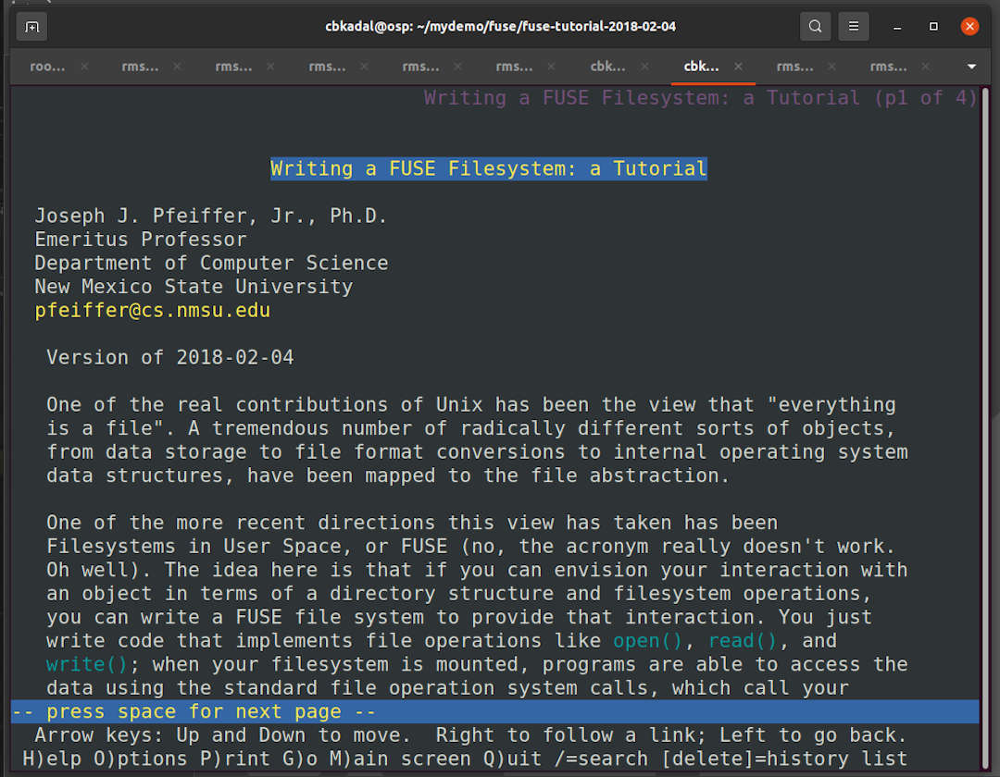

---
---

[HOME](index.md)
[ABOUT](README.md)
[WEB](https://osp4diss.vlsm.org/)
[GITHUB](https://github.com/os2xx/osp4diss)
[TOP](#)
[BOTTOM](#endofpage)
[PREV](index.md)
[NEXT](index.md)

# FUSE DEMO

* Visit: [Writing a FUSE Filesystem: a Tutorial](https://www.cs.nmsu.edu/~pfeiffer/fuse-tutorial/)
* Download the fuse TARBALL: <http://www.cs.nmsu.edu/~pfeiffer/fuse-tutorial.tgz>

### INPUT01
```
cd
[ -d mydemo/fuse/ ] || mkdir -p mydemo/fuse/
cd mydemo/fuse/
wget -c http://www.cs.nmsu.edu/~pfeiffer/fuse-tutorial.tgz
ls -al

```

### OUTPUT01

```
cbkadal@osp:~$ cd

cbkadal@osp:~$ [ -d mydemo/fuse/ ] || mkdir -p mydemo/fuse/

cbkadal@osp:~$ cd mydemo/fuse/

cbkadal@osp:~/mydemo/fuse$ wget -c http://www.cs.nmsu.edu/~pfeiffer/fuse-tutorial.tgz
--2021-03-11 15:59:01--  http://www.cs.nmsu.edu/~pfeiffer/fuse-tutorial.tgz
Resolving www.cs.nmsu.edu (www.cs.nmsu.edu)... 128.123.64.49
Connecting to www.cs.nmsu.edu (www.cs.nmsu.edu)|128.123.64.49|:80... connected.
HTTP request sent, awaiting response... 301 Moved Permanently
Location: https://www.cs.nmsu.edu/~pfeiffer/fuse-tutorial.tgz [following]
--2021-03-11 15:59:02--  https://www.cs.nmsu.edu/~pfeiffer/fuse-tutorial.tgz
Connecting to www.cs.nmsu.edu (www.cs.nmsu.edu)|128.123.64.49|:443... connected.
HTTP request sent, awaiting response... 200 OK
Length: 151814 (148K) [application/x-gzip]
Saving to: ‘fuse-tutorial.tgz’

fuse-tutorial.tgz        100%[======================================>] 148.26K  205KB/s in 0.7s    

2021-03-11 15:59:04 (205 KB/s) - ‘fuse-tutorial.tgz’ saved [151814/151814]

cbkadal@osp:~/mydemo/fuse$ ls -al
total 160
drwxr-xr-x 2 cbkadal cbkadal   4096 Mar 11 15:59 .
drwxr-xr-x 3 cbkadal cbkadal   4096 Mar 11 15:59 ..
-rw-r--r-- 1 cbkadal cbkadal 151814 Feb  4  2018 fuse-tutorial.tgz

cbkadal@osp:~/mydemo/fuse$ 

```

<br>
## Extract the TARBALL

<br>
### INPUT02

```
ls -al
tar tfv fuse-tutorial.tgz
tar  xf fuse-tutorial.tgz
ls -al
cd fuse-tutorial-2018-02-04/
ls -al

```

### OUTPUT02

```
cbkadal@osp:~/mydemo/fuse$ ls -al
total 160
drwxr-xr-x 2 cbkadal cbkadal   4096 Mar 11 16:01 .
drwxr-xr-x 3 cbkadal cbkadal   4096 Mar 11 15:59 ..
-rw-r--r-- 1 cbkadal cbkadal 151814 Feb  4  2018 fuse-tutorial.tgz

cbkadal@osp:~/mydemo/fuse$ tar tfv fuse-tutorial.tgz 
drwxr-xr-x 1248/1005         0 2018-02-04 23:16 fuse-tutorial-2018-02-04/
-rwxr-xr-x 1248/1005     45153 2014-06-05 10:12 fuse-tutorial-2018-02-04/autogen.sh
-rw-r--r-- 1248/1005         0 2014-06-05 10:12 fuse-tutorial-2018-02-04/NEWS
-rw-r--r-- 1248/1005     24356 2018-02-04 23:05 fuse-tutorial-2018-02-04/Makefile.in

=== TL;DR ===

-rw-r--r-- 1248/1005         0 2014-06-05 10:12 fuse-tutorial-2018-02-04/ChangeLog
-rw-r--r-- 1248/1005      5505 2018-02-04 23:12 fuse-tutorial-2018-02-04/index.html
-rw-r--r-- 1248/1005     35147 2014-02-23 16:53 fuse-tutorial-2018-02-04/COPYING
-rwxr-xr-x 1248/1005     15155 2018-02-04 23:05 fuse-tutorial-2018-02-04/install-sh

cbkadal@osp:~/mydemo/fuse$ tar xf fuse-tutorial.tgz 

cbkadal@osp:~/mydemo/fuse$ ls -al
total 164
drwxr-xr-x 3 cbkadal cbkadal   4096 Mar 11 16:06 .
drwxr-xr-x 3 cbkadal cbkadal   4096 Mar 11 15:59 ..
drwxr-xr-x 5 cbkadal cbkadal   4096 Feb  4  2018 fuse-tutorial-2018-02-04
-rw-r--r-- 1 cbkadal cbkadal 151814 Feb  4  2018 fuse-tutorial.tgz

cbkadal@osp:~/mydemo/fuse$ cd fuse-tutorial-2018-02-04/

cbkadal@osp:~/mydemo/fuse/fuse-tutorial-2018-02-04$ ls -al
total 452
drwxr-xr-x 5 cbkadal cbkadal   4096 Feb  4  2018 .
drwxr-xr-x 3 cbkadal cbkadal   4096 Mar 11 16:06 ..
-rw-r--r-- 1 cbkadal cbkadal  52393 Feb  4  2018 aclocal.m4
-rw-r--r-- 1 cbkadal cbkadal      0 Jun  5  2014 AUTHORS
-rwxr-xr-x 1 cbkadal cbkadal  45153 Jun  5  2014 autogen.sh
-rw-r--r-- 1 cbkadal cbkadal      0 Jun  5  2014 ChangeLog
-rwxr-xr-x 1 cbkadal cbkadal   7333 Feb  4  2018 compile
-rwxr-xr-x 1 cbkadal cbkadal 188215 Feb  4  2018 configure
-rw-r--r-- 1 cbkadal cbkadal   1133 Feb  4  2018 configure.ac
-rw-r--r-- 1 cbkadal cbkadal  35147 Feb 23  2014 COPYING
-rwxr-xr-x 1 cbkadal cbkadal  23567 Feb  4  2018 depcomp
drwxr-xr-x 2 cbkadal cbkadal   4096 Feb  4  2018 example
drwxr-xr-x 2 cbkadal cbkadal   4096 Feb  4  2018 html
-rw-r--r-- 1 cbkadal cbkadal   5505 Feb  4  2018 index.html
-rw-r--r-- 1 cbkadal cbkadal  15752 Mar 27  2016 INSTALL
-rwxr-xr-x 1 cbkadal cbkadal  15155 Feb  4  2018 install-sh
-rw-r--r-- 1 cbkadal cbkadal    436 Jun 13  2014 Makefile.am
-rw-r--r-- 1 cbkadal cbkadal  24356 Feb  4  2018 Makefile.in
-rwxr-xr-x 1 cbkadal cbkadal   6872 Feb  4  2018 missing
-rw-r--r-- 1 cbkadal cbkadal      0 Jun  5  2014 NEWS
-rw-r--r-- 1 cbkadal cbkadal      0 Jun  5  2014 README
drwxr-xr-x 2 cbkadal cbkadal   4096 Feb  4  2018 src

cbkadal@osp:~/mydemo/fuse/fuse-tutorial-2018-02-04$ 

```

<br>
## Try the lynx Text Browser

### INPUT03

```
lynx index.html

```

### OUTPUT03



<br>
## Configure and Make

### INPUT04

```
./configure
make

```

### OUTPUT04

```
cbkadal@osp:~/mydemo/fuse/fuse-tutorial-2018-02-04$ ./configure
checking for a BSD-compatible install... /usr/bin/install -c
checking whether build environment is sane... yes
checking for a thread-safe mkdir -p... /usr/bin/mkdir -p
checking for gawk... gawk

=== TL;DR ===

config.status: creating html/Makefile
config.status: creating src/Makefile
config.status: creating src/config.h
config.status: executing depfiles commands

cbkadal@osp:~/mydemo/fuse/fuse-tutorial-2018-02-04$ make
Making all in example
make[1]: Entering directory '/home/cbkadal/mydemo/fuse/fuse-tutorial-2018-02-04/example'
mkdir -p mountdir
mkdir -p rootdir
echo "bogus file" > rootdir/bogus.txt
make[1]: Leaving directory '/home/cbkadal/mydemo/fuse/fuse-tutorial-2018-02-04/example'

=== TL;DR ===

make[2]: Leaving directory '/home/cbkadal/mydemo/fuse/fuse-tutorial-2018-02-04/src'
make[1]: Leaving directory '/home/cbkadal/mydemo/fuse/fuse-tutorial-2018-02-04/src'
make[1]: Entering directory '/home/cbkadal/mydemo/fuse/fuse-tutorial-2018-02-04'
make[1]: Nothing to be done for 'all-am'.
make[1]: Leaving directory '/home/cbkadal/mydemo/fuse/fuse-tutorial-2018-02-04'

cbkadal@osp:~/mydemo/fuse/fuse-tutorial-2018-02-04$ 

```

<br>
## Mount / Unmount

### INPUT05

```
cd example
ls -al
ls -al rootdir
ls -al mountdir
df
../src/bbfs rootdir/ mountdir/
df
ls -al rootdir
cp Makefile mountdir/
touch mountdir/touch-a-file.txt
ls -al mountdir/

```

### OUTPUT05

```
cbkadal@osp:~/mydemo/fuse/fuse-tutorial-2018-02-04$ cd example

cbkadal@osp:~/mydemo/fuse/fuse-tutorial-2018-02-04/example$ ls -al
total 20
drwxr-xr-x 4 cbkadal cbkadal 4096 Mar 11 16:31 .
drwxr-xr-x 5 cbkadal cbkadal 4096 Mar 11 16:29 ..
-rw-r--r-- 1 cbkadal cbkadal  185 Feb  4  2018 Makefile
drwxr-xr-x 2 cbkadal cbkadal 4096 Mar 11 16:31 mountdir
drwxr-xr-x 2 cbkadal cbkadal 4096 Mar 11 16:31 rootdir

cbkadal@osp:~/mydemo/fuse/fuse-tutorial-2018-02-04/example$ ls -al rootdir
total 12
drwxr-xr-x 2 cbkadal cbkadal 4096 Mar 11 16:31 .
drwxr-xr-x 4 cbkadal cbkadal 4096 Mar 11 16:31 ..
-rw-r--r-- 1 cbkadal cbkadal   11 Mar 11 16:31 bogus.txt

cbkadal@osp:~/mydemo/fuse/fuse-tutorial-2018-02-04/example$ ls -al mountdir
total 8
drwxr-xr-x 2 cbkadal cbkadal 4096 Mar 11 16:31 .
drwxr-xr-x 4 cbkadal cbkadal 4096 Mar 11 16:31 ..

cbkadal@osp:~/mydemo/fuse/fuse-tutorial-2018-02-04/example$ df
Filesystem     1K-blocks    Used Available Use% Mounted on
udev              490192       0    490192   0% /dev
tmpfs             101016    3004     98012   3% /run
/dev/sda2       65543732 3438472  58746028   6% /
tmpfs             505076       0    505076   0% /dev/shm
tmpfs               5120       0      5120   0% /run/lock
tmpfs             505076       0    505076   0% /sys/fs/cgroup
/dev/sdb2       65543732   53272  62131228   1% /lfs
tmpfs             101012       0    101012   0% /run/user/1000

cbkadal@osp:~/mydemo/fuse/fuse-tutorial-2018-02-04/example$ ../src/bbfs rootdir/ mountdir/
Fuse library version 2.9
about to call fuse_main

cbkadal@osp:~/mydemo/fuse/fuse-tutorial-2018-02-04/example$ df
Filesystem     1K-blocks    Used Available Use% Mounted on
udev              490192       0    490192   0% /dev
tmpfs             101016    3008     98008   3% /run
/dev/sda2       65543732 3438476  58746024   6% /
tmpfs             505076       0    505076   0% /dev/shm
tmpfs               5120       0      5120   0% /run/lock
tmpfs             505076       0    505076   0% /sys/fs/cgroup
/dev/sdb2       65543732   53272  62131228   1% /lfs
tmpfs             101012       0    101012   0% /run/user/1000
bbfs            65543732 3438476  58746024   6% /home/cbkadal/mydemo/fuse/fuse-tutorial-2018-02-04/example/mountdir

cbkadal@osp:~/mydemo/fuse/fuse-tutorial-2018-02-04/example$ ls -al rootdir
total 12
drwxr-xr-x 2 cbkadal cbkadal 4096 Mar 11 16:31 .
drwxr-xr-x 4 cbkadal cbkadal 4096 Mar 11 16:36 ..
-rw-r--r-- 1 cbkadal cbkadal   11 Mar 11 16:31 bogus.txt

cbkadal@osp:~/mydemo/fuse/fuse-tutorial-2018-02-04/example$ cp Makefile mountdir/

cbkadal@osp:~/mydemo/fuse/fuse-tutorial-2018-02-04/example$ touch mountdir/touch-a-file.txt

cbkadal@osp:~/mydemo/fuse/fuse-tutorial-2018-02-04/example$ ls -al mountdir/
total 16
drwxr-xr-x 2 cbkadal cbkadal 4096 Mar 11 16:43 .
drwxr-xr-x 4 cbkadal cbkadal 4096 Mar 11 16:36 ..
-rw-r--r-- 1 cbkadal cbkadal   11 Mar 11 16:31 bogus.txt
-rw-r--r-- 1 cbkadal cbkadal  185 Mar 11 16:40 Makefile
-rw-r--r-- 1 cbkadal cbkadal    0 Mar 11 16:43 touch-a-file.txt

cbkadal@osp:~/mydemo/fuse/fuse-tutorial-2018-02-04/example$

```

<br>
## UNMOUNT

### INPUT06

```
df
fusermount -u mountdir
df
ls -al mountdir/
ls -al rootdir/

```

### OUTPUT06

```
cbkadal@osp:~/mydemo/fuse/fuse-tutorial-2018-02-04/example$ df
Filesystem     1K-blocks    Used Available Use% Mounted on
udev              490192       0    490192   0% /dev
tmpfs             101016    3008     98008   3% /run
/dev/sda2       65543732 3438516  58745984   6% /
tmpfs             505076       0    505076   0% /dev/shm
tmpfs               5120       0      5120   0% /run/lock
tmpfs             505076       0    505076   0% /sys/fs/cgroup
/dev/sdb2       65543732   53272  62131228   1% /lfs
tmpfs             101012       0    101012   0% /run/user/1000
bbfs            65543732 3438516  58745984   6% /home/cbkadal/mydemo/fuse/fuse-tutorial-2018-02-04/example/mountdir

cbkadal@osp:~/mydemo/fuse/fuse-tutorial-2018-02-04/example$ fusermount -u mountdir

cbkadal@osp:~/mydemo/fuse/fuse-tutorial-2018-02-04/example$ df
Filesystem     1K-blocks    Used Available Use% Mounted on
udev              490192       0    490192   0% /dev
tmpfs             101016    3008     98008   3% /run
/dev/sda2       65543732 3438516  58745984   6% /
tmpfs             505076       0    505076   0% /dev/shm
tmpfs               5120       0      5120   0% /run/lock
tmpfs             505076       0    505076   0% /sys/fs/cgroup
/dev/sdb2       65543732   53272  62131228   1% /lfs
tmpfs             101012       0    101012   0% /run/user/1000

cbkadal@osp:~/mydemo/fuse/fuse-tutorial-2018-02-04/example$ ls -al mountdir/
total 8
drwxr-xr-x 2 cbkadal cbkadal 4096 Mar 11 16:31 .
drwxr-xr-x 4 cbkadal cbkadal 4096 Mar 11 16:36 ..

cbkadal@osp:~/mydemo/fuse/fuse-tutorial-2018-02-04/example$ ls -al rootdir/
total 16
drwxr-xr-x 2 cbkadal cbkadal 4096 Mar 11 16:43 .
drwxr-xr-x 4 cbkadal cbkadal 4096 Mar 11 16:36 ..
-rw-r--r-- 1 cbkadal cbkadal   11 Mar 11 16:31 bogus.txt
-rw-r--r-- 1 cbkadal cbkadal  185 Mar 11 16:40 Makefile
-rw-r--r-- 1 cbkadal cbkadal    0 Mar 11 16:43 touch-a-file.txt

cbkadal@osp:~/mydemo/fuse/fuse-tutorial-2018-02-04/example$

```

<br>
## Create File W03-Fuse-ls-alR.txt

```
ls -alR > W03-Fuse-ls-alR.txt

```

<br id="endofpage"><br>

[HOME](index.md)
[ABOUT](README.md)
[WEB](https://osp4diss.vlsm.org/)
[GITHUB](https://github.com/os2xx/osp4diss)
[TOP](#)
[BOTTOM](#endofpage)
[PREV](index.md)
[NEXT](index.md)
<br>

