---
---

[HOME](index.md)
[ABOUT](README.md)
[WEB](https://osp4diss.vlsm.org/)
[GITHUB](https://github.com/os2xx/osp4diss)
[TOP](#)
[BOTTOM](#endofpage)
[PREV](index.md)
[NEXT](index.md)

# TOP (was Table Of Processes)

* FYI: The term/name "top" was from the "Table of Processes."
* Learn (man, GSGS, ATM) how to use the command "top".
* Find if any old TOP configuration file exists.
  * Recent Debian: $HOME/.config/procps/toprc
  * Ubuntu or others: $HOME/.toprc
* (If exists) delete OR rename that configuration file.

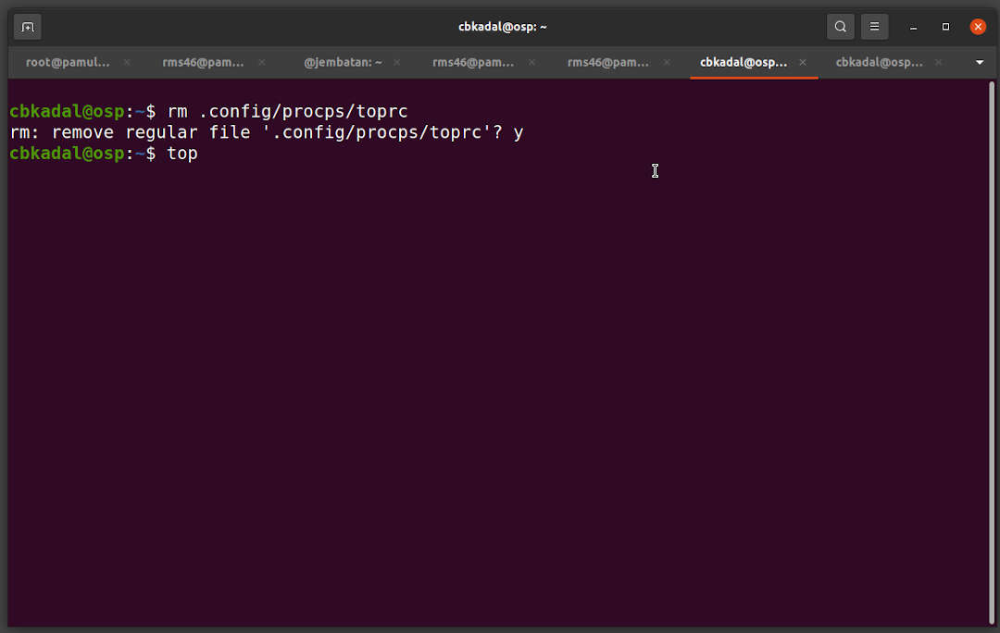

## Execute "top"

### INPUT-01
```
top

```
### DEFAULT TOP OUTPUT
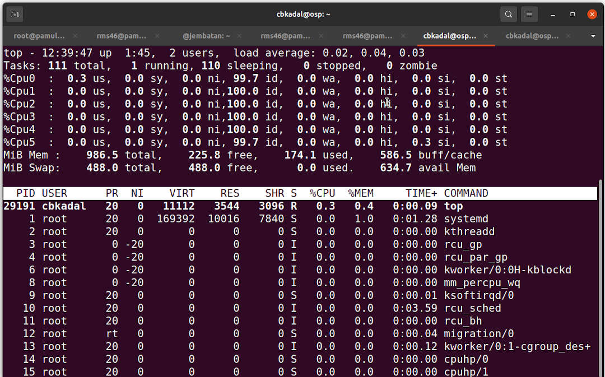

<br>
### HIT "h" for the HELP menu

* HIT "q" to quit the HELP menu.

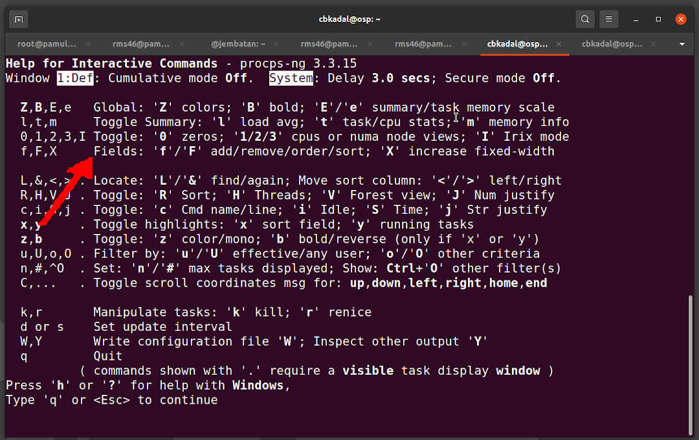

<br>
### HIT "f" to modify the Fields

* "d" or <SPACE> togles display.
* Move with the **UP**/**DOWN** arrow key.
* Turn off displays **USER**, **PR**, **NI**, **VIRT**, **RES**, **SHR**, **S**, **%CPU**, **MEM**, 
  **TIME++**, and **COMMAND**.

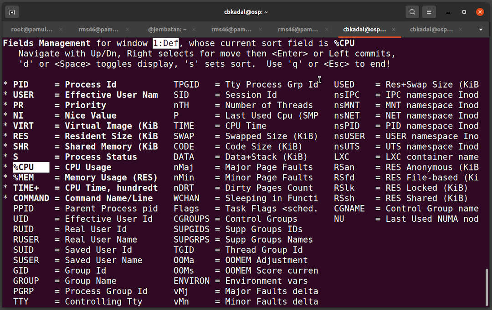

<br>
* Display only **PID**.

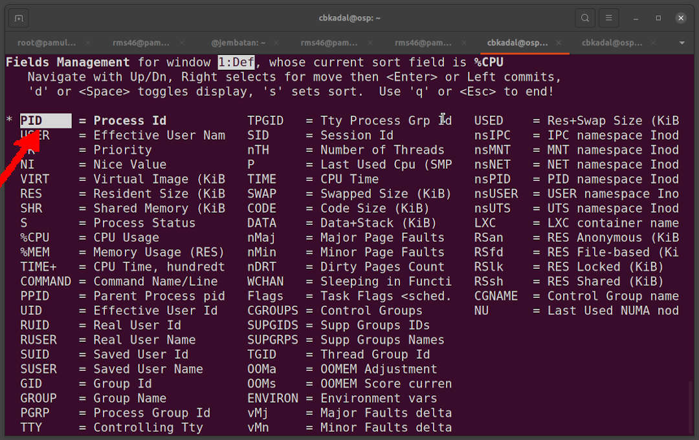

### Select **VIRT**

* Select with the right arrow key.

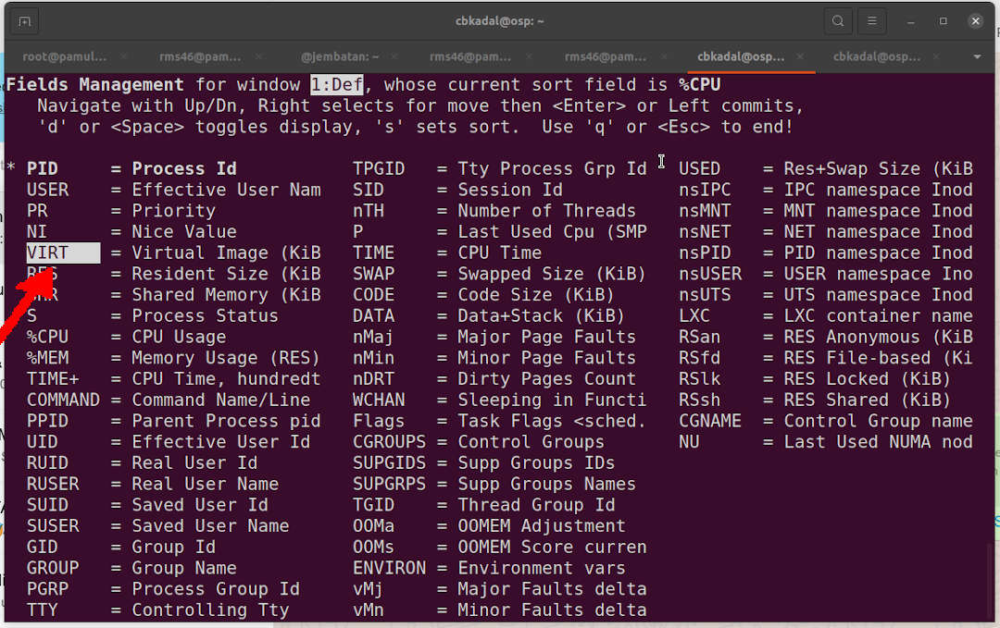

* Move **VIRT** UP.

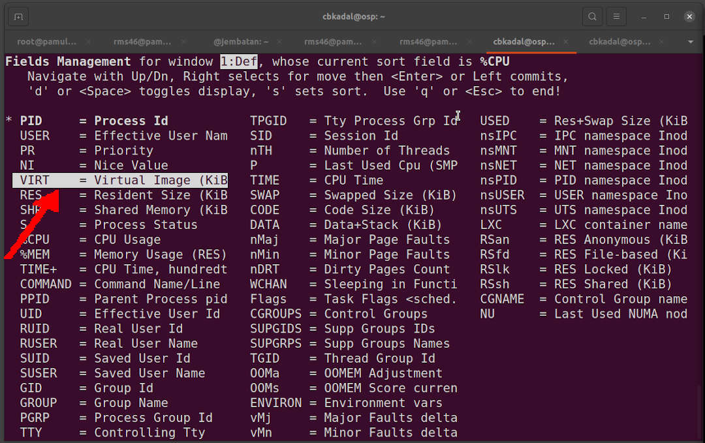

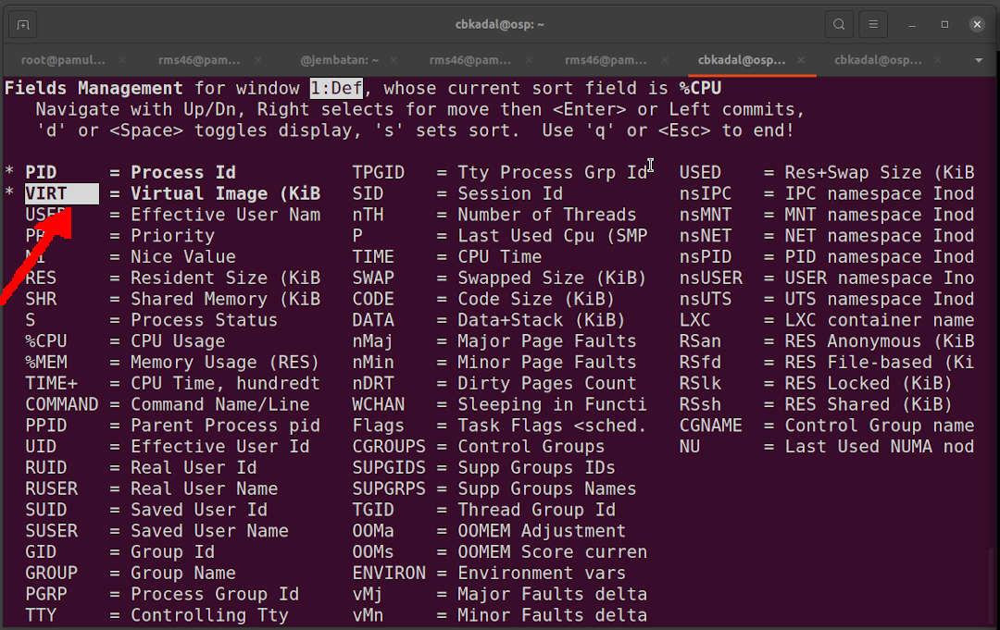

* Move **RES** UP.

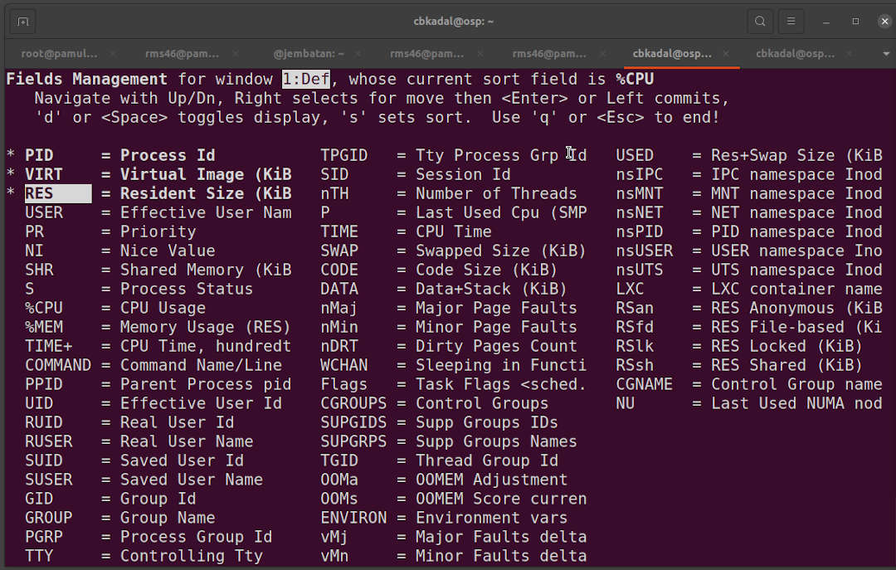

* Move **SHR**, **SWAP**, **CODE**, **DATA**, **USED**, **nDRT** UP.

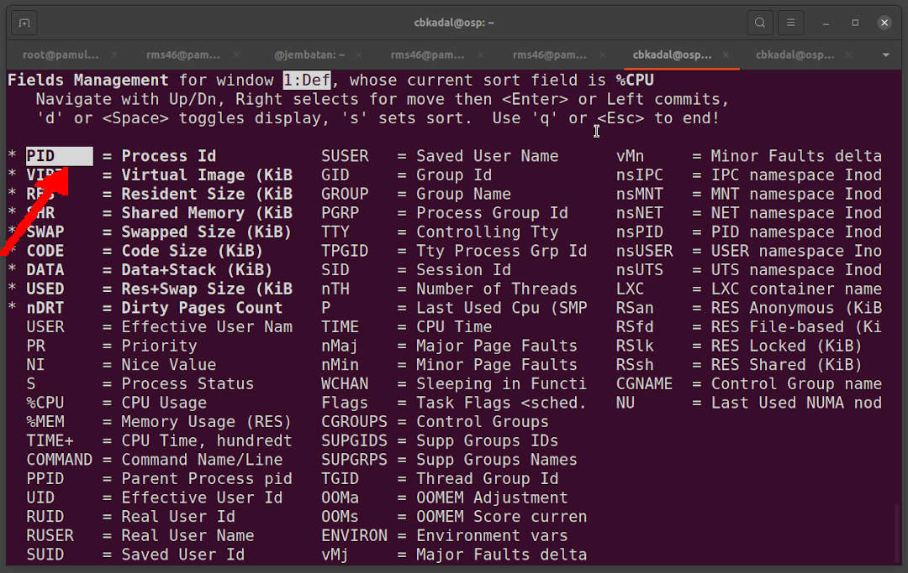

### HIT "q" to quit the **FIELD** menu.

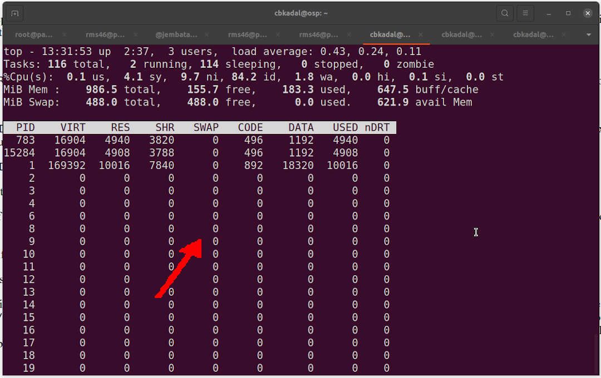

* Hit "1" (CPU/Core View)
* Hit "W" (Write to $HOME/.config/procps/toprc)

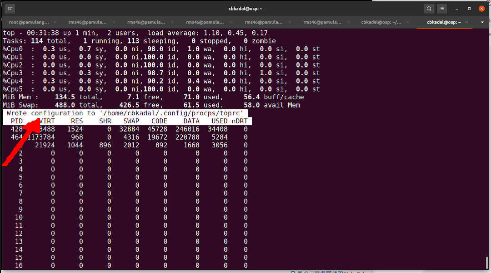


<br id="endofpage"><br>

[HOME](index.md)
[ABOUT](README.md)
[WEB](https://osp4diss.vlsm.org/)
[GITHUB](https://github.com/os2xx/osp4diss)
[TOP](#)
[BOTTOM](#endofpage)
[PREV](index.md)
[NEXT](index.md)
<br>

