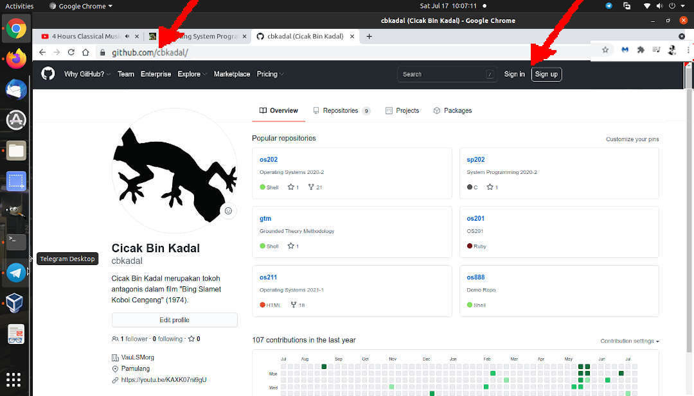
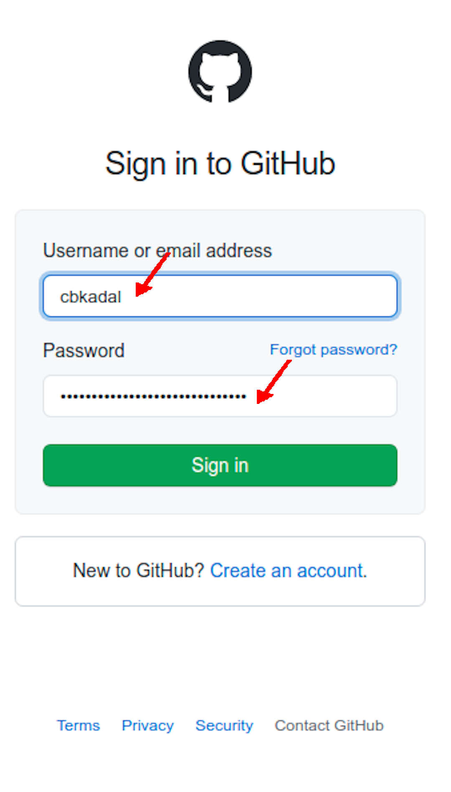
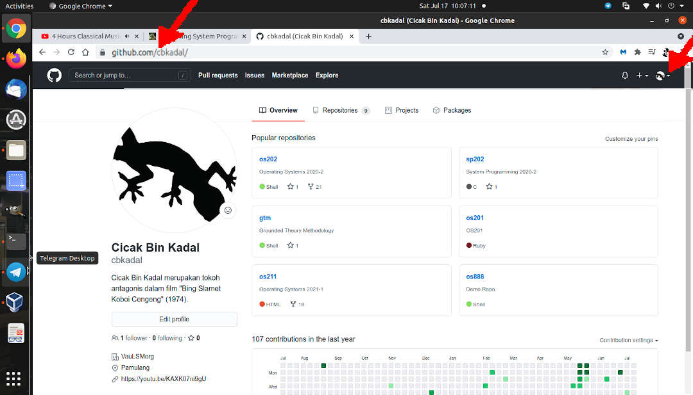
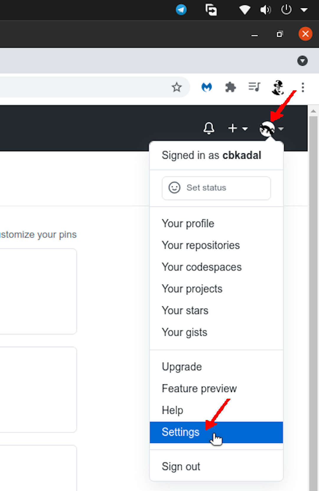
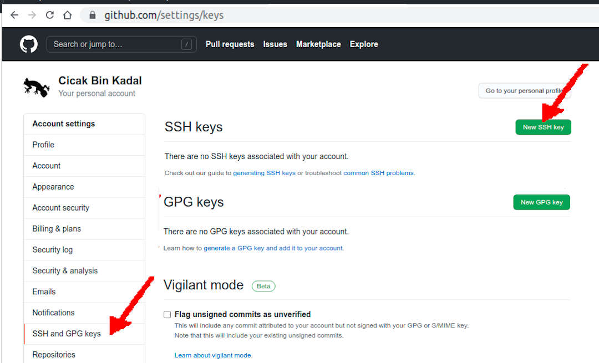
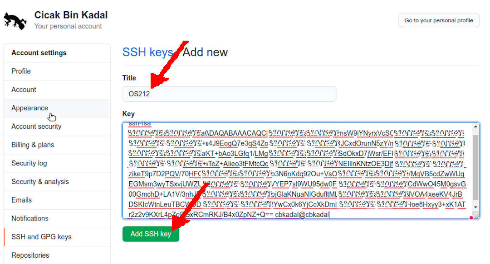
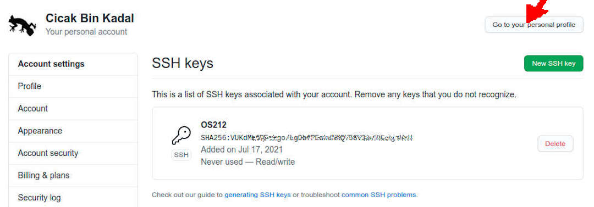

---
---

[HOME](index.md)
[ABOUT](README.md)
[WEB](https://osp4diss.vlsm.org/)
[GITHUB](https://github.com/os2xx/osp4diss)
[TOP](#)
[BOTTOM](#endofpage)
[PREV](osp-110.md)
[NEXT](osp-112.md)

# SSH: Put a Public Key at GitHub.com (e.g. cbkadal)

* Visit [GitHub.com/cbkadal/](https://GitHub.com/cbkadal/)
* Sign In 

<br>

<br>

* E.g. cbkadal

<br>

<br>

* Click the logo at the top right corner

<br>

<br>

* Signed as cbkadal
  * Select SETTINGS

<br>

<br>

* Select SSH and GPG keys (left bar)
  * Select New SSH Key

<br>

<br>

* Copy your RSA public key

```
cbkadal@cbkadal:~$ cat .ssh/id_rsa.pub
ssh-rsa AAAAB8lmsW9iYNyrxVcSCZWSvkAGYx0hev3C7S1ULGR1E8lmsW9iYNyrxVcSCZWSvkAGYx0hev3C7S1ULGR1E8lmsW9iYNyrxVcSCZWSvkAGYx0hev3C7S1ULGR1E8lmsW9iYNyrxVcSCZWSvkAGYx0hev3C7S1ULGR1E8lmsW9iYNyrxVcSCZWSvkAGYx0hev3C7S1ULGR1E8lmsW9iYNyrxVcSCZWSvkAGYx0hev3C7S1ULGR1E8lmsW9iYNyrxVcSCZWSvkAGYx0hev3C7S1ULGR1E8lmsW9iYNyrxVcSCZWSvkAGYx0hev3C7S1ULGR1E8lmsW9iYNyrxVcSCZWSvkAGYx0hev3C7S1ULGR1E8lmsW9iYNyrxVcSCZWSvkAGYx0hev3C7S1ULGR1E8lmsW9iYNyrxVcSCZWSvkAGYx0hev3C7S1ULGR1E8lmsW9iYNyrxVcSCZWSvkAGYx0hev3C7S1ULGR1E8lmsW9iYNyrxVcSCZWSvkAGYx0hev3C7S1ULGR1E8lmsW9iYNyrxVcSCZWSvkAGYx0hev3C7S1ULGR1E8lmsW9iYNyrxVcSCZWSvkAGYx0hev3C7S1ULGR1E8lmsW9iYNyrxVcSCZWSvkAGYx0hev3C7S1ULGR1E8lmsW9iYNyrxVcSCZWSvkAGYx0hev3C7S1ULGR1E8lmsW9iYNyrxVcSCZWSvkAGYx0hev3C7S1ULGR1E8lmsW9iYNyrxVcSCZWSvkAGYx0hev3C7S1ULGR1E8lmsW9iYNyrxVcSCZWSvkAGYx0hev3C7S1ULGR1E8lmsW9iY/B4x0ZpNZ+Q== cbkadal@cbkadal

cbkadal@cbkadal:~$

```

<br>

* Title: (e.g.) cbkadal
* Key: Paste your key
* Select: ADD SSH KEY

<br>

<br>

* Your key is at GitHub.com

<br>

<br>

* Return/Go to your personal profile

<br>
## Test Your Key

```
ssh -T git@github.com

```

(RESULT)
```
cbkadal@cbkadal:~$ ssh -T git@github.com
The authenticity of host 'github.com (13.250.177.223)' can't be established.
RSA key fingerprint is SHA256:XYZZYYYYYYYYYYYYYYYYYYYYYYYYYYYYYYYYYYYYYYY.

Are you sure you want to continue connecting (yes/no)? yes

Warning: Permanently added 'github.com,13.250.177.223' (RSA) to the list of known hosts.
Hi cbkadal! You've successfully authenticated, but GitHub does not provide shell access.

cbkadal@cbkadal:~$

```

<br id="endofpage"><br>

[HOME](index.md)
[ABOUT](README.md)
[WEB](https://osp4diss.vlsm.org/)
[GITHUB](https://github.com/os2xx/osp4diss)
[TOP](#)
[BOTTOM](#endofpage)
[PREV](osp-110.md)
[NEXT](osp-112.md)
<br>

