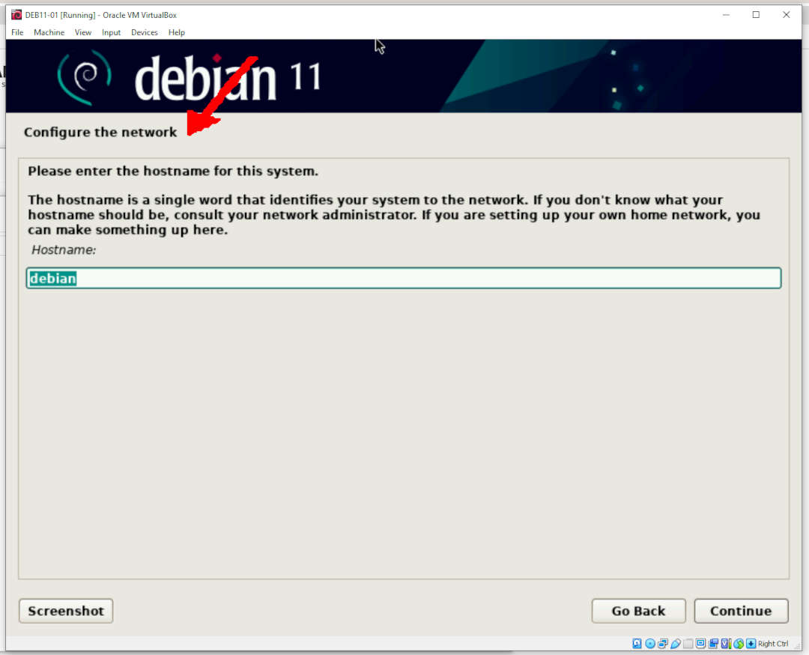
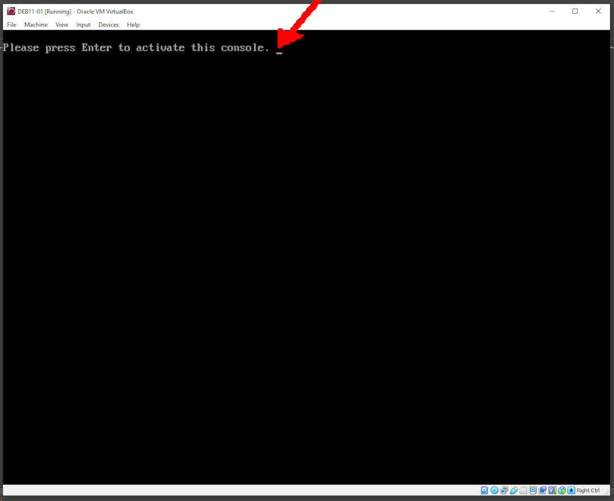
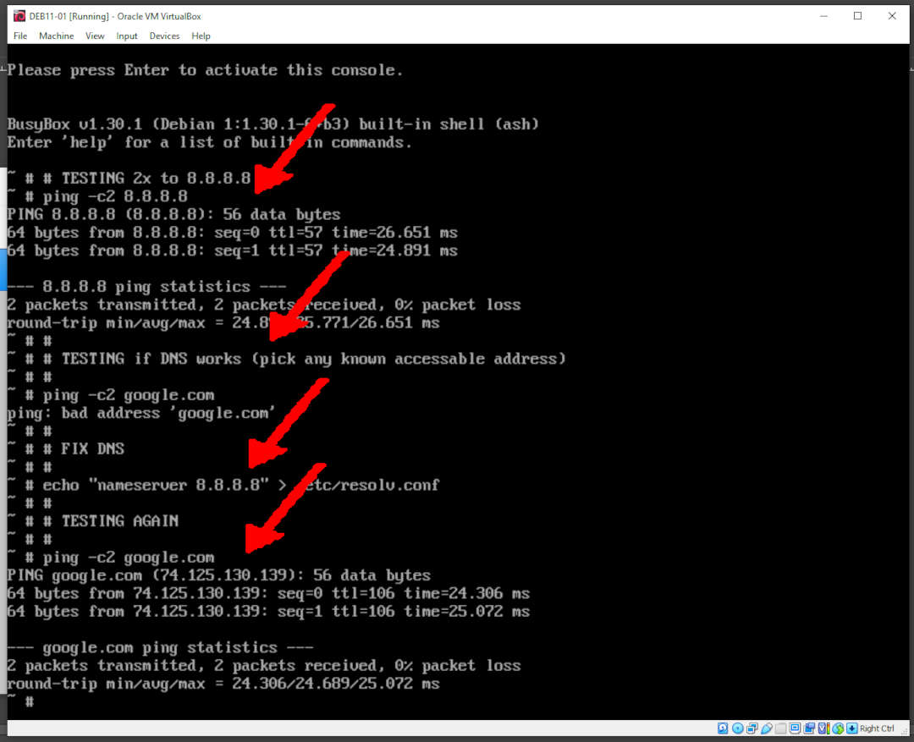

---
---

[HOME](index.md)
[ABOUT](README.md)
[WEB](https://osp4diss.vlsm.org/)
[GITHUB](https://github.com/os2xx/osp4diss)
[TOP](#)
[BOTTOM](#endofpage)
[PREV](index.md#idx03)
[NEXT](index.md#idx03)

# Troubleshooting: DNS Server Failure

* Sometimes, the DNS Server does not set properly.
Activate the Debian console for testing the DNS Server.
* To activate the console, press: (HOST KEY) F2
* Return to Debian Install mode, press: (HOST KEY) F5

<br>
## (HOST KEY)

* Linux: &lt;CTRL RIGHT>
* Windows: &lt;CTRL ALT>

<br>
## Activate Console

* press (HOST KEY) F2



* press ENTER



* test the network link (8.8.8.8)

```
ping -c2 8.8.8.8

```

* test the DNS server

```
ping -c2 google.com

```

* if fails, change the DNS server

```
echo "nameserver 8.8.8.8" > /etc/resolv.conf

```

* re-test the DNS server

```
ping -c2 google.com

```



* return with: (HOME KEY) F5.

<br id="endofpage"><br>

[HOME](index.md)
[ABOUT](README.md)
[WEB](https://osp4diss.vlsm.org/)
[GITHUB](https://github.com/os2xx/osp4diss)
[TOP](#)
[BOTTOM](#endofpage)
[PREV](index.md#idx03)
[NEXT](index.md#idx03)
<br>

