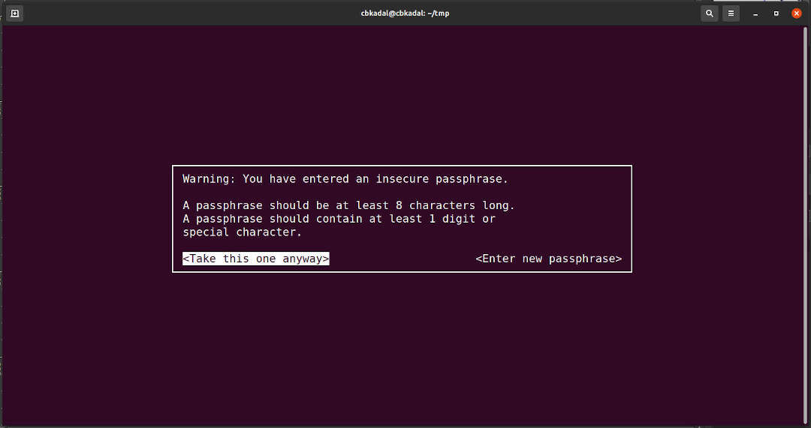

---
---

[HOME](index.md)
[ABOUT](README.md)
[WEB](https://osp4diss.vlsm.org/)
[GITHUB](https://github.com/os2xx/osp4diss/)
[TOP](#)
[BOTTOM](#endofpage)
[PREV](index.md#idx06)
[NEXT](index.md#idx06)

# GNUPG: How to symmetrically encrypt and decrypt a file

* [Encryption](#idx01)
* [Decryption](#idx02)

<br id="idx01">
## Encryption

Suppose you want to symmetrically encrypt file "secretFile.txt" with the passphrase "dodol."
The command will be:

```
ls -al
# symmetrically encryption with armor
gpg --output secretFile.txt.asc --symmetric --armor secretFile.txt
ls -al
# check the result 
cat secretFile.txt.asc

```

(RESULT)

```
cbkadal@cbkadal:~/tmp$ ls -al
total 12
drwxr-xr-x  2 cbkadal cbkadal 4096 Feb 24 22:30 .
drwx------ 20 cbkadal cbkadal 4096 Feb 24 22:30 ..
-rw-r--r--  1 cbkadal cbkadal   19 Feb 24 22:30 secretFile.txt

cbkadal@cbkadal:~/tmp$ # symmetrically encryption with armor

cbkadal@cbkadal:~/tmp$ gpg --output secretFile.txt.asc --symmetric --armor secretFile.txt 

```

<br>
### Asking For Passphrase (=dodol)


<br>
### A warning because "dodol" is a poor choise.



<br>
### Yes for "dodol" again.


(RESULT)

```

cbkadal@cbkadal:~/tmp$ ls -al
total 16
drwxr-xr-x  2 cbkadal cbkadal 4096 Feb 24 22:35 .
drwx------ 20 cbkadal cbkadal 4096 Feb 24 22:30 ..
-rw-r--r--  1 cbkadal cbkadal   19 Feb 24 22:30 secretFile.txt
-rw-r--r--  1 cbkadal cbkadal  196 Feb 24 22:35 secretFile.txt.asc

cbkadal@cbkadal:~/tmp$ # check the result 

cbkadal@cbkadal:~/tmp$ cat secretFile.txt.asc 
-----BEGIN PGP MESSAGE-----

jA0ECQMCUHQNk+rqFgb/0lABkMW0sI305R5u3tuDgzU0rBPIeOVXJ1+SheWbZr7s
80FG97IQCvCMdLY+kbxTmXOP/KFeZUhSgM+zUrofBJo6UX9ajpXXAI1htuK4wXQN
+g==
=ftx/
-----END PGP MESSAGE-----

cbkadal@cbkadal:~/tmp$

```

<br id="idx02">
## Decryption

Symmetrically decrypt file "secretFile.txt.asc" with the passphrase "dodol."
The command will be:

```
ls -al
# Reset gpg-agent
gpgconf --kill gpg-agent
gpgconf --reload gpg-agent
gpg --output RESULT.txt --decrypt secretFile.txt.asc
ls -al
# comparing
diff RESULT.txt secretFile.txt

```

(RESULT)

```
cbkadal@cbkadal:~/tmp$ ls -al
total 16
drwxr-xr-x  2 cbkadal cbkadal 4096 Feb 24 23:03 .
drwx------ 20 cbkadal cbkadal 4096 Feb 24 22:36 ..
-rw-r--r--  1 cbkadal cbkadal   19 Feb 24 22:30 secretFile.txt
-rw-r--r--  1 cbkadal cbkadal  196 Feb 24 22:53 secretFile.txt.asc

cbkadal@cbkadal:~/tmp$ # Reset gpg-agent

cbkadal@cbkadal:~/tmp$ gpgconf --kill gpg-agent

cbkadal@cbkadal:~/tmp$ gpgconf --reload gpg-agent

cbkadal@cbkadal:~/tmp$ gpg --output RESULT.txt --decrypt secretFile.txt.asc

```

<br>
### Asking For Passphrase (=dodol)


```
gpg: AES256.CFB encrypted data
gpg: encrypted with 1 passphrase

cbkadal@cbkadal:~/tmp$ ls -al
total 20
drwxr-xr-x  2 cbkadal cbkadal 4096 Feb 24 23:03 .
drwx------ 20 cbkadal cbkadal 4096 Feb 24 22:36 ..
-rw-r--r--  1 cbkadal cbkadal   19 Feb 24 23:03 RESULT.txt
-rw-r--r--  1 cbkadal cbkadal   19 Feb 24 22:30 secretFile.txt
-rw-r--r--  1 cbkadal cbkadal  196 Feb 24 22:53 secretFile.txt.asc

cbkadal@cbkadal:~/tmp$ # comparing

cbkadal@cbkadal:~/tmp$ diff RESULT.txt secretFile.txt

cbkadal@cbkadal:~/tmp$ 

```

<br id="endofpage"><br>

[HOME](index.md)
[ABOUT](README.md)
[WEB](https://osp4diss.vlsm.org/)
[GITHUB](https://github.com/os2xx/osp4diss/)
[TOP](#)
[BOTTOM](#endofpage)
[PREV](index.md#idx06)
[NEXT](index.md#idx06)
<br>

