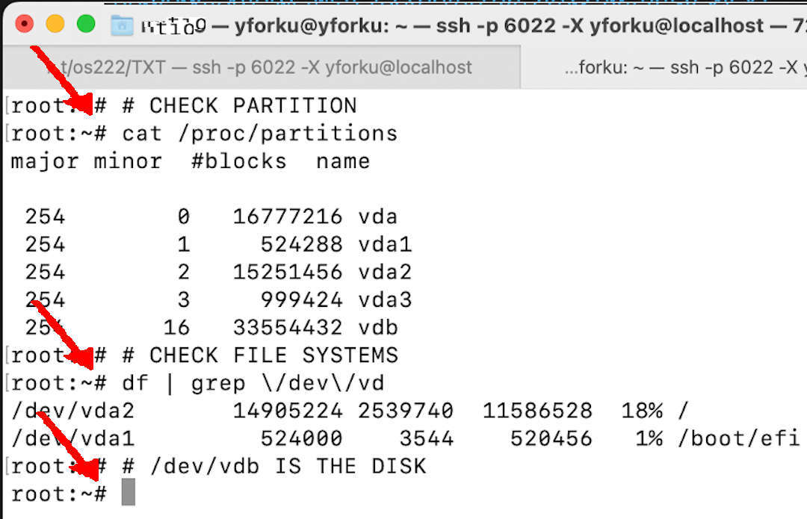
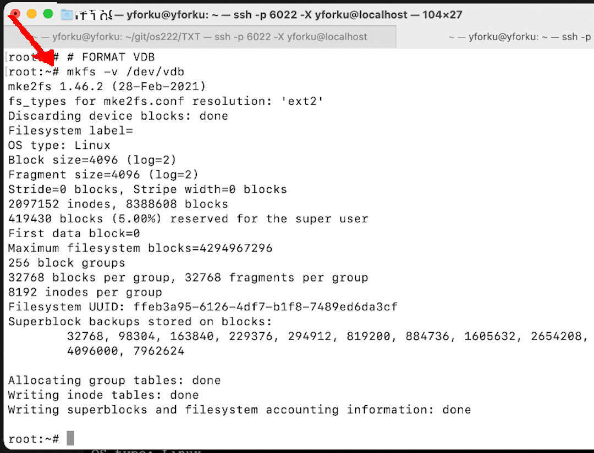
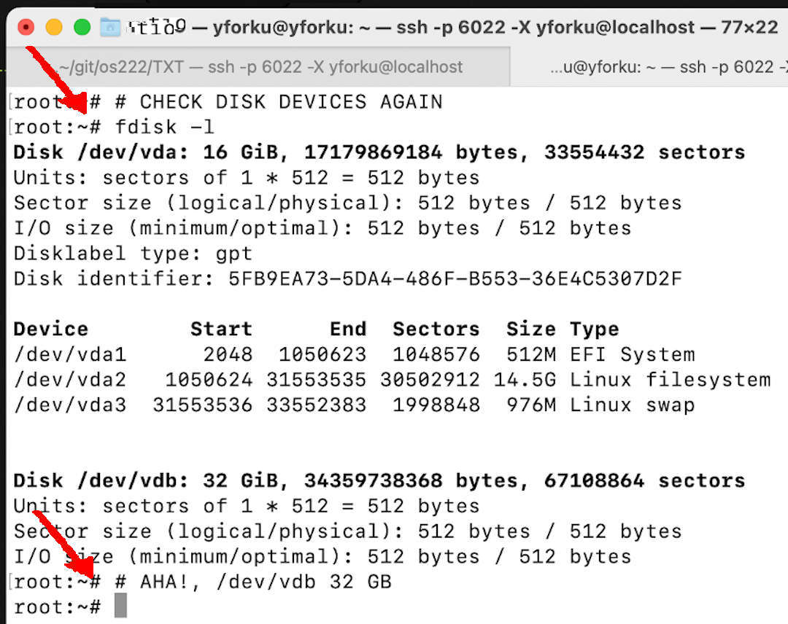
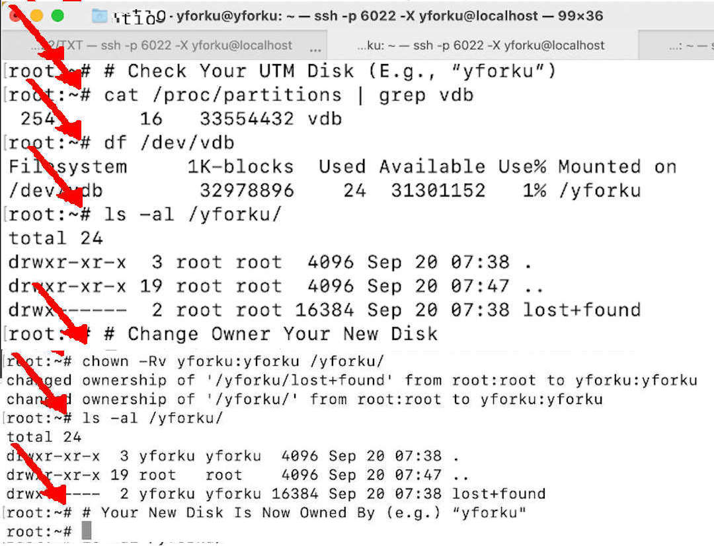

---
---

[HOME](index.md)
[ABOUT](README.md)
[WEB](https://osp4diss.vlsm.org/)
[GITHUB](https://github.com/os2xx/osp4diss/)
[TOP](#)
[BOTTOM](#endofpage)
[PREV](W03-03.md)
[NEXT](W03-03.md)

# WEEK03: UTM M1

* VirtualBox uses devices like sda, sdb, sdc...
* UTM M1 uses devices like vda, vdb, vdc...
* Device /dev/vdb will be also used for LFS (Linux From Scratch).
* You are not <span style="color:red; font-weight:bold; font-size:larger;">yforku</span>, Use your own account!

<br id="idx01">
## M1: Update Your Debian Guest (<span style="color:red; font-weight:bold; font-size:larger;">root</span> mode)

```
apt-get update;apt-get upgrade -y;apt-get autoremove -y;apt-get autoclean -y;apt-get clean -y;

```

<br id="idx02">
## M1: Find Your New Disk (<span style="color:red; font-weight:bold; font-size:larger;">root</span> mode)

```
cat /proc/partitions

```

<br id="idx03">
## M1: Cross checking the current mounted disks (<span style="color:red; font-weight:bold; font-size:larger;">root</span> mode)

```
df | grep \/dev\/vd

```



<br id="idx04">
## M1: (In This Example) Your device is "/dev/vdb" 

<br id="idx05">
## M1: Formating Your New Disk (<span style="color:red; font-weight:bold; font-size:larger;">root</span> mode)

```
mkfs -v /dev/vdb

```

<br id="idx06">


<br id="idx07">
## M1: Creat a New Mounting Directory (<span style="color:red; font-weight:bold; font-size:larger;">root</span> mode)
* Use your "GitHub Account" as the directory name. E.g., "yforku"
  * You are not <span style="color:red; font-weight:bold; font-size:larger;">yforku</span>!
    Replace <span style="color:red; font-weight:bold; font-size:larger;">yforku</span> with your GitHub Account.

```
mkdir -pv /yforku/
ls -al /yforku/

```

<br id="idx08">
## M1: Mount Your New Disk (<span style="color:red; font-weight:bold; font-size:larger;">root</span> mode)
* Use your "GitHub Account" as the directory name. E.g., "yforku"
  * You are not <span style="color:red; font-weight:bold; font-size:larger;">yforku</span>!
    Replace <span style="color:red; font-weight:bold; font-size:larger;">yforku</span> with your GitHub Account.

```
mount -v /dev/vdb /yforku/

```

<br id="idx09">
## M1: Check Your UTM Disk (<span style="color:red; font-weight:bold; font-size:larger;">root</span> mode)
* Use your "GitHub Account" as the directory name. E.g., "yforku"
  * You are not <span style="color:red; font-weight:bold; font-size:larger;">yforku</span>!
    Replace <span style="color:red; font-weight:bold; font-size:larger;">yforku</span> with your GitHub Account.

```
fdisk -l

```


<br id="idx10">

```
cat /proc/partitions | grep vdb
df                   | grep vdb
ls -al /yforku/

```

<br id="idx09">
## M1: Change Owner Your New Disk (<span style="color:red; font-weight:bold; font-size:larger;">root</span> mode)
* Use your "GitHub Account" as the directory name. E.g., "yforku"
  * You are not <span style="color:red; font-weight:bold; font-size:larger;">yforku</span>!
    Replace <span style="color:red; font-weight:bold; font-size:larger;">yforku</span> with your GitHub Account.

```
ls -al    /yforku/
chown -Rv yforku:yforku /yforku/
ls -al    /yforku/

```


<br id="idx11">


<br id="endofpage"><br>

[HOME](index.md)
[ABOUT](README.md)
[WEB](https://osp4diss.vlsm.org/)
[GITHUB](https://github.com/os2xx/osp4diss/)
[TOP](#)
[BOTTOM](#endofpage)
[PREV](W03-03.md)
[NEXT](W03-03.md)
<br>

