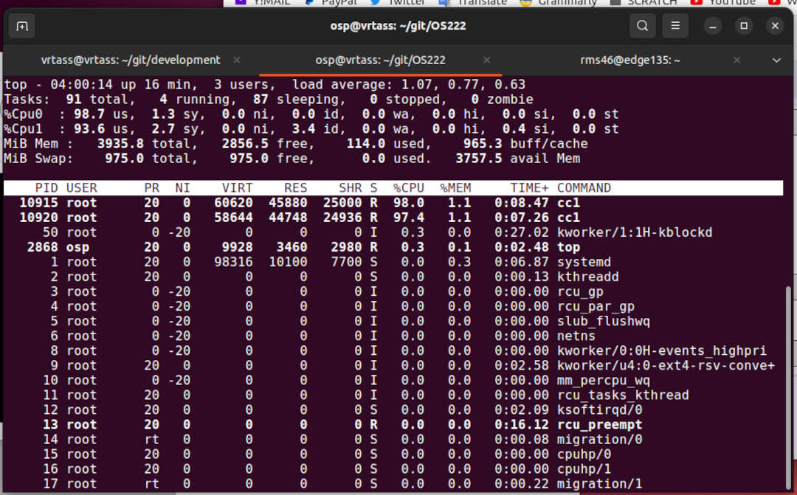

---
---

[HOME](index.md)
[ABOUT](README.md)
[WEB](https://osp4diss.vlsm.org/)
[GITHUB](https://github.com/os2xx/osp4diss/)
[TOP](#)
[BOTTOM](#endofpage)
[PREV](index.md)
[NEXT](index.md)

<br id="idx00">
# The LFS Check List
* The LFS Book ([11.3](https://www.linuxfromscratch.org/lfs/view/11.3/)) and
  [Kernotex's Playlist](https://www.youtube.com/playlist?list=PLyc5xVO2uDsB4gJ2dPySvs2eK_roFwKeb).
* Always BACKUP your VirtualGuest, and make sure you understand HOW TO RESTORE your BACKUP!
* Check LFS, NPROC, and MAKEFLAGS
  * LFS=/mnt/lfs
  * NPROC=MAKEFLAGS

```
echo "LFS=\"$LFS $(df $LFS|tail -1|awk '{print $1,int($2/1000000)"G"}')\" NPROC=$(nproc) MAKEFLAGS=$MAKEFLAGS"

```
* LFS chapter 5 and 6 (Before CHROOT)
  * "/" and "$LFS" should be on a separate filesystem.
  * "/" on /dev/sda2 (VirtualBox) or /dev/vda2 (UTM)
  * "$LFS" on /dev/sdb2 (VirtualBox) or /dev/vdb (UTM)

```
df / $LFS

```
* LFS chapter 7 and 8 (After CHROOT)
  * "$LFS" now becomes "ROOT" on /dev/sdb2 (VirtualBox) or /dev/vdb (UTM)

```
df /

```
* Make sure that the source-code checksum (md5sum) is always correct!
  * ALL (87) checksums should be OK!

```
echo "LFS=$LFS"
#  Fetch "md5sums" using ROOT:
#  wget -c https://www.linuxfromscratch.org/lfs/view/11.2/md5sums --directory-prefix=$LFS/sources

pushd $LFS/sources/
  md5sum -c md5sums
  echo "Is the checksum result 87? Checksum result: $(md5sum -c md5sums | grep OK | wc -l)"
popd

```
* Check/Run TOP (Table of Processes)
  * current time --- 4:00:14
  * up time --- 16 minutes
  * users --- 3
  * load average --- 1.07, 0.77, 0.63 (0, 5, 15 minutes ago)
  * Tasks: Running, Sleeping, Stopped, Zombie
  * CPU utilities: us(er), sy(stem), ni(ce), id(le), IO wa(it), 
    h(ardware)i(nterrupts), s(oftware)i(nterrupts), (hypervisor) st(olen).
  * Mem(ory) usage (total, free, used, buffer/cache)
  * Swap usage (total, free, used)
  * Avail(able) memory.



<br id="endofpage"><br>

[HOME](index.md)
[ABOUT](README.md)
[WEB](https://osp4diss.vlsm.org/)
[GITHUB](https://github.com/os2xx/osp4diss/)
[TOP](#)
[BOTTOM](#endofpage)
[PREV](index.md)
[NEXT](index.md)
<br>

