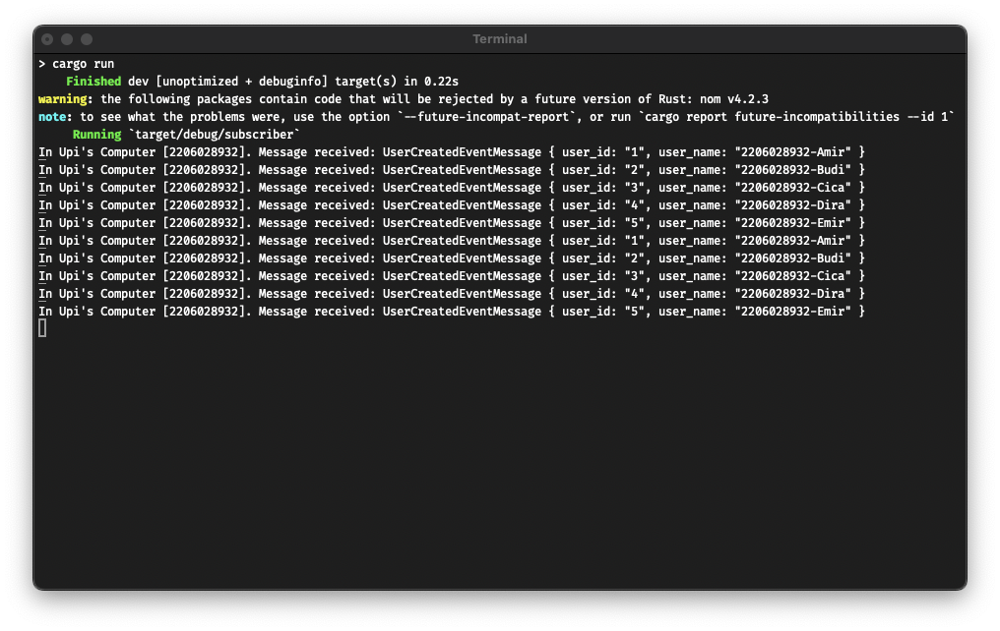

# Tutorial Pemrograman Lanjut
## Alden Luthfi - 2206028932

### Answer No. 7
1. 5 times
2. Because they are requesting to the same server

### Running RabbitMQ as Message Broker

### Sending and Processing Event

### Monitoring Chart Based on Publisher
